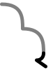
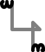
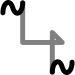

<nav class="pagination-nav">
  <a href="/ithkuil4-rus/02-formative/02-02-structure.html" class="nav-link prev">Назад</a>
  <a href="/ithkuil4-rus/index.html" class="nav-link contents">Содержание</a>
  <a href="/ithkuil4-rus/02-formative/02-04-preformative.html" class="nav-link next">Вперёд</a>
</nav>

## Ядро форматива

### Корень (Root) и Основы (Stems)

Каждый **Корень** форматива объединяет 3 близких по смыслу значения. Для сужения значения форматива до одного из этих трех значений, к корню применяется грамматическая категория **Основы**, значения которой так и называются: **S1 1-я основа, S2 2-я основа, S3 3-я основа**. Корни нового ифкуиля даны в документе [Лексикон](http://www.ithkuil.net/newithkuil_lexicon.pdf), и для каждого корня в этом документе явным образом раскрыты значения каждой из трех его основ.

Например, корень "медведь" имеет следующие три основы:
1. Черный медведь
2. Гризли
3. Бурый медведь

В ситуациях, когда конкретное значение основы не важно, или необходимо выразить обобщенное значение, можно применить **S0 Нулевую основу**. Например, корень "медведь" с нулевой основой будет означать просто медведя, безотносительно к конкретному биологическому виду.

### Спецификация (Specification)

Каждая из трех основ, равно как и нулевая основа, имеет четыре спецификации. Эти Спецификации служат для того, чтобы показать, как основа должна быть семантически интерпретирована в контексте оставшейся части предложения. Ниже дается определение каждой из них, а примеры использования спецификаций (и других категорий ядра) будут даны после рассмотрения того, как эти категории выражаются фонетически и на письме.

- **BSC Базовая (Basic)** спецификация. Целостная передача основы, до применения других трех спецификаций, в особенности охватывающая значение содержательной и основополагающей спецификаций. Для корней представляющих естественным образом “активизированных”, “не стабильных во времени”, динамических, или в психологическом значении глаголо-подобных понятий, именной форматив в Базовой спецификации будет означать “случай/событие X-а”, в то время как глагольный форматив будет означать “(случай/событие) X происходит”. Для основ, естественно “овеществленных”, “стабильных во времени”, статичных, или психологически имя-подобных понятий, именной форматив в Базовой спецификации будет означать “X”, а в случае “неисчислимых” сущностей “(не указанное/определенное) количество/объем X”, в то время как глагольный форматив в Базовой спецификации будет нести статичную интерпретацию значения “X присутствует” / “есть X”; вербальное расширение этого значения будет сопровождаться использованием других Спецификации.

- **CTE Содержательная (Contential)** спецификация. Эта спецификация комплементарна основополагающей спецификации (см. ниже). Физическое или не физическое содержание или сущность или целевая функция или идеализированная / абстрактная / платоническая форма чего-либо, в противопоставлении его простой физической форме.

- **CSV Основополагающая (Constitutive)** спецификация. Эта спецификация указывает на форму (физическую или не физическую) в которой сущность / состояние / действие выражает себя оформленно или реализованно, в противоположность функциональному / целевому содержанию, т.е. “что представляет собой X”.

- **OBJ Объектная (Objective)** спецификация. Эта спецификация указывает на то, что из нижеперечисленного наиболее характерно для семантики конкретной основы:
    1. реальный инструмент / средство при помощи которого действие / состояние / события происходит, или, если не применимо, тогда 
    2. третий объект / сущность ассоциированный с взаимодействием между двумя сторонами (например, объект, участвующий в дательном взаимодействии), или если не применимо, тогда
    3. результирующий реальный объект / продукт / ситуация, или если не применимо, тогда
    4. тот, кто подвергается воздействию или переживает состояние / действие / событие.

Когда в этих определениях говорится о "глаголо-подобных понятиях", либо об "имя-подобных понятиях", речь не идет о делении на "глаголы" и "существительные", которое осуществляется категорией Отношения. Речь идет о том что для каких-то корней более характерно использование в роли "глагола" или в роли "существительного". Но при этом в ифкуиле любой корень может принимать форму и "глагола" и "существительного". Например, корень, описывающий явление *идти*, можно считать "глаголо-подобным" понятием, но он может принимать форму и "глагола" *идет" и форму "существительного" *прогулка*. Наоборот корень, обозначающий *кошку*, обычно рассматривается нами как "существительное", но в ифкуиле он так же может принимать форму "глагола" со значением *существует кошка*.

Возвращаясь к категории Спецификации, для отдельно взятого корня может оказаться непросто понять, какие значения будут иметь те или иные его спецификации, и разные люди могут прийти к разным выводам. Поэтому в Лексиконе приведены не только значения всех основ корня, но и значения его спецификаций.

Следует помнить, что любой перевод с одного языка на другой объективно не точен, и переводы  корней ифкуиля на английский, данные в Лексиконе, - не исключение. При интерпретации значения определенной спецификации определенного корня, следует принимать во внимание как перевод из Лексикона, так и определение спецификации, данное в грамматике.

### Активность (Function)

Категория Активности указывает на то, отсылает ли значение форматива к статической экзистенции / психологическому состоянию или к динамическому действию / событию. Другими словами, это можно объяснить так: если мгновенный снимок описываемого явления совпадает с самим явлением, то оно статично, если нет - то динамично. Соответственно категория активности имеет одно из двух значений: **STA Статичная (Stative)** или **DYN Динамичная (Dynamic)**.

Различие между Статичной и Динамичной активностями одновременно объективное и субъективное. Это значит что в какие-то явления могут быть описаны только как статичные, другие - только как динамичные, но существуют явления, которые в зависимости от точки зрения можно интерпретировать и как статичные и как динамичные. Например, явление "бега" мы обычно воспринимаем как динамичное, потому что положения бегущего человека в пространстве постоянно меняется. Но если мы рассматриваем утреннюю пробежку, как регулярное ежедневное занятие, то мы вправе описать его используя статичную активность, и это точнее выразит наше намерение.

### Версия (Version)

Версия указывает на двойственное различие, известное в лингвистике как *предельность*, т.е. является ли сущность, действие, событие или состояние ориентированным на достижение цели или результата, подразумевает ли это явление переход к качественно иному состоянию.

Категория Версии имеет два значения: **PRC Процессуальная (Processual)** и **CPT Реализующая (Completive)**. Реализующая подразумевает достижение цели или результата (предельное действие), процессуальная - нет (непредельное действие).

Неплохим тестом на предельность будет попытка составить предложения такого вида:
1. Я говорил два часа - непредельный глагол, процессуальная версия.
2. Я рассказал за два часа - предельный глагол, реализующая версия.

В русском языке есть что-то похожее на реализующую версию - совершенные глаголы. *Шел /пришел, учить / выучить, читать / прочитать*. Но это соответствие не полное: мы можем сказать *я поспал два часа*, а можем *я поспал за два часа*, то есть один и тот же совершенный глагол может выступать и как предельный и как непредельный.

Не следует понимать Реализующую версию так, что действие фактически завершено. Действие может быть завершено в прошлом, может быть завершено в будущем, может быть неизвестно, завершится оно когда-либо или нет, или наоборот, точно известно, что оно не завершится никогда, но это завершение так или иначе подразумевается.

Отдельного упоминания заслуживает тот факт, что категория версии может быть применена не только к процессам и событиям, но и к материальным объектам. Например "здание" в Процессуальной версии имеет значение "здание в процессе постройки", в то время как "построенное здание" - это Реализующая версия.

### Стандартная последовательность гласных форм

Для выражения большинства морфологических категорий новый ифкуиль применяет ***стандартную последовательность гласных форм***. Это упрощает запоминание грамматики при изучении.

| | Серия 1 | Серия 2 | Серия 3* | Серия 4 |
|--- | --- | --- | --- | --- |
| Форма 1 | a | ai | ia/uä | ao |
| Форма 2 | ä | au | ie/uë | aö |
| Форма 3 | e | ei | io/üä | eo |
| Форма 4 | i | eu | iö/üë | eö |
| Форма 5 | ëi | ëu | eë | oë |
| Форма 6 | ö | ou | uö/öë | öe |
| Форма 7 | o | oi | uo/öä | oe |
| Форма 8 | ü | iu | ue/ië | öa |
| Форма 9 | u | ui | ua/iä | oa |
| Форма 0 | ae | ea | üo | üö |

\* после согласного **y-**, формы серии 3, начинающиеся на **-i** заменяются на альтернативные формы (например, **yuä**, а не **yia**), в то время как формы  серии 3, начинающиеся на **-u** используют свою альтернативную форму после **w-** (например, **wiä**, а не **wua**).

Форма 0 применяется в специальных грамматических конструкциях.

### Фонетические формы ядра форматива

Корень форматива обозначается согласной формой в слoте 3. Он состоит из от одного до пяти  согласных (например, **-k-, -st-, -ntr-, -pstw-, -rmzgl-**). Фонотактические ограничения (TODO ссылка) языка допускают более 33000 возможных корней. В корнях никогда не используется согласный **'** (гортанная смычка), а согласные **w** и **y** используются только в сочетании с другими согласными.

Категории ядра форматива обозначаются гласными формами стандартной последовательности в слотах 2 и 4:

| | Гласная форма серии 1 | Категории 2-го слота | Категории 4-го слота |
| --- | --- | --- | --- |
| Форма 1 | **a** | S1 PRC | BSC STA |
| Форма 2 | **ä** | S1 CPT | CTE STA |
| Форма 3 | **e** | S2 PRC | CSV STA |
| Форма 4 | **i** | S2 CPT | OBJ STA |
| Форма 5 | **ëi** | - | - |
| Форма 6 | **ö** | S0 CPT | OBJ DYN | 
| Форма 7 | **o** | S0 PRC | CSV DYN |
| Форма 8 | **ü** | S3 CPT | CTE DYN |
| Форма 9 | **u** | S3 PRC | BSC DYN |

Кроме категорий ядра, слоты 2 и 4 могут нести дополнительную информацию, в соответствие в правилами, которые будут объяснены позже. В этом случае эти слоты будут содержать гласных формы других последовательностей. Например, если в 4-м слоте мы встречаем **ui**, то мы должны понимать, что это 9-я форма, вторая серия. Поскольку это 9-я форма, мы заключаем, что форматив имеет базовую спецификацию и динамичную активность. Вторая серия означает субъективный контекст.

### Расшифровка слотовой структуры форматива

Для того чтобы безошибочно найти 2, 3 и 4 слот, надо знать простое правило: 1-й слот форматива может начинаться только с согласных **h**, **w** и **y**, в то время как корень форматива (3-й слот) с этих согласных начинаться не может. 

Соответственно в формативе **wela** 2-й слот содержит **e**, 3-й **l**, а 4-й отсутствует, потому что формы **w** и **y** указывают на сокращение 4-го и 6-го слотов. Сокращение форматива будет изучаться позже.

В формативе **agulá** 2-й слот содержит **a**, 3-й **g**, 4-й **u**.

В формативе **rrala** 2-й слот содержит **а** (гласный по-умолчанию), 3-й **rr** четвертый **a**.

### Запись категорий ядра в нативном письме

Категории ядра записываются в нативном письме в составе **первичного символа**. Значения категорий по умолчанию - это 1-я основа, базовая спецификация, статичная активность и процессуальная версия.
Первичный символ, содержащий значения по-умолчанию для всех категорий ядра выглядит как показано ниже, и  в начале предложения может быть пропущен:

<table> 
<thead><tr>
<th> Глоссы категорий </th> <th> Каллиграфическое начертание </th> <th> Рукописное начертание </th> 
</tr></thead>
<tbody>
<tr>
    <td align="center"> <b> S1 BSC STA PRC</b> </td> 
    <td align="center">  </td> 
    <td align="center">  </td> 
</tr>
</tbody>
</table>

Остальные спецификации (кроме базовой спецификации по-умолчанию), модифицируют центральный элемент символа:

<table> 
<thead><tr>
<th> Глоссы категорий </th> <th> Каллиграфическое начертание </th> <th> Рукописное начертание </th> 
</tr></thead>
<tbody>
<tr>
    <td align="center">  S1 <b>CTE</b> STA PRC </td> 
    <td align="center">  </td> 
    <td align="center">  </td> 
</tr>
<tr>
    <td align="center">  S1 <b>CSV</b> STA PRC </td> 
    <td align="center">  </td> 
    <td align="center">  </td> 
</tr>
<tr>
    <td align="center">  S1 <b>OBJ</b> STA PRC </td> 
    <td align="center">  </td> 
    <td align="center">  </td> 
</tr>
</tbody>
</table>

Категории Основы, Активности и Версии, отличные от значений по умолчанию, добавляют дополнительный графический элемент к нижнему концу центрального элемента (на примере базовой спецификации):

<table> 
<thead>
    <tr><th rowspan=2> BSC </th><th colspan=2> STA </th> <th colspan=2> DYN </th></tr>
    <tr><th> PRC </th> <th> CPT </th><th> PRC </th> <th> CPT </th></tr>
</thead>
<tbody>
<tr>
    <td align="center" rowspan=2>  <b>S1</b> </td> 
    <td align="center">  </td> 
    <td align="center">  </td> 
    <td align="center">  </td> 
    <td align="center">  </td> 
</tr>
<tr>
    <td align="center">  </td> 
    <td align="center">  </td> 
    <td align="center">  </td> 
    <td align="center">  </td> 
</tr>
<tr>
    <td align="center" rowspan=2>  <b>S2</b> </td> 
    <td align="center">  </td> 
    <td align="center">  </td> 
    <td align="center">  </td> 
    <td align="center">  </td> 
</tr>
<tr>
    <td align="center">  </td> 
    <td align="center">  </td> 
    <td align="center">  </td> 
    <td align="center">  </td> 
</tr>
<tr>
    <td align="center" rowspan=2>  <b>S3</b> </td> 
    <td align="center">  </td> 
    <td align="center">  </td> 
    <td align="center">  </td> 
    <td align="center">  </td> 
</tr>
<tr>
    <td align="center">  </td> 
    <td align="center">  </td> 
    <td align="center">  </td> 
    <td align="center">  </td> 
</tr>
<tr>
    <td align="center" rowspan=2>  <b>S0</b> </td> 
    <td align="center">  </td> 
    <td align="center">  </td> 
    <td align="center">  </td> 
    <td align="center">  </td> 
</tr>
<tr>
    <td align="center">  </td> 
    <td align="center">  </td> 
    <td align="center">  </td> 
    <td align="center">  </td> 
</tr>
</tbody>
</table>

Форма дополнительного элемента, присоединяемого на конце линии центрального элемента, может зависеть от наклона линии центрального элемента. В каллиграфическом начертании наклон центрального элемента одинаков для всех спецификаций, поэтому форма дополнительного элемента от спецификации не зависит. Для рукописного начертания это не так: символ базовой, содержательной и объектной спецификаций снизу заканчивается горизонтальной линией, в то время как символ основополагающей спецификации снизу заканчивается вертикальной линией. Ниже приведены формы дополнительного элемента для основополагающей спецификации в рукописном начертании:

<table> 
<thead>
    <tr><th rowspan=2> CSV </th><th colspan=2> STA </th> <th colspan=2> DYN </th></tr>
    <tr><th> PRC </th> <th> CPT </th><th> PRC </th> <th> CPT </th></tr>
</thead>
<tbody>
<tr>
    <td align="center">  <b>S1</b> </td> 
    <td align="center">  </td> 
    <td align="center">  </td> 
    <td align="center">  </td> 
    <td align="center">  </td> 
</tr>
<tr>
    <td align="center">  <b>S2</b> </td> 
    <td align="center">  </td> 
    <td align="center">  </td> 
    <td align="center">  </td> 
    <td align="center">  </td> 
</tr>
<tr>
    <td align="center">  <b>S3</b> </td> 
    <td align="center">  </td> 
    <td align="center">  </td> 
    <td align="center">  </td> 
    <td align="center">  </td> 
</tr>
<tr>
    <td align="center">  <b>S0</b> </td> 
    <td align="center">  </td> 
    <td align="center">  </td> 
    <td align="center">  </td> 
    <td align="center">  </td> 
</tr>
</tbody>
</table>

### Запись корня форматива в нативном письме

Корень форматива записывается при помощи **вторичного символа**, который следует сразу за первичным символом, либо, если первичный символ пропущен, является первым символом слова. Для каждого согласного существует свой центральный элемент символа. К этому элементу могут быть добавлен один верхний и/или нижний концевой элемент. Верхний концевой элемент добавляет согласный до центрального элемента, нижний - после. Если корень содержит более 3 согласных, следом (правее) за центральным элементом добавляется центральный элемент - **заполнитель**, к которому также прикрепляются верхний и/или нижний концевые элементы.

Для каллиграфического письма различаются начертания концевых элементов, которые присоединяются к горизонтальной, вертикальной и диагональной линиям. В рукописном письме концы центрального элемента не могут располагаться по диагонали, поэтому остается два варианта: горизонтальный и вертикальный. В таблице ниже приведены примеры концевых элементов:

+ Для каллиграфического письма:
    + с верхним и нижним вертикальными концами
    + с правым горизонтальным концом
    + с правым нижним диагональным концом
    + с левым верхним диагональным концом
+ Для рукописного письма:
    + с верхним и нижним вертикальными концами
    + с правым и левым горизонтальным концом

Другие варианты концов центрального элемента в письменности не встречаются.

<table> 
<thead>
    <tr><th> Согласный </th><th> Центральный элемент </th> <th colspan=3> Концевые элементы </th> </tr>
</thead>
<tbody>
<tr>
     <td align="center" rowspan=2> <b>m</b> </td> 
     <td align="center">  </td> 
     <td align="center">  </td> 
     <td align="center">  </td> 
     <td align="center">  </td> 
</tr>
<tr>
     <td align="center">  </td> 
     <td align="center">  </td> 
     <td align="center">  </td> 
     <td align="center">  </td> 
</tr>
<tr>
     <td align="center" rowspan=2> <b>n</b> </td> 
     <td align="center">  </td> 
     <td align="center">  </td> 
     <td align="center">  </td> 
     <td align="center">  </td> 
</tr>
<tr>
     <td align="center">  </td> 
     <td align="center">  </td> 
     <td align="center">  </td> 
     <td align="center">  </td> 
</tr>
<tr>
     <td align="center" rowspan=2> <b>ň</b> </td> 
     <td align="center">  </td> 
     <td align="center">  </td> 
     <td align="center">  </td> 
     <td align="center">  </td> 
</tr>
<tr>
     <td align="center">  </td> 
     <td align="center">  </td> 
     <td align="center">  </td> 
     <td align="center">  </td> 
</tr>
<tr>
     <td align="center" rowspan=2> <b>p</b> </td> 
     <td align="center">  </td> 
     <td align="center">  </td> 
     <td align="center">  </td> 
     <td align="center">  </td> 
</tr>
<tr>
     <td align="center">  </td> 
     <td align="center">  </td> 
     <td align="center">  </td> 
     <td align="center">  </td> 
</tr>
<tr>
     <td align="center" rowspan=2> <b>b</b> </td> 
     <td align="center">  </td> 
     <td align="center">  </td> 
     <td align="center">  </td> 
     <td align="center">  </td> 
</tr>
<tr>
     <td align="center">  </td> 
     <td align="center">  </td> 
     <td align="center">  </td> 
     <td align="center">  </td> 
</tr>
<tr>
     <td align="center" rowspan=2> <b>t</b> </td> 
     <td align="center">  </td> 
     <td align="center">  </td> 
     <td align="center">  </td> 
     <td align="center">  </td> 
</tr>
<tr>
     <td align="center">  </td> 
     <td align="center">  </td> 
     <td align="center">  </td> 
     <td align="center">  </td> 
</tr>
<tr>
     <td align="center" rowspan=2> <b>d</b> </td> 
     <td align="center">  </td> 
     <td align="center">  </td> 
     <td align="center">  </td> 
     <td align="center">  </td> 
</tr>
<tr>
     <td align="center">  </td> 
     <td align="center">  </td> 
     <td align="center">  </td> 
     <td align="center">  </td> 
</tr>
<tr>
     <td align="center" rowspan=2> <b>k</b> </td> 
     <td align="center">  </td> 
     <td align="center">  </td> 
     <td align="center">  </td> 
     <td align="center">  </td> 
</tr>
<tr>
     <td align="center">  </td> 
     <td align="center">  </td> 
     <td align="center">  </td> 
     <td align="center">  </td> 
</tr>
<tr>
     <td align="center" rowspan=2> <b>g</b> </td> 
     <td align="center">  </td> 
     <td align="center">  </td> 
     <td align="center">  </td> 
     <td align="center">  </td> 
</tr>
<tr>
     <td align="center">  </td> 
     <td align="center">  </td> 
     <td align="center">  </td> 
     <td align="center">  </td> 
</tr>
<tr>
     <td align="center" rowspan=2> <b>s</b> </td> 
     <td align="center">  </td> 
     <td align="center">  </td> 
     <td align="center">  </td> 
     <td align="center">  </td> 
</tr>
<tr>
     <td align="center">  </td> 
     <td align="center">  </td> 
     <td align="center">  </td> 
     <td align="center"> </td> 
</tr>
<tr>
     <td align="center" rowspan=2> <b>z</b> </td> 
     <td align="center">  </td> 
     <td align="center">  </td> 
     <td align="center">  </td> 
     <td align="center">  </td> 
</tr>
<tr>
     <td align="center">  </td> 
     <td align="center">  </td> 
     <td align="center">  </td> 
     <td align="center"> </td> 
</tr>
<tr>
     <td align="center" rowspan=2> <b>š</b> </td> 
     <td align="center">  </td> 
     <td align="center">  </td> 
     <td align="center">  </td> 
     <td align="center">  </td> 
</tr>
<tr>
     <td align="center">  </td> 
     <td align="center">  </td> 
     <td align="center">  </td> 
     <td align="center"> </td> 
</tr>
<tr>
     <td align="center" rowspan=2> <b>ž</b> </td> 
     <td align="center">  </td> 
     <td align="center">  </td> 
     <td align="center">  </td> 
     <td align="center">  </td> 
</tr>
<tr>
     <td align="center">  </td> 
     <td align="center">  </td> 
     <td align="center">  </td> 
     <td align="center"> </td> 
</tr>
<tr>
     <td align="center" rowspan=2> <b>f</b> </td> 
     <td align="center">  </td> 
     <td align="center">  </td> 
     <td align="center">  </td> 
     <td align="center">  </td> 
</tr>
<tr>
     <td align="center">  </td> 
     <td align="center">  </td> 
     <td align="center">  </td> 
     <td align="center"> </td> 
</tr>
<tr>
     <td align="center" rowspan=2> <b>v</b> </td> 
     <td align="center">  </td> 
     <td align="center">  </td> 
     <td align="center">  </td> 
     <td align="center">  </td> 
</tr>
<tr>
     <td align="center">  </td> 
     <td align="center">  </td> 
     <td align="center">  </td> 
     <td align="center"> </td> 
</tr>
<tr>
     <td align="center" rowspan=2> <b>ţ</b> </td> 
     <td align="center">  </td> 
     <td align="center">  </td> 
     <td align="center">  </td> 
     <td align="center">  </td> 
</tr>
<tr>
     <td align="center">  </td> 
     <td align="center">  </td> 
     <td align="center">  </td> 
     <td align="center"> </td> 
</tr>
<tr>
     <td align="center" rowspan=2> <b>ḑ</b> </td> 
     <td align="center">  </td> 
     <td align="center">  </td> 
     <td align="center">  </td> 
     <td align="center">  </td> 
</tr>
<tr>
     <td align="center">  </td> 
     <td align="center">  </td> 
     <td align="center">  </td> 
     <td align="center"> </td> 
</tr>
<tr>
     <td align="center" rowspan=2> <b>ç</b> </td> 
     <td align="center">  </td> 
     <td align="center">  </td> 
     <td align="center">  </td> 
     <td align="center">  </td> 
</tr>
<tr>
     <td align="center">  </td> 
     <td align="center">  </td> 
     <td align="center">  </td> 
     <td align="center"> </td> 
</tr>
<tr>
     <td align="center" rowspan=2> <b>x</b> </td> 
     <td align="center">  </td> 
     <td align="center">  </td> 
     <td align="center">  </td> 
     <td align="center">  </td> 
</tr>
<tr>
     <td align="center">  </td> 
     <td align="center">  </td> 
     <td align="center">  </td> 
     <td align="center"> </td> 
</tr>
<tr>
     <td align="center" rowspan=2> <b>h</b> </td> 
     <td align="center">  </td> 
     <td align="center">  </td> 
     <td align="center">  </td> 
     <td align="center">  </td> 
</tr>
<tr>
     <td align="center">  </td> 
     <td align="center">  </td> 
     <td align="center">  </td> 
     <td align="center"> </td> 
</tr>
<tr>
     <td align="center" rowspan=2> <b>ř</b> </td> 
     <td align="center">  </td> 
     <td align="center">  </td> 
     <td align="center">  </td> 
     <td align="center">  </td> 
</tr>
<tr>
     <td align="center">  </td> 
     <td align="center">  </td> 
     <td align="center">  </td> 
     <td align="center"> </td> 
</tr>
<tr>
     <td align="center" rowspan=2> <b>с</b> </td> 
     <td align="center">  </td> 
     <td align="center">  </td> 
     <td align="center">  </td> 
     <td align="center">  </td> 
</tr>
<tr>
     <td align="center">  </td> 
     <td align="center">  </td> 
     <td align="center">  </td> 
     <td align="center"> </td> 
</tr>
<tr>
     <td align="center" rowspan=2> <b>ẓ</b> </td> 
     <td align="center">  </td> 
     <td align="center">  </td> 
     <td align="center">  </td> 
     <td align="center">  </td> 
</tr>
<tr>
     <td align="center">  </td> 
     <td align="center">  </td> 
     <td align="center">  </td> 
     <td align="center"> </td> 
</tr>
<tr>
     <td align="center" rowspan=2> <b>č</b> </td> 
     <td align="center">  </td> 
     <td align="center">  </td> 
     <td align="center">  </td> 
     <td align="center">  </td> 
</tr>
<tr>
     <td align="center">  </td> 
     <td align="center">  </td> 
     <td align="center">  </td> 
     <td align="center"> </td> 
</tr>
<tr>
     <td align="center" rowspan=2> <b>j</b> </td> 
     <td align="center">  </td> 
     <td align="center">  </td> 
     <td align="center">  </td> 
     <td align="center">  </td> 
</tr>
<tr>
     <td align="center">  </td> 
     <td align="center">  </td> 
     <td align="center">  </td> 
     <td align="center"> </td> 
</tr>
<tr>
     <td align="center" rowspan=2> <b>l</b> </td> 
     <td align="center">  </td> 
     <td align="center">  </td> 
     <td align="center">  </td> 
     <td align="center">  </td> 
</tr>
<tr>
     <td align="center">  </td> 
     <td align="center">  </td> 
     <td align="center">  </td> 
     <td align="center"> </td> 
</tr>
<tr>
     <td align="center" rowspan=2> <b>r</b> </td> 
     <td align="center">  </td> 
     <td align="center">  </td> 
     <td align="center">  </td> 
     <td align="center">  </td> 
</tr>
<tr>
     <td align="center">  </td> 
     <td align="center">  </td> 
     <td align="center">  </td> 
     <td align="center"> </td> 
</tr>
<tr>
     <td align="center" rowspan=2> <b>w</b> </td> 
     <td align="center"> </td> 
     <td align="center">  </td> 
     <td align="center">  </td> 
     <td align="center">  </td> 
</tr>
<tr>
     <td align="center"> </td> 
     <td align="center">  </td> 
     <td align="center">  </td> 
     <td align="center"> </td> 
</tr>
<tr>
     <td align="center" rowspan=2> <b>y</b> </td> 
     <td align="center"> </td> 
     <td align="center">  </td> 
     <td align="center">  </td> 
     <td align="center">  </td> 
</tr>
<tr>
     <td align="center"> </td> 
     <td align="center">  </td> 
     <td align="center">  </td> 
     <td align="center"> </td> 
</tr>
<tr>
     <td align="center" rowspan=2> <b>ļ</b> </td> 
     <td align="center">  </td> 
     <td align="center">  </td> 
     <td align="center">  </td> 
     <td align="center">  </td> 
</tr>
<tr>
     <td align="center">  </td> 
     <td align="center">  </td> 
     <td align="center">  </td> 
     <td align="center"> </td> 
</tr>
<tr>
     <td align="center" rowspan=2> <b>заполнитель</b> </td> 
     <td align="center">  </td> 
     <td align="center"> </td> 
     <td align="center"> </td> 
     <td align="center"> </td> 
</tr>
<tr>
     <td align="center">  </td> 
     <td align="center"> </td> 
     <td align="center"> </td> 
     <td align="center"> </td> 
</tr>
<tr>
     <td align="center" rowspan=4> геминация центрального элемента </td> 
     <td align="center"> </td> 
     <td align="center">  </td> 
     <td align="center">  </td> 
     <td align="center">  </td> 
</tr>
<tr>
     <td align="center"> </td> 
     <td align="center">  </td> 
     <td align="center">  </td> 
     <td align="center"> </td> 
</tr>
<tr>
     <td align="center"> </td> 
     <td align="center">  </td> 
     <td align="center">  </td> 
     <td align="center"> </td> 
</tr>
<tr>
     <td align="center"> </td> 
     <td align="center">  </td> 
     <td align="center">  </td> 
     <td align="center"> </td> 
</tr>
</tbody>
</table>

### Примеры

#### Категория Основы

     Gunļá rralu.

     Кошка идет.

     <b>S1.PRC</b>-“идет”-<b>BSC.DYN</b>-ASO-OBS <b>S1.PRC</b>-“кошка”-<b>BSC.STA</b>-IND

     <svg viewBox="0 -35 303.1499938964844 129.10293579101562" stroke-linejoin="round" stroke-linecap="round" fill="black" xmlns="http://www.w3.org/2000/svg"><g><g><g><g><path d="M 7.5 -35 l -7.5 7.5 57.5 62.5 7.5 -7.5 -57.5 -62.5 z"></path><path d="M 54.9 25 q -1.655 2.716 2.6 10 l 15 0 l 10 -10 l -20 0 q -7.015 -2.931 -7.6 0 z"></path><path d="M 37.5 -27.5 l 20 20 l 7.5 -7.5 l -20 -20 l -7.5 7.5 z"></path><path d="M 17.5 52.5 l 7.5 7.5 l 7.5 -7.5 l -7.5 -7.5 l -7.5 7.5 z"></path></g><g><path d="M 158.14999694824218 -24.925 l 10 -10 l -65.75 0 l -9.9 9.95 l 30.45 37.55 l 7.25 -7.3 l 24.15 29.65 l 7.45 -7.4 l -25.2 -31.05 l -7.5 7.45 l -23.1 -28.85 l 52.15 0 z"></path></g><g><path d="M 185.64999389648438 -35 l -7.5 7.5 57.5 62.5 7.5 -7.5 -57.5 -62.5 z"></path></g><g><path d="M 260.6499938964844 -35 l -7.5 7.5 l 31.25 31.25 l -31.25 31.25 l 40 0 l 10 -10 l -37.6 0 l 27.5 -27.6 l -32.4 -32.4 z"></path><g><path d="M 288.1499938964844 25 l 15 0 l 0 15 l -10 10 l 0 -15 l -10 0 q 7.753 -3.874 5 -10 z"></path></g><path d="M 265.2944378852844 82.5 q 0.75 5.3 5.4 8.4 q 4.9 3.3 12.95 3.2 l 7.5 -7.5 q -14.9 -0.4 -18.6 -8.55 q -3.75 -8.2 7.45 -16.9 l -1.25 -1.15 q -7.35 5.2 -10.9 11.4 q -3.3 5.85 -2.55 11.1 z"></path></g></g></g></g></svg>

     <svg viewBox="-2.5 -37.5 314.1666564941406 108.42926025390625" stroke-linejoin="round" stroke-linecap="round" stroke-width="5" stroke="black" fill="none" xmlns="http://www.w3.org/2000/svg"><g><g><g><g><path d="M 0 -35 c 0 40 30 70 70 70"></path><path d="M 70 35 c 15 0 3.75 -22.5 -11.25 7.5"></path><path d="M 50 -35 l 20 20"></path><path d="M 28.25 45.75 a -0.75 -0.75 0 0 0 -0.75 -0.75 a -0.75 -0.75 0 0 0 -0.75 0.75 a -0.75 -0.75 0 0 0 0.75 0.75 a -0.75 -0.75 0 0 0 0.75 -0.75"></path></g><g><path d="M 152.0833282470703 -35 h -60 c 0 35 25 35 25 35 a 7.5 7.5 0 0 1 7.5 -7.5 c 20 0 17.5 42.5 17.5 42.5"></path></g><g><path d="M 167.0833282470703 -35 c 0 40 30 70 70 70"></path></g><g><path d="M 252.0833282470703 -35 c 40 0 40 50 0 70 h 50"></path><g><path d="M 302.0833282470703 35 c 15 0 3.75 22.5 -11.25 -7.5"></path></g><path d="M 276.8749942779541 53.100006103515625 c -7.5 7.5 -3.75 17.25 11.25 15"></path></g></g></g></g></svg>

Первая основа корня **-g-** в базовой спецификации имеет значение *случая телесного передвижения, условной ходьбы, с той поправкой, что подразумевается естественный для данного существа способ передвижения, например, ходить, прыгать, ползать, плавать, скользить и т.д.*. Первая основа корня **-rr-**  означает *домашнюю кошку*.

     Egunļá rralu.

     Кошка бежит.

     <b>S2.PRC</b>-“бежит”-<b>BSC.DYN</b>-ASO-OBS <b>S1.PRC</b>-“кошка”-<b>BSC.STA</b>-IND

     <svg viewBox="0 -35 298.1499938964844 129.10293579101562" stroke-linejoin="round" stroke-linecap="round" fill="black" xmlns="http://www.w3.org/2000/svg"><g><g><g><g><path d="M 7.5 -35 l -7.5 7.5 57.5 62.5 7.5 -7.5 -57.5 -62.5 z"></path><path d="M 77.5 25 l -15 0 q -7 -2.95 -7.6 0 q -1.65 2.7 2.6 10 l 10 0 l 0 15 l 10 -10 l 0 -15 z"></path><path d="M 37.5 -27.5 l 20 20 l 7.5 -7.5 l -20 -20 l -7.5 7.5 z"></path><path d="M 17.5 52.5 l 7.5 7.5 l 7.5 -7.5 l -7.5 -7.5 l -7.5 7.5 z"></path></g><g><path d="M 153.14999694824218 -24.925 l 10 -10 l -65.75 0 l -9.9 9.95 l 30.45 37.55 l 7.25 -7.3 l 24.15 29.65 l 7.45 -7.4 l -25.2 -31.05 l -7.5 7.45 l -23.1 -28.85 l 52.15 0 z"></path></g><g><path d="M 180.64999389648438 -35 l -7.5 7.5 57.5 62.5 7.5 -7.5 -57.5 -62.5 z"></path></g><g><path d="M 255.64999389648438 -35 l -7.5 7.5 l 31.25 31.25 l -31.25 31.25 l 40 0 l 10 -10 l -37.6 0 l 27.5 -27.6 l -32.4 -32.4 z"></path><g><path d="M 283.1499938964844 25 l 15 0 l 0 15 l -10 10 l 0 -15 l -10 0 q 7.753 -3.874 5 -10 z"></path></g><path d="M 260.2944378852844 82.5 q 0.75 5.3 5.4 8.4 q 4.9 3.3 12.95 3.2 l 7.5 -7.5 q -14.9 -0.4 -18.6 -8.55 q -3.75 -8.2 7.45 -16.9 l -1.25 -1.15 q -7.35 5.2 -10.9 11.4 q -3.3 5.85 -2.55 11.1 z"></path></g></g></g></g></svg>

     <svg viewBox="-2.5 -37.5 314.1666564941406 108.42926025390625" stroke-linejoin="round" stroke-linecap="round" stroke-width="5" stroke="black" fill="none" xmlns="http://www.w3.org/2000/svg"><g><g><g><g><path d="M 0 -35 c 0 40 30 70 70 70"></path><path d="M 70 35 c 15 0 3.75 22.5 -11.25 -7.5"></path><path d="M 50 -35 l 20 20"></path><path d="M 28.25 45.75 a -0.75 -0.75 0 0 0 -0.75 -0.75 a -0.75 -0.75 0 0 0 -0.75 0.75 a -0.75 -0.75 0 0 0 0.75 0.75 a -0.75 -0.75 0 0 0 0.75 -0.75"></path></g><g><path d="M 152.0833282470703 -35 h -60 c 0 35 25 35 25 35 a 7.5 7.5 0 0 1 7.5 -7.5 c 20 0 17.5 42.5 17.5 42.5"></path></g><g><path d="M 167.0833282470703 -35 c 0 40 30 70 70 70"></path></g><g><path d="M 252.0833282470703 -35 c 40 0 40 50 0 70 h 50"></path><g><path d="M 302.0833282470703 35 c 15 0 3.75 22.5 -11.25 -7.5"></path></g><path d="M 276.8749942779541 53.100006103515625 c -7.5 7.5 -3.75 17.25 11.25 15"></path></g></g></g></g>
</svg>

Вторая основа корня **-g-** в базовой спецификации имеет значение *быстрого перемещения*, в данном случае - *бежать*.

     Ugunļá rralu.

     Кошка хромает.

     <b>S3.PRC</b>-“хромает”-<b>BSC.DYN</b>-ASO-OBS <b>S1.PRC</b>-“кошка”-<b>BSC.STA</b>-IND

     <svg viewBox="0 -35 294.45001220703125 129.10293579101562" stroke-linejoin="round" stroke-linecap="round" fill="black" xmlns="http://www.w3.org/2000/svg"><g><g><g><g><path d="M 7.5 -35 l -7.5 7.5 57.5 62.5 7.5 -7.5 -57.5 -62.5 z"></path><path d="M 63.8 26.3 q -6.486 -1.216 -4.75 5 q 2.924 -3.894 5.95 -3.8 l 8.8 -8.8 l 0 -15 l -10 10 l 0 12.6 z"></path><path d="M 37.5 -27.5 l 20 20 l 7.5 -7.5 l -20 -20 l -7.5 7.5 z"></path><path d="M 17.5 52.5 l 7.5 7.5 l 7.5 -7.5 l -7.5 -7.5 l -7.5 7.5 z"></path></g><g><path d="M 149.45 -24.925 l 10 -10 l -65.75 0 l -9.9 9.95 l 30.45 37.55 l 7.25 -7.3 l 24.15 29.65 l 7.45 -7.4 l -25.2 -31.05 l -7.5 7.45 l -23.1 -28.85 l 52.15 0 z"></path></g><g><path d="M 176.9499969482422 -35 l -7.5 7.5 57.5 62.5 7.5 -7.5 -57.5 -62.5 z"></path></g><g><path d="M 251.9499969482422 -35 l -7.5 7.5 l 31.25 31.25 l -31.25 31.25 l 40 0 l 10 -10 l -37.6 0 l 27.5 -27.6 l -32.4 -32.4 z"></path><g><path d="M 279.4499969482422 25 l 15 0 l 0 15 l -10 10 l 0 -15 l -10 0 q 7.753 -3.874 5 -10 z"></path></g><path d="M 256.59444093704224 82.5 q 0.75 5.3 5.4 8.4 q 4.9 3.3 12.95 3.2 l 7.5 -7.5 q -14.9 -0.4 -18.6 -8.55 q -3.75 -8.2 7.45 -16.9 l -1.25 -1.15 q -7.35 5.2 -10.9 11.4 q -3.3 5.85 -2.55 11.1 z"></path></g></g></g></g></svg>

     <svg viewBox="-2.5 -37.5 317.0833435058594 108.42926025390625" stroke-linejoin="round" stroke-linecap="round" stroke-width="5" stroke="black" fill="none" xmlns="http://www.w3.org/2000/svg"><g><g><g><g><path d="M 0 -35 c 0 40 30 70 70 70"></path><path d="M 70 35 a -10 -10 0 0 1 10 10 v -15"></path><path d="M 50 -35 l 20 20"></path><path d="M 28.25 45.75 a -0.75 -0.75 0 0 0 -0.75 -0.75 a -0.75 -0.75 0 0 0 -0.75 0.75 a -0.75 -0.75 0 0 0 0.75 0.75 a -0.75 -0.75 0 0 0 0.75 -0.75"></path></g><g><path d="M 155 -35 h -60 c 0 35 25 35 25 35 a 7.5 7.5 0 0 1 7.5 -7.5 c 20 0 17.5 42.5 17.5 42.5"></path></g><g><path d="M 170 -35 c 0 40 30 70 70 70"></path></g><g><path d="M 255 -35 c 40 0 40 50 0 70 h 50"></path><g><path d="M 305 35 c 15 0 3.75 22.5 -11.25 -7.5"></path></g><path d="M 279.7916660308838 53.100006103515625 c -7.5 7.5 -3.75 17.25 11.25 15"></path></g></g></g></g>
</svg>

Третья основа корня **-g-** в базовой спецификации имеет значение *неестественного, нарушенного передвижения, например, хромать, шататься*.

     Gunļá orralu.

     Кошка идет.

     <b>S1.PRC</b>-“идет”-<b>BSC.DYN</b>-ASO-OBS <b>S0.PRC</b>-“кошка”-<b>BSC.STA</b>-IND

     <svg viewBox="0 -35 328.20001220703125 129.10293579101562" stroke-linejoin="round" stroke-linecap="round" fill="black" xmlns="http://www.w3.org/2000/svg"><g><g><g><g><path d="M 7.5 -35 l -7.5 7.5 57.5 62.5 7.5 -7.5 -57.5 -62.5 z"></path><path d="M 54.9 25 q -1.655 2.716 2.6 10 l 15 0 l 10 -10 l -20 0 q -7.015 -2.931 -7.6 0 z"></path><path d="M 37.5 -27.5 l 20 20 l 7.5 -7.5 l -20 -20 l -7.5 7.5 z"></path><path d="M 17.5 52.5 l 7.5 7.5 l 7.5 -7.5 l -7.5 -7.5 l -7.5 7.5 z"></path></g><g><path d="M 158.14999694824218 -24.925 l 10 -10 l -65.75 0 l -9.9 9.95 l 30.45 37.55 l 7.25 -7.3 l 24.15 29.65 l 7.45 -7.4 l -25.2 -31.05 l -7.5 7.45 l -23.1 -28.85 l 52.15 0 z"></path></g><g><path d="M 185.64999389648438 -35 l -7.5 7.5 57.5 62.5 7.5 -7.5 -57.5 -62.5 z"></path><path d="M 243.14999389648438 27.5 l 15.05 0 l 10 -10 l -17.45 0 l -8.75 8.8 q -6.9 -0.2 -3.8 6.15 l 4.95 -4.95 z"></path></g><g><path d="M 285.70001220703125 -35 l -7.5 7.5 l 31.25 31.25 l -31.25 31.25 l 40 0 l 10 -10 l -37.6 0 l 27.5 -27.6 l -32.4 -32.4 z"></path><g><path d="M 313.20001220703125 25 l 15 0 l 0 15 l -10 10 l 0 -15 l -10 0 q 7.753 -3.874 5 -10 z"></path></g><path d="M 290.3444561958313 82.5 q 0.75 5.3 5.4 8.4 q 4.9 3.3 12.95 3.2 l 7.5 -7.5 q -14.9 -0.4 -18.6 -8.55 q -3.75 -8.2 7.45 -16.9 l -1.25 -1.15 q -7.35 5.2 -10.9 11.4 q -3.3 5.85 -2.55 11.1 z"></path></g></g></g></g></svg>

     <svg viewBox="-2.5 -37.5 324.1666564941406 108.42926025390625" stroke-linejoin="round" stroke-linecap="round" stroke-width="5" stroke="black" fill="none" xmlns="http://www.w3.org/2000/svg"><g><g><g><g><path d="M 0 -35 c 0 40 30 70 70 70"></path><path d="M 70 35 c 15 0 3.75 -22.5 -11.25 7.5"></path><path d="M 50 -35 l 20 20"></path><path d="M 28.25 45.75 a -0.75 -0.75 0 0 0 -0.75 -0.75 a -0.75 -0.75 0 0 0 -0.75 0.75 a -0.75 -0.75 0 0 0 0.75 0.75 a -0.75 -0.75 0 0 0 0.75 -0.75"></path></g><g><path d="M 152.0833282470703 -35 h -60 c 0 35 25 35 25 35 a 7.5 7.5 0 0 1 7.5 -7.5 c 20 0 17.5 42.5 17.5 42.5"></path></g><g><path d="M 167.0833282470703 -35 c 0 40 30 70 70 70"></path><path d="M 237.0833282470703 35 a -5 -5 0 0 0 0 -10 h 10"></path></g><g><path d="M 262.0833282470703 -35 c 40 0 40 50 0 70 h 50"></path><g><path d="M 312.0833282470703 35 c 15 0 3.75 22.5 -11.25 -7.5"></path></g><path d="M 286.8749942779541 53.100006103515625 c -7.5 7.5 -3.75 17.25 11.25 15"></path></g></g></g></g></svg>

Корень **-rr-** имеет три основы: *домашняя кошка, дикая кошка, манул*. В этом примере мы намеренно не указываем о каком из этих трех видов животных идет речь.

#### Категория Спецификации

Рассмотрим значения спецификаций корня **-rr-** (*кошка*). В лексиконе описывается единый паттерн спецификаций, применяемый ко всем животным:

- **Базовая спецификация** рассматривает животное в его холистической целостности, включая его телесную сторону, ментальную идентичность и  жизненную сущность;
- **Содержательная спецификация**  означает то, что придает определенному животному его  индивидуальную идентичность; жизненную сущность или ментальную идентичность животного;
- **Основополагающая спецификация** означает физическое тело животного; телесный аспект животного;
- **Объектная спецификация** означает активность в которую вовлечено животное, то что животное делает;  действовать так, как определенное животное действует;

     Švädá rräli.

     Кошка хочет играть.

     <b>S1.PRC</b>-“игра/развлечение”-<b>CTE.STA</b>-PRX-OBS <b>S1.PRC</b>-“кошка”-<b>CTE.STA</b>-AFF

     <svg viewBox="-4.76837158203125e-7 -35 240.15000915527344 114.97955322265625" stroke-linejoin="round" stroke-linecap="round" fill="black" xmlns="http://www.w3.org/2000/svg"><g><g><g><g><path d="M 40 5 l 7.5 -7.5 -32.5 -32.5 -7.5 7.5 32.5 32.5 m -17.5 -10 l -7.5 7.5 32.5 32.5 7.5 -7.5 -32.5 -32.5 z"></path><path d="M 13.899999999999999 -31.95 q -3.28 1.825 -6.4 4.45 l -7.5 7.5 l 1.2 1.2 l 7.5 -7.5 q 4.106 1.688 4.55 0.35 q 0.6 -1.45 0.65 -6 z"></path><path d="M 16.25 52.5 l 7.5 7.5 l 7.5 -7.5 l -7.5 -7.5 l -7.5 7.5 z"></path></g><g><path d="M 105 -35 l -10 10 l 0 20 l -20 0 l -10 10 l 0 30 l 30 0 l 10 -10 l -30 0 l 0 -20 l 20 0 l 10 -10 l 0 -30 z"></path><g><path d="M 110.15 17.5 l -7.5 7.5 l -11.1 0 q 3.05 5.25 -1.5 10 l 5 0 l 8.8 -8.85 q 0.445 14.232 18.8 18.85 q -12.993 -10.704 -12.45 -27.5 z"></path></g></g><g><path d="M 165.15000915527344 5 l 7.5 -7.5 -32.5 -32.5 -7.5 7.5 32.5 32.5 m -17.5 -10 l -7.5 7.5 32.5 32.5 7.5 -7.5 -32.5 -32.5 z"></path></g><g><path d="M 197.65000915527344 -35 l -7.5 7.5 l 31.25 31.25 l -31.25 31.25 l 40 0 l 10 -10 l -37.6 0 l 27.5 -27.6 l -32.4 -32.4 z"></path><g><path d="M 225.15000915527344 25 l 15 0 l 0 15 l -10 10 l 0 -15 l -10 0 q 7.753 -3.874 5 -10 z"></path></g><path d="M 235.40000915527344 61.25 l -1.15 -1.25 q -6.55 11.7 -14.4 12.25 q -7.8 0.5 -17.45 -9.75 l -7.5 7.5 q 6.55 12.05 18.7 9.55 q 12.25 -2.5 21.8 -18.3 z"></path></g></g></g></g></svg>

     <svg viewBox="-2.5000009536743164 -37.5 277.47747802734375 98.10000610351562" stroke-linejoin="round" stroke-linecap="round" stroke-width="5" stroke="black" fill="none" xmlns="http://www.w3.org/2000/svg"><g><g><g><g><path d="M 9.14413833618164 -35 c 17.156325 0 30 17.1428 30 40 m 20 30 c -17.156325 0 -30 -17.1428 -30 -40"></path><path d="M 9.14413833618164 -35 c -10 0 -12 7 -5 10"></path><path d="M 27.39413833618164 45.75 a -0.75 -0.75 0 0 0 -0.75 -0.75 a -0.75 -0.75 0 0 0 -0.75 0.75 a -0.75 -0.75 0 0 0 0.75 0.75 a -0.75 -0.75 0 0 0 0.75 -0.75"></path></g><g><path d="M 124.14413833618164 35 c -40 0 -50 -5 -50 -15 c 0 -20 30 -15 30 -15 v -40"></path><g><path d="M 124.14413833618164 35 a -7.5 -7.5 0 0 1 7.5 -7.5 c -2.5 7.5 -2 10 3.75 15"></path></g></g><g><path d="M 150.39413452148438 -35 c 17.156325 0 30 17.1428 30 40 m 20 30 c -17.156325 0 -30 -17.1428 -30 -40"></path></g><g><path d="M 215.39413452148438 -35 c 40 0 40 50 0 70 h 50"></path><g><path d="M 265.3941345214844 35 c 15 0 3.75 22.5 -11.25 -7.5"></path></g><path d="M 253.93580055236816 53.100006103515625 a 12.5 12.5 0 0 1 -20 0"></path></g></g></g></g></svg>

Мы используем корень *кошка* в содержательной спецификации чтобы показать, что ее желание играть относится к ее "внутреннему миру". Отметим, что в данном случае, выбор спецификации отражает наше субъективное понимание ситуации. Мы могли бы использовать основополагающую спецификацию, как бы указывая на то, что *кошка всем своим телом хочет играть*, либо базовую, выражая мысль, что желание играть охватывает все стороны кошачьей природы.

Отдельно остановимся на корне глагола. Значение корня **-šv-** охватывает две стороны одного явления: процесс игры/развлечения в одной стороны и  желание которое мотивирует к игре/развлечению с другой. При этом основополагающая спецификация вычленяет из общего смысла физический процесс игры, а содержательная - желание, как психологическую составляющую этого явления. Поэтому при составлении этого предложения нам не понадобился отдельный глагол *хотеть* или модальный суффикс к глаголу. Ядро форматива уже имеет требуемое значение.

     Rredufřá aggwil.

     Камень, по форме похожий на кошку.

     <b>S1.PRC</b>-“кошка”-<b>CSV.STA</b>-PRX-"имеющий_3D_форму_X"₁-OBS <b>S1.PRC</b>-“камень”-<b>OBJ.STA</b>-THM

     <svg viewBox="-4.76837158203125e-7 -35 361.6469421386719 95" stroke-linejoin="round" stroke-linecap="round" fill="black" xmlns="http://www.w3.org/2000/svg"><g><g><g><g><path d="M 35.5 8.1 l 7.45 -7.5 27.05 34.4 7.5 -7.5 -27.8 -36 -7.75 7.8 -26.95 -34.3 -7.5 7.5 28 35.6 z"></path><path d="M 13.899999999999999 -31.95 q -3.28 1.825 -6.4 4.45 l -7.5 7.5 l 1.2 1.2 l 7.5 -7.5 q 4.106 1.688 4.55 0.35 q 0.6 -1.45 0.65 -6 z"></path><path d="M 27.5 52.5 l 7.5 7.5 l 7.5 -7.5 l -7.5 -7.5 l -7.5 7.5 z"></path></g><g><path d="M 95 -35 l -7.5 7.5 l 31.25 31.25 l -31.25 31.25 l 40 0 l 10 -10 l -37.6 0 l 27.5 -27.6 l -32.4 -32.4 z"></path><g><path d="M 122.5 25 l 15 0 l 0 15 l -10 10 l 0 -15 l -10 0 q 7.753 -3.874 5 -10 z"></path></g></g><g><path d="M 158.49694633483887 25 l -10 10 l 50 0 l 10 -10 l 0 -30 l -30 0 l 0 -30 l -10 10 l 0 30 l 30 0 l 0 20 l -40 0 z"></path><g><path d="M 164.14694633483887 35 l -15.65 0 l 10 -10 q -17.75 -9.4 -6.85 -21.2 q -2.15 12.25 15.5 14.85 l -6.3 6.35 l 8.1 0 q -9.5 4.8 -4.8 10 z"></path></g><path d="M 187.99847412109375 55 l 10 -10 l -30 0 l -10 10 l 30 0 z"></path></g><g><path d="M 265.9969482421875 35 l 7.5 -7.5 -26.9 -26.9 7.45 -7.55 -28.05 -28.05 -7.5 7.5 26.9 26.9 -7.5 7.5 28.1 28.1 z"></path></g><g><path d="M 349.1469451904297 -24.925 l 10 -10 l -65.75 0 l -9.9 9.95 l 30.45 37.55 l 7.25 -7.3 l 24.15 29.65 l 7.45 -7.4 l -25.2 -31.05 l -7.5 7.45 l -23.1 -28.85 l 52.15 0 z"></path><g><path d="M 344.1469451904297 -34.92499923706055 l 15 0 l 0 15 l -10 10 l 0 -15 l -10 0 q 7.753 -3.874 5 -10 z"></path></g><g><path d="M 351.6469451904297 46.074999237060545 l -7.5 7.5 l 1.2 1.2 l 16.3 -16.3 l 0 -22.35 l -10 10.1 q -4.2 -0.65 -6.3 2.7 q -0.8 1 0 6 l 6.3 -6.3 l 0 17.45 z"></path></g></g></g></g></g></svg>

     <svg viewBox="-2.5000009536743164 -45 375.8108215332031 98.5" stroke-linejoin="round" stroke-linecap="round" stroke-width="5" stroke="black" fill="none" xmlns="http://www.w3.org/2000/svg"><g><g><g><g><path d="M 9.14413833618164 -35 c 30 0 30 20 30 35 c 30 0 30 20 30 35"></path><path d="M 9.14413833618164 -35 c -10 0 -12 7 -5 10"></path><path d="M 32.39413833618164 45.75 a -0.75 -0.75 0 0 0 -0.75 -0.75 a -0.75 -0.75 0 0 0 -0.75 0.75 a -0.75 -0.75 0 0 0 0.75 0.75 a -0.75 -0.75 0 0 0 0.75 -0.75"></path></g><g><path d="M 84.14413452148438 -35 c 40 0 40 50 0 70 h 50"></path><g><path d="M 134.14413452148438 35 c 15 0 3.75 22.5 -11.25 -7.5"></path></g></g><g><path d="M 163.72747802734375 35 c 40 0 50 -5 50 -15 c 0 -20 -30 -15 -30 -15 v -40"></path><g><path d="M 163.72747802734375 35 l 7.5 -7.5 c -7.5 2.5 -10 2 -15 -3.75"></path></g><path d="M 174.97747802734375 45 h 20"></path></g><g><path d="M 228.72747802734375 -35 c 0 35 15 35 30 35 c 0 35 15 35 30 35"></path></g><g><path d="M 363.72747802734375 -35 h -60 c 0 35 25 35 25 35 a 7.5 7.5 0 0 1 7.5 -7.5 c 20 0 17.5 42.5 17.5 42.5"></path><g><path d="M 363.72747802734375 -35 c 15 0 3.75 22.5 -11.25 -7.5"></path></g><g><path d="M 353.72747802734375 35 a -5 -6 0 0 0 10 0 v 6 a -10 -10 0 0 1 -10 10"></path></g></g></g></g></g></svg>

Когда мы говорим, что камень похож на кошку, мы, очевидно, имеем в виду тело кошки, поэтому в этом примере использована основополагающая спецификация.

Что касается корня **-ggw-**, то значения его спецификаций, определяются общим паттерном для всех корней, обозначающий материалы:

- **Базовая спецификация** означает экземпляр или некоторое количество вещества (камня), а также его форму.
- **Содержательная спецификация** означает камень, как вещество.
- **Основополагающая спецификация** означает форму, которую принимает камень.
- **Объектная спецификация** означает объект/сущность, состоящую из камня, как из материала.

В данном контексте мы говорим не о веществе *камень*, а о определенном предмете из этого вещества, поэтому используем объектную спецификацию. Можно также подумать о применении основополагающей спецификации, но по мнению автора этого примера, *форма камня имеет форму кошки* звучит чересчур тавтологично.

     Ägunļeḑá lalaicu rrilao.

     Женщина вошла как кошка.

     <b>S1.CPT</b>-“идет”-<b>BSC.DYN</b>-ASO-"движение_сюда_вовнутрь"₁-OBS <b>S1.PRC</b>-“взрослый человек”-<b>BSC.STA</b>-"женский"₂-IND <b>S1.PRC</b>-“кошка”-<b>OBJ.STA</b>-FUN

     <svg viewBox="0 -64.97955322265625 548.1500244140625 144.90455627441406" stroke-linejoin="round" stroke-linecap="round" fill="black" xmlns="http://www.w3.org/2000/svg"><g><g><g><g><path d="M 7.5 -35 l -7.5 7.5 57.5 62.5 7.5 -7.5 -57.5 -62.5 z"></path><path d="M 58.6 31.95 q 3.28 -1.825 6.4 -4.45 l 7.5 -7.5 l -1.2 -1.2 l -7.5 7.5 q -4.106 -1.688 -4.55 -0.35 q -0.6 1.45 -0.65 6 z"></path><path d="M 37.5 -27.5 l 20 20 l 7.5 -7.5 l -20 -20 l -7.5 7.5 z"></path><path d="M 17.5 52.5 l 7.5 7.5 l 7.5 -7.5 l -7.5 -7.5 l -7.5 7.5 z"></path></g><g><path d="M 148.14999694824218 -24.925 l 10 -10 l -65.75 0 l -9.9 9.95 l 30.45 37.55 l 7.25 -7.3 l 24.15 29.65 l 7.45 -7.4 l -25.2 -31.05 l -7.5 7.45 l -23.1 -28.85 l 52.15 0 z"></path></g><g><path d="M 168.14999389648438 34.925 l 50 0 l 10 -10 l 0 -40 l -9.55 9.55 l -20.65 -29.4 l -7.65 7.65 l 21.65 30.8 l 6.2 -6.2 l 0 27.6 l -40 0 l -10 10 z"></path><path d="M 188.1499948501587 54.92499923706055 l 0 25 l 20 -20 l -1.2 -1.2 l -8.8 8.8 l 0 -22.6 l -10 10 z"></path></g><g><path d="M 245.64999389648438 -35 l -7.5 7.5 57.5 62.5 7.5 -7.5 -57.5 -62.5 z"></path></g><g><path d="M 328.1499938964844 -35 l -10 10 l 0 35 l 19.95 0 l -24.95 25 l 40 0 l 10 -10 l -37.6 0 l 24.85 -25 l -22.25 0 l 0 -35 z"></path><path d="M 325.2944378852844 67.5 q 0.75 5.3 5.4 8.4 q 4.9 3.3 12.95 3.2 l 7.5 -7.5 q -14.9 -0.4 -18.6 -8.55 q -3.75 -8.2 7.45 -16.9 l -1.25 -1.15 q -7.35 5.2 -10.9 11.4 q -3.3 5.85 -2.55 11.1 z"></path></g><g><path d="M 413.1499938964844 35 l 10 -10 l 0 -60 l -40 0 l -10 10 l 40 0 l 0 60 z"></path><path d="M 390.6499938964844 -52.5 l 7.5 7.5 l 7.5 -7.5 l -7.5 -7.5 l -7.5 7.5 z"></path><path d="M 390.6499938964844 52.5 l 7.5 7.5 l 7.5 -7.5 l -7.5 -7.5 l -7.5 7.5 z"></path></g><g><path d="M 480.6499938964844 35 l 7.5 -7.5 -26.9 -26.9 7.45 -7.55 -28.05 -28.05 -7.5 7.5 26.9 26.9 -7.5 7.5 28.1 28.1 z"></path></g><g><path d="M 505.6499938964844 -35 l -7.5 7.5 l 31.25 31.25 l -31.25 31.25 l 40 0 l 10 -10 l -37.6 0 l 27.5 -27.6 l -32.4 -32.4 z"></path><g><path d="M 533.1499938964844 25 l 15 0 l 0 15 l -10 10 l 0 -15 l -10 0 q 7.753 -3.874 5 -10 z"></path></g><path d="M 543.3999938964844 -63.72955322265625 l -1.15 -1.25 q -6.55 11.7 -14.4 12.25 q -7.8 0.5 -17.45 -9.75 l -7.5 7.5 q 6.55 12.05 18.7 9.55 q 12.25 -2.5 21.8 -18.3 z"></path></g></g></g></g></svg>

     <svg viewBox="-2.5 -52.5 596.2274780273438 117.5" stroke-linejoin="round" stroke-linecap="round" stroke-width="5" stroke="black" fill="none" xmlns="http://www.w3.org/2000/svg"><g><g><g><g><path d="M 0 -35 c 0 40 30 70 70 70"></path><path d="M 70 35 c 10 0 12 -7 5 -10"></path><path d="M 50 -35 l 20 20"></path><path d="M 28.25 45.75 a -0.75 -0.75 0 0 0 -0.75 -0.75 a -0.75 -0.75 0 0 0 -0.75 0.75 a -0.75 -0.75 0 0 0 0.75 0.75 a -0.75 -0.75 0 0 0 0.75 -0.75"></path></g><g><path d="M 154.14413452148438 -35 h -60 c 0 35 25 35 25 35 a 7.5 7.5 0 0 1 7.5 -7.5 c 20 0 17.5 42.5 17.5 42.5"></path></g><g><path d="M 169.14413452148438 35 c 50 0 50 -20 50 -40 l 10 10 c -40 10 -40 -40 -40 -40"></path><path d="M 196.64413452148438 45 v 15 a 2.5 2.5 0 0 0 5 0"></path></g><g><path d="M 244.14413452148438 -35 c 0 40 30 70 70 70"></path></g><g><path d="M 329.1441345214844 -35 v 35 c 60 0 0 35 0 35 h 50"></path><path d="M 350.3941345214844 45 c -7.5 7.5 -3.75 17.25 11.25 15"></path></g><g><path d="M 444.1441345214844 35 v -70 h -50"></path><path d="M 419.8941345214844 -45.75 a -0.75 -0.75 0 0 0 -0.75 -0.75 a -0.75 -0.75 0 0 0 -0.75 0.75 a -0.75 -0.75 0 0 0 0.75 0.75 a -0.75 -0.75 0 0 0 0.75 -0.75"></path><path d="M 419.8941345214844 45.75 a -0.75 -0.75 0 0 0 -0.75 -0.75 a -0.75 -0.75 0 0 0 -0.75 0.75 a -0.75 -0.75 0 0 0 0.75 0.75 a -0.75 -0.75 0 0 0 0.75 -0.75"></path></g><g><path d="M 459.1441345214844 -35 c 0 35 15 35 30 35 c 0 35 15 35 30 35"></path></g><g><path d="M 534.1441650390625 -35 c 40 0 40 50 0 70 h 50"></path><g><path d="M 584.1441650390625 35 c 15 0 3.75 22.5 -11.25 -7.5"></path></g><path d="M 572.6858310699463 -50 a 12.5 12.5 0 0 1 -20 0"></path></g></g></g></g></svg>

Когда мы сравниваем походку с кошкой, мы имеем ввиду *кошачью активность*, поэтому выбираем объектную спецификацию.

Некоторые корни более продуктивно раскрывают значения своих спецификаций при словообразовании.

Рассмотрим значения спецификаций корня **-sř-**:
- **BSC** *комната/помещение; быть комнатой/помещением*
- **CTE** *состояние комнаты/помещения, представляющего собой отгороженную квазиавтономную (под)секцию более крупного внутреннего пространства здания; быть таким состоянием*
- **CSV** *поверхности, задающие форму комнаты/помещения (т.е. стены, потолок, пол, дверной проем и т.д.); быть такими поверхностями; создание/постройка комнаты (путем возведения разделительных стен, входа и т.д.)*
- **OBJ** *To, для чего предназначена (используется) конкретная комната/помещение, какую функцию она выполняет; быть этим объектом*

Пример использования объектной спецификации:

     Äsřilecřáu tale!

     Назначение этого помещения временно приостановлено!

     <b>S1.CPT</b>-“комната/помещение”-<b>OBJ.STA</b>-‘временная приостановка/отмена/изменение X’₁-DEC <b>S1.PRC</b>-“это (рядом с говорящим)”-<b>BSC.STA</b>-ABS

     <svg viewBox="0 -54.974998474121094 340 152.57501220703125" stroke-linejoin="round" stroke-linecap="round" fill="black" xmlns="http://www.w3.org/2000/svg"><g><g><g><g><path d="M 47.5 35 l 7.5 -7.5 -26.9 -26.9 7.45 -7.55 -28.05 -28.05 -7.5 7.5 26.9 26.9 -7.5 7.5 28.1 28.1 z"></path><path d="M 62.5 50 l 7.5 -7.5 l -15 -15 q -6.8 0.5 -7.5 7.5 l 15 15 z"></path><path d="M 12.5 52.5 l 7.5 7.5 l 7.5 -7.5 l -7.5 -7.5 l -7.5 7.5 z"></path></g><g><path d="M 135 -34.975 l -10 10 l 0 20 l -35 0 l -10 10 l 29.95 29.95 l 7.5 -7.5 l -22.45 -22.45 l 30 0 l 10 -10 l 0 -30 z"></path><g><path d="M 109.95 34.974998474121094 l 7.05 -7.05 q -4.298 -1.674 -7.9 0.9 q -1.089 2.895 -0.3 4.95 l -7.5 7.55 q 16.8 -0.55 27.5 12.45 q -4.6 -18.35 -18.85 -18.8 z"></path></g><path d="M 117.5 -44.974998474121094 l 10 -10 l -30 0 l -10 10 l 30 0 z"></path></g><g><path d="M 185 35 l 10 -10 l 0 -60 l -40 0 l -10 10 l 40 0 l 0 60 z"></path><g><path d="M 185 32.6 l -7.5 7.55 q 16.8 -0.55 27.5 12.45 q -4.6 -18.35 -18.85 -18.8 l 8.85 -8.8 l 0 -5 q -4.75 4.55 -10 1.5 l 0 11.1 z"></path></g><path d="M 165.00000095367432 72.5999984741211 l 0 25 l 20 -20 l -1.2 -1.2 l -8.8 8.8 l 0 -22.6 l -10 10 z"></path></g><g><path d="M 222.5 -35 l -7.5 7.5 57.5 62.5 7.5 -7.5 -57.5 -62.5 z"></path></g><g><path d="M 300 -35 l -10 10 l 0 60 l 10 -10 l 0 -50 l 30 0 l 10 -10 l -40 0 z"></path><path d="M 325 55 l 10 -10 l -30 0 l -10 10 l 30 0 z"></path></g></g></g></g></svg>

     <svg viewBox="-2.5 -47.5 362.5 123.75" stroke-linejoin="round" stroke-linecap="round" stroke-width="5" stroke="black" fill="none" xmlns="http://www.w3.org/2000/svg"><g><g><g><g><path d="M 0 -35 c 0 35 15 35 30 35 c 0 35 15 35 30 35"></path><path d="M 60 35 c 5 0 7 0 10 3 c -10 -3 -12 3 -12 2"></path><path d="M 23.25 45.75 a -0.75 -0.75 0 0 0 -0.75 -0.75 a -0.75 -0.75 0 0 0 -0.75 0.75 a -0.75 -0.75 0 0 0 0.75 0.75 a -0.75 -0.75 0 0 0 0.75 -0.75"></path></g><g><path d="M 135 -35 c -10 55 -50 20 -50 20 c 0 45 30 50 40 50"></path><g><path d="M 125 35 l -7.5 7.5 c 7.5 -2.5 10 -2 15 3.75"></path></g><path d="M 100 -45 h 20"></path></g><g><path d="M 200 35 v -70 h -50"></path><g><path d="M 200 35 a -7.5 -7.5 0 0 0 -7.5 7.5 c 7.5 -2.5 10 -2 15 3.75"></path></g><path d="M 176.25 56.25 v 15 a 2.5 2.5 0 0 0 5 0"></path></g><g><path d="M 222.5 -35 c 0 40 30 70 70 70"></path></g><g><path d="M 357.5 -35 h -50 v 70"></path><path d="M 322.5 45 h 20"></path></g></g></g></g></svg>

#### Категория Активности

     Ẓadá kšilu akçnalëi.

     Клоун смотрит на карту без особой цели.

     <b>S1.PRC</b>-“зрение”-<b>BCS.STA</b>-PRX-OBS <b>S1.PRC</b>-“клоун”-<b>OBJ.STA</b>-IND <b>S1.PRC</b>-“карта”-<b>CTE.STA</b>-STM

     <svg viewBox="-4.76837158203125e-7 -35.025001525878906 439.25 127.80294799804688" stroke-linejoin="round" stroke-linecap="round" fill="black" xmlns="http://www.w3.org/2000/svg"><g><g><g><g><path d="M 15 -35 l -7.5 7.5 57.5 62.5 7.5 -7.5 -57.5 -62.5 z"></path><path d="M 13.899999999999999 -31.95 q -3.28 1.825 -6.4 4.45 l -7.5 7.5 l 1.2 1.2 l 7.5 -7.5 q 4.106 1.688 4.55 0.35 q 0.6 -1.45 0.65 -6 z"></path><path d="M 25 52.5 l 7.5 7.5 l 7.5 -7.5 l -7.5 -7.5 l -7.5 7.5 z"></path></g><g><path d="M 102.5 -35 l -10 10 l 0 50 l -10 10 l 45 0 l 10 -10 l -42.6 0 l 7.6 -7.6 l 0 -52.4 z"></path></g><g><path d="M 195 35 l 7.5 -7.5 -26.9 -26.9 7.45 -7.55 -28.05 -28.05 -7.5 7.5 26.9 26.9 -7.5 7.5 28.1 28.1 z"></path></g><g><path d="M 222.39999694824218 -35.025 l -9.9 9.95 l 47.35 58.35 l 0.05 0 l 1.4 1.75 l 7.5 -7.5 l -42.7 -52.55 l 52.05 0 l 10 -10 l -65.75 0 z"></path><g><path d="M 267.59999694824216 26.325001525878907 q -4.2 -0.65 -6.3 2.7 q -0.8 1 0 6 l 6.3 -6.3 l 0 19.95 l 10 -10.1 l 0 -22.35 l -10 10.1 z"></path></g><path d="M 237.46944093704224 81.17500305175781 q 0.75 5.3 5.4 8.4 q 4.9 3.3 12.95 3.2 l 7.5 -7.5 q -14.9 -0.4 -18.6 -8.55 q -3.75 -8.2 7.45 -16.9 l -1.25 -1.15 q -7.35 5.2 -10.9 11.4 q -3.3 5.85 -2.55 11.1 z"></path></g><g><path d="M 330.6500244140625 5 l 7.5 -7.5 -32.5 -32.5 -7.5 7.5 32.5 32.5 m -17.5 -10 l -7.5 7.5 32.5 32.5 7.5 -7.5 -32.5 -32.5 z"></path></g><g><path d="M 379.3500228881836 -35 l -10 10 l 17.5 17.5 l -15 0 l -16.2 16.15 l 26.35 26.35 l 7.5 -7.5 l -25 -25 l 32.35 0 l 7.5 -7.5 l -20 -20 l 35 0 l 10 -10 l -50 0 z"></path><g><path d="M 406.9500228881836 -15 l 22.4 0 l 9.9 -10 l -19.9 0 l 10 -10 l -12.65 0 q 5.504 3.447 -5.3 10 l 5.5 0 l -9.95 10 z"></path></g><g><path d="M 379.40002288818357 25 q -1.65 2.7 2.6 10 l 12.6 0 l -7.5 7.5 l 1.2 1.2 l 18.7 -18.7 l -20 0 q -7 -2.95 -7.6 0 z"></path></g><path d="M 377.20002365112305 72.42955017089844 l 1.15 1.25 q 6.55 -11.7 14.4 -12.25 q 7.8 -0.5 17.45 9.75 l 7.5 -7.5 q -6.55 -12.05 -18.7 -9.55 q -12.25 2.5 -21.8 18.3 z"></path></g></g></g></g></svg>

     <svg viewBox="-2.5 -46.64413833618164 441.9862976074219 117.14413452148438" stroke-linejoin="round" stroke-linecap="round" stroke-width="5" stroke="black" fill="none" xmlns="http://www.w3.org/2000/svg"><g><g><g><g><path d="M 10 -35 c 0 40 30 70 70 70"></path><path d="M 10 -35 c 0 -10 -7 -12 -10 -5"></path><path d="M 38.25 45.75 a -0.75 -0.75 0 0 0 -0.75 -0.75 a -0.75 -0.75 0 0 0 -0.75 0.75 a -0.75 -0.75 0 0 0 0.75 0.75 a -0.75 -0.75 0 0 0 0.75 -0.75"></path></g><g><path d="M 110 -35 v 58 a 15 12 0 0 1 -15 12 h 50"></path></g><g><path d="M 160 -35 c 0 35 15 35 30 35 c 0 35 15 35 30 35"></path></g><g><path d="M 296.9862976074219 -35 h -60 c -10 50 20 70 40 70"></path><g><path d="M 276.9862976074219 35 a -10 -10 0 0 0 10 -10 v 17"></path></g><path d="M 262.24314880371094 52 c -7.5 7.5 -3.75 17.25 11.25 15"></path></g><g><path d="M 311.9862976074219 -35 c 17.156325 0 30 17.1428 30 40 m 20 30 c -17.156325 0 -30 -17.1428 -30 -40"></path></g><g><path d="M 426.9862976074219 -35 h -42.5 c 0 35 30 35 30 35 h -37.5 c 0 35 30 35 30 35"></path><g><path d="M 426.9862976074219 -35 a -5 -5 0 0 1 0 10 h 10"></path></g><g><path d="M 406.9862976074219 35 a -7 -5 0 0 1 0 10 v 8"></path></g><path d="M 416.9862976074219 68 a 12.5 12.5 0 0 0 -20 0"></path></g></g></g></g></svg>

     Ẓuldá kšilu akçnalëi.

     Клоун рассматривает карту.

     <b>S1.PRC</b>-“зрение”-<b>BCS.DYN</b>-ASO.PRX-OBS <b>S1.PRC</b>-“клоун”-<b>OBJ.STA</b>-IND <b>S1.PRC</b>-“карта”-<b>CTE.STA</b>-STM

     <svg viewBox="-4.76837158203125e-7 -35.025001525878906 456.75 127.80294799804688" stroke-linejoin="round" stroke-linecap="round" fill="black" xmlns="http://www.w3.org/2000/svg"><g><g><g><g><path d="M 15 -35 l -7.5 7.5 57.5 62.5 7.5 -7.5 -57.5 -62.5 z"></path><path d="M 13.899999999999999 -31.95 q -3.28 1.825 -6.4 4.45 l -7.5 7.5 l 1.2 1.2 l 7.5 -7.5 q 4.106 1.688 4.55 0.35 q 0.6 -1.45 0.65 -6 z"></path><path d="M 62.4 25 q -1.655 2.716 2.6 10 l 15 0 l 10 -10 l -20 0 q -7.015 -2.931 -7.6 0 z"></path><path d="M 45 -27.5 l 20 20 l 7.5 -7.5 l -20 -20 l -7.5 7.5 z"></path><path d="M 25 52.5 l 7.5 7.5 l 7.5 -7.5 l -7.5 -7.5 l -7.5 7.5 z"></path></g><g><path d="M 120 -35 l -10 10 l 0 50 l -10 10 l 45 0 l 10 -10 l -42.6 0 l 7.6 -7.6 l 0 -52.4 z"></path></g><g><path d="M 212.5 35 l 7.5 -7.5 -26.9 -26.9 7.45 -7.55 -28.05 -28.05 -7.5 7.5 26.9 26.9 -7.5 7.5 28.1 28.1 z"></path></g><g><path d="M 239.89999694824218 -35.025 l -9.9 9.95 l 47.35 58.35 l 0.05 0 l 1.4 1.75 l 7.5 -7.5 l -42.7 -52.55 l 52.05 0 l 10 -10 l -65.75 0 z"></path><g><path d="M 285.09999694824216 26.325001525878907 q -4.2 -0.65 -6.3 2.7 q -0.8 1 0 6 l 6.3 -6.3 l 0 19.95 l 10 -10.1 l 0 -22.35 l -10 10.1 z"></path></g><path d="M 254.96944093704224 81.17500305175781 q 0.75 5.3 5.4 8.4 q 4.9 3.3 12.95 3.2 l 7.5 -7.5 q -14.9 -0.4 -18.6 -8.55 q -3.75 -8.2 7.45 -16.9 l -1.25 -1.15 q -7.35 5.2 -10.9 11.4 q -3.3 5.85 -2.55 11.1 z"></path></g><g><path d="M 348.1500244140625 5 l 7.5 -7.5 -32.5 -32.5 -7.5 7.5 32.5 32.5 m -17.5 -10 l -7.5 7.5 32.5 32.5 7.5 -7.5 -32.5 -32.5 z"></path></g><g><path d="M 396.8500228881836 -35 l -10 10 l 17.5 17.5 l -15 0 l -16.2 16.15 l 26.35 26.35 l 7.5 -7.5 l -25 -25 l 32.35 0 l 7.5 -7.5 l -20 -20 l 35 0 l 10 -10 l -50 0 z"></path><g><path d="M 424.4500228881836 -15 l 22.4 0 l 9.9 -10 l -19.9 0 l 10 -10 l -12.65 0 q 5.504 3.447 -5.3 10 l 5.5 0 l -9.95 10 z"></path></g><g><path d="M 396.90002288818357 25 q -1.65 2.7 2.6 10 l 12.6 0 l -7.5 7.5 l 1.2 1.2 l 18.7 -18.7 l -20 0 q -7 -2.95 -7.6 0 z"></path></g><path d="M 394.70002365112305 72.42955017089844 l 1.15 1.25 q 6.55 -11.7 14.4 -12.25 q 7.8 -0.5 17.45 9.75 l 7.5 -7.5 q -6.55 -12.05 -18.7 -9.55 q -12.25 2.5 -21.8 18.3 z"></path></g></g></g></g></svg>

     <svg viewBox="-2.5 -46.64413833618164 449.06964111328125 117.14413452148438" stroke-linejoin="round" stroke-linecap="round" stroke-width="5" stroke="black" fill="none" xmlns="http://www.w3.org/2000/svg"><g><g><g><g><path d="M 10 -35 c 0 40 30 70 70 70"></path><path d="M 10 -35 c 0 -10 -7 -12 -10 -5"></path><path d="M 80 35 c 15 0 3.75 -22.5 -11.25 7.5"></path><path d="M 60 -35 l 20 20"></path><path d="M 38.25 45.75 a -0.75 -0.75 0 0 0 -0.75 -0.75 a -0.75 -0.75 0 0 0 -0.75 0.75 a -0.75 -0.75 0 0 0 0.75 0.75 a -0.75 -0.75 0 0 0 0.75 -0.75"></path></g><g><path d="M 117.08332824707031 -35 v 58 a 15 12 0 0 1 -15 12 h 50"></path></g><g><path d="M 167.0833282470703 -35 c 0 35 15 35 30 35 c 0 35 15 35 30 35"></path></g><g><path d="M 304.0696258544922 -35 h -60 c -10 50 20 70 40 70"></path><g><path d="M 284.0696258544922 35 a -10 -10 0 0 0 10 -10 v 17"></path></g><path d="M 269.32647705078125 52 c -7.5 7.5 -3.75 17.25 11.25 15"></path></g><g><path d="M 319.06964111328125 -35 c 17.156325 0 30 17.1428 30 40 m 20 30 c -17.156325 0 -30 -17.1428 -30 -40"></path></g><g><path d="M 434.06964111328125 -35 h -42.5 c 0 35 30 35 30 35 h -37.5 c 0 35 30 35 30 35"></path><g><path d="M 434.06964111328125 -35 a -5 -5 0 0 1 0 10 h 10"></path></g><g><path d="M 414.06964111328125 35 a -7 -5 0 0 1 0 10 v 8"></path></g><path d="M 424.06964111328125 68 a 12.5 12.5 0 0 0 -20 0"></path></g></g></g></g></svg>     

В этих двух примерах глагол на основе корня *зрение* используется в разных значениях активности. Использование статичной активности можно выразить другими словами как *клоун созерцает карту*, или *клоун задумчиво пялится на карту*. Динамичная же активность подразумевает, что взгляд клоуна движется, вероятно он смотрит то на один элемент карты, то на другой, возможно что-то ищет на карте или изучает ее.

Различие категории Активности в этих примерах дополнительно усилено различием категории Принадлежности, которая будет изучаться в следующей главе.

Обсудим спецификации формативов использованные в данных примерах.

Спецификации корня **-ẓ-** означают физический процесс зрения (CSV), картинку которую кто-то в результате этого видит (CTE) и объект на которой кто-то смотрит или который видит (OBJ). Мы применяем базовую спецификацию, потому что рассматриваем это явление целиком не выделяя отдельных его аспектов.

Спецификации корня **-kš-** означают *действовать как клоун, выступать в роли клоуна* (CSV), *быть как клоун, ощущать себя клоуном* (CTE) и просто *клоун* (OBJ). В этих примерах мы не хотим сказать, что этот человек в данный момент ведет себя как клоун (возможно это и так, но мы об этом намеренно умалчиваем), мы просто идентифицируем его как клоуна, поэтому применяем объектную спецификацию.

Спецификации корня **-kçn-** означают *физическая карта как таковая* (CTE), *физическое действие чтения, использования, интерпретирования карты* (CSV) или *географическая или пространственная область, изображенная на карте* (OBJ). Мы выбрали содержательную спецификацию. Как видно из значений этого корня, мы могли бы отказаться от использования корня *зрение* и сделать корень *карта* "глаголом" в основополагающей спецификации. Получилось бы *клоун изучает карту*, однако тогда было бы сложно понять, значение статичной активности применительно к этому глаголу, что не соответствует цели примера. В нашем примере мы указываем, что клоун именно *смотрит* на карту, это вовсе не обязательно означает, что он использует ее по назначению, об этом предложения из нашего примера умалчивают.

     Addruldá ebzatu elzudu'a.

     Группа похожих зайцев путешествует на судне по ручью/реке.

     <b>S1.PRC</b>-“путешествовать_на_судне”-<b>BSC.DYN</b>-ASO.PRX-OBS <b>S2.PRC</b>-“заяц”-<b>BSC.STA</b>-MSS-IND <b>S2.PRC</b>-“ручей/река”-<b>BSC.DYN</b>-PRX-NAV

     <svg viewBox="-4.76837158203125e-7 -65 466.60003662109375 152.80294799804688" stroke-linejoin="round" stroke-linecap="round" fill="black" xmlns="http://www.w3.org/2000/svg"><g><g><g><g><path d="M 15 -35 l -7.5 7.5 57.5 62.5 7.5 -7.5 -57.5 -62.5 z"></path><path d="M 13.899999999999999 -31.95 q -3.28 1.825 -6.4 4.45 l -7.5 7.5 l 1.2 1.2 l 7.5 -7.5 q 4.106 1.688 4.55 0.35 q 0.6 -1.45 0.65 -6 z"></path><path d="M 62.4 25 q -1.655 2.716 2.6 10 l 15 0 l 10 -10 l -20 0 q -7.015 -2.931 -7.6 0 z"></path><path d="M 45 -27.5 l 20 20 l 7.5 -7.5 l -20 -20 l -7.5 7.5 z"></path><path d="M 25 52.5 l 7.5 7.5 l 7.5 -7.5 l -7.5 -7.5 l -7.5 7.5 z"></path></g><g><path d="M 110 -35 l -10 10 l 0 36.3 l 10 -10.05 l 0 33.75 l 10 -10 l 0 -36.15 l -10 10 l 0 -23.85 l 30 0 l 10 -10 l -40 0 z"></path><g><path d="M 135 -35 l 15 0 l 0 15 l -10 10 l 0 -15 l -10 0 q 7.753 -3.874 5 -10 z"></path></g><g><path d="M 120 42.6 l 0 -17.6 q -7.3 -5 -10 10 l 0 20 l 17.5 -17.5 l -1.2 -1.2 l -6.3 6.3 z"></path></g></g><g><path d="M 167.5 -35 l -7.5 7.5 57.5 62.5 7.5 -7.5 -57.5 -62.5 z"></path><path d="M 220 32.5 l 5 -5 l 10 10 l 7.15 -7.15 l -11.3 -11.2 l -7 7.1 l -1 1 q -3.183 -1.742 -3.85 0 q -0.916 1.293 0 6.25 z"></path><path d="M 160 15 l 20 20 l 7.5 -7.5 l -20 -20 l -7.5 7.5 z"></path></g><g><path d="M 311.5499942779541 -35 l -50 0 l -9.4 9.4 l 23.2 33.05 l 6.2 -6.25 l 0 33.8 l 10 -10 l 0 -36.15 l -1.1 1.1 q -2.967 2.977 -5.95 5.95 l -1.95 2 l -0.65 0.65 l -16.5 -23.5 l 36.2 0 l 10 -10 z"></path><g><path d="M 274.0499942779541 40.1 l 1.2 1.2 l 16.3 -16.3 l 0 -7.75 q -5 9.444 -10 6.55 l 0 8.8 l -7.5 7.5 z"></path></g><path d="M 269.01943826675415 73.80000305175781 q 0.75 5.3 5.4 8.4 q 4.9 3.3 12.95 3.2 l 7.5 -7.5 q -14.9 -0.4 -18.6 -8.55 q -3.75 -8.2 7.45 -16.9 l -1.25 -1.15 q -7.35 5.2 -10.9 11.4 q -3.3 5.85 -2.55 11.1 z"></path></g><g><path d="M 336.6000061035156 -35 l -7.5 7.5 57.5 62.5 7.5 -7.5 -57.5 -62.5 z"></path><path d="M 335.5000061035156 -31.95 q -3.28 1.825 -6.4 4.45 l -7.5 7.5 l 1.2 1.2 l 7.5 -7.5 q 4.106 1.688 4.55 0.35 q 0.6 -1.45 0.65 -6 z"></path><path d="M 406.6000061035156 25 l -15 0 q -7 -2.95 -7.6 0 q -1.65 2.7 2.6 10 l 10 0 l 0 15 l 10 -10 l 0 -15 z"></path></g><g><path d="M 431.6000061035156 -35 l -10 10 l 0 35 l 19.95 0 l -24.95 25 l 40 0 l 10 -10 l -37.6 0 l 24.85 -25 l -22.25 0 l 0 -35 z"></path><g><path d="M 446.70000610351565 42.5 l 1.2 1.2 l 18.7 -18.7 l -10 0 q 0.85 5.4 -10 10 l 7.6 0 l -7.5 7.5 z"></path></g><path d="M 434.0000057220459 -55 l 8.8 -8.8 l -1.2 -1.2 l -20 20 l 30 0 l 10 -10 l -27.6 0 z"></path><path d="M 428.7444500923157 76.19999694824219 q 0.75 5.3 5.4 8.4 q 4.9 3.3 12.95 3.2 l 7.5 -7.5 q -14.9 -0.4 -18.6 -8.55 q -3.75 -8.2 7.45 -16.9 l -1.25 -1.15 q -7.35 5.2 -10.9 11.4 q -3.3 5.85 -2.55 11.1 z"></path></g></g></g></g></svg>

     <svg viewBox="-2.5 -52.5 503.75 125.32925415039062" stroke-linejoin="round" stroke-linecap="round" stroke-width="5" stroke="black" fill="none" xmlns="http://www.w3.org/2000/svg"><g><g><g><g><path d="M 10 -35 c 0 40 30 70 70 70"></path><path d="M 10 -35 c 0 -10 -7 -12 -10 -5"></path><path d="M 80 35 c 15 0 3.75 -22.5 -11.25 7.5"></path><path d="M 60 -35 l 20 20"></path><path d="M 38.25 45.75 a -0.75 -0.75 0 0 0 -0.75 -0.75 a -0.75 -0.75 0 0 0 -0.75 0.75 a -0.75 -0.75 0 0 0 0.75 0.75 a -0.75 -0.75 0 0 0 0.75 -0.75"></path></g><g><path d="M 152.0833282470703 -35 h -50 v 35 l 10 -10 v 45"></path><g><path d="M 152.0833282470703 -35 c 15 0 3.75 22.5 -11.25 -7.5"></path></g><g><path d="M 112.08332824707031 35 c 0 5 -2.5 8 -5 10 l 12 -12"></path></g></g><g><path d="M 174.16665649414062 -35 c 0 40 30 70 70 70"></path><path d="M 244.16665649414062 35 c -5 -10 12 -10 15 5"></path><path d="M 174.16665649414062 15 l 20 20"></path></g><g><path d="M 324.1666564941406 -35 h -50 c 0 20 15 40 35 30 l -10 -10 v 50"></path><g><path d="M 299.1666564941406 35 a -7.5 -10 0 0 1 -7.5 10"></path></g><path d="M 295.4166564941406 55 c -7.5 7.5 -3.75 17.25 11.25 15"></path></g><g><path d="M 349.1666564941406 -35 c 0 40 30 70 70 70"></path><path d="M 349.1666564941406 -35 c 0 -10 -7 -12 -10 -5"></path><path d="M 419.1666564941406 35 c 15 0 3.75 22.5 -11.25 -7.5"></path></g><g><path d="M 441.25 -35 v 35 c 60 0 0 35 0 35 h 50"></path><g><path d="M 491.25 35 a -7.5 -7.5 0 0 1 7.5 7.5"></path></g><path d="M 478.75 -45 h -15 a 2.5 2.5 0 0 1 0 -5"></path><path d="M 466.25 52.5 c -7.5 7.5 -3.75 17.25 11.25 15"></path></g></g></g></g></svg>

В этом примере динамичная активность применяется не только к "глаголу" *путешествовать на судне*, но и к "существительному" *ручей/река* для того чтобы показать, что движение воды в ручье имеет значение в данном контексте.

Сравните со следующим примером:

     Änžhünļá ňu elzalëibru'a.

     Они перешли реку/ручей по мосту.

     <b>S1.CPT</b>-“мост”-<b>DYN.CTE</b>-ASO-OBS "множественное_одушевленное"-IND <b>S2.PRC</b>-“ручей/река”-<b>BSC.STA</b>-‘перпендикулярное_движение_через’₁-NAV

     <svg viewBox="0 -65 457.1499938964844 152.80294799804688" stroke-linejoin="round" stroke-linecap="round" fill="black" xmlns="http://www.w3.org/2000/svg"><g><g><g><g><path d="M 32.5 5 l 7.5 -7.5 -32.5 -32.5 -7.5 7.5 32.5 32.5 m -17.5 -10 l -7.5 7.5 32.5 32.5 7.5 -7.5 -32.5 -32.5 z"></path><path d="M 41.1 31.95 q 3.28 -1.825 6.4 -4.45 l 7.5 -7.5 l -1.2 -1.2 l -7.5 7.5 q -4.106 -1.688 -4.55 -0.35 q -0.6 1.45 -0.65 6 z"></path><path d="M 32.5 -27.5 l 20 20 l 7.5 -7.5 l -20 -20 l -7.5 7.5 z"></path><path d="M 8.75 52.5 l 7.5 7.5 l 7.5 -7.5 l -7.5 -7.5 l -7.5 7.5 z"></path></g><g><path d="M 94.99999923706055 -35.025 l -7.5 7.5 l 22.55 22.55 l -14.4 0 l -17.6 17.65 l 0 22.35 l 40 0 l 10 -10 l -40 0 l 0 -20 l 30 0 l 8.5 -8.5 l -31.55 -31.55 z"></path><g><path d="M 97.59999923706054 -25.025001525878906 q 1.65 -2.7 -2.6 -10 l -12.6 0 l 7.5 -7.5 l -1.2 -1.2 l -18.7 18.7 l 20 0 q 7 2.95 7.6 0 z"></path></g><g><path d="M 100.54999923706055 65.22500152587891 l 1.2 1.2 l 16.3 -16.3 l 0 -15.1 l 10 -10 l -18.3 0 q 4.75 2.3 -1.7 10 l 7.6 0 l 0.25 -0.2 l -7.85 7.85 l 0 15.05 l -7.5 7.5 z"></path></g></g><g><path d="M 148.0500030517578 -35 l -10 10 l 0 60 l 10 -10 l 0 -60 z"></path><g><path d="M 138.0500030517578 20 l 0 15 l 15 0 l 10 -10 l -15 0 l 0 -10 q -3.874 7.753 -10 5 z"></path></g></g><g><path d="M 184.40000114440917 -25.05 l 0 25 l -8.45 8.45 l 26.7 26.65 l 7.5 -7.5 l -25.5 -25.5 l 9.75 -9.7 l 0 -27.4 l -10 10 z"></path><path d="M 203.0500030517578 -45.04999923706055 l 10 -10 l -30 0 l -10 10 l 30 0 z"></path></g><g><path d="M 230.5500030517578 -35 l -7.5 7.5 57.5 62.5 7.5 -7.5 -57.5 -62.5 z"></path><path d="M 283.0500030517578 32.5 l 5 -5 l 10 10 l 7.15 -7.15 l -11.3 -11.2 l -7 7.1 l -1 1 q -3.183 -1.742 -3.85 0 q -0.916 1.293 0 6.25 z"></path></g><g><path d="M 330.1999816894531 -35 l -10 10 l 0 35 l 19.95 0 l -24.95 25 l 40 0 l 10 -10 l -37.6 0 l 24.85 -25 l -22.25 0 l 0 -35 z"></path><g><path d="M 345.29998168945315 42.5 l 1.2 1.2 l 18.7 -18.7 l -10 0 q 0.85 5.4 -10 10 l 7.6 0 l -7.5 7.5 z"></path></g><path d="M 332.5999813079834 -55 l 8.8 -8.8 l -1.2 -1.2 l -20 20 l 30 0 l 10 -10 l -27.6 0 z"></path><path d="M 327.3444256782532 76.19999694824219 q 0.75 5.3 5.4 8.4 q 4.9 3.3 12.95 3.2 l 7.5 -7.5 q -14.9 -0.4 -18.6 -8.55 q -3.75 -8.2 7.45 -16.9 l -1.25 -1.15 q -7.35 5.2 -10.9 11.4 q -3.3 5.85 -2.55 11.1 z"></path></g><g><path d="M 397.75001068115233 35 l 50 0 l 9.4 -9.4 l -23.2 -33.05 l -6.2 6.25 l 0 -33.8 l -10 10 l 0 36.15 l 1.1 -1.1 q 2.967 -2.977 5.95 -5.95 l 1.95 -2 l 0.65 -0.65 l 16.5 23.5 l -36.2 0 l -10 10 z"></path><g><path d="M 375.2000106811523 27.5 l 1.2 1.2 l 7.5 -7.5 l 13.8 13.8 q 8.65 -2.75 10 -10 l -5 0 l -12.5 -12.5 l -15 15 z"></path></g><path d="M 402.42501068115234 52.5 l 20 20 l 7.5 -7.5 l -20 -20 l -7.5 7.5 z"></path></g></g></g></g></svg>

     <svg viewBox="-2.5 -52.5 457.094970703125 127" stroke-linejoin="round" stroke-linecap="round" stroke-width="5" stroke="black" fill="none" xmlns="http://www.w3.org/2000/svg"><g><g><g><g><path d="M 0 -35 c 17.156325 0 30 17.1428 30 40 m 20 30 c -17.156325 0 -30 -17.1428 -30 -40"></path><path d="M 50 35 c 10 0 12 -7 5 -10"></path><path d="M 35 -35 l 20 20"></path><path d="M 18.25 45.75 a -0.75 -0.75 0 0 0 -0.75 -0.75 a -0.75 -0.75 0 0 0 -0.75 0.75 a -0.75 -0.75 0 0 0 0.75 0.75 a -0.75 -0.75 0 0 0 0.75 -0.75"></path></g><g><path d="M 84.14413833618164 -35 c 0 20 10 35 30 35 c -40 0 -40 35 0 35"></path><g><path d="M 84.14413833618164 -35 h -10 l 6 -9"></path></g><g><path d="M 114.14413833618164 35 c 10 0 15 7 5 10 c -10 3 -5 10 5 10"></path></g></g><g><path d="M 139.59498596191406 -35 v 70"></path><g><path d="M 139.59498596191406 35 h 10"></path></g></g><g><path d="M 174.59498596191406 -35 v 45 l -10 -10 c 40 -4 40 35 40 35"></path><path d="M 174.59498596191406 -45 h 20"></path></g><g><path d="M 219.59498596191406 -35 c 0 40 30 70 70 70"></path><path d="M 289.59498596191406 35 c -5 -10 12 -10 15 5"></path></g><g><path d="M 319.594970703125 -35 v 35 c 60 0 0 35 0 35 h 50"></path><g><path d="M 369.594970703125 35 a -7.5 -7.5 0 0 1 7.5 7.5"></path></g><path d="M 357.094970703125 -45 h -15 a 2.5 2.5 0 0 1 0 -5"></path><path d="M 344.594970703125 52.5 c -7.5 7.5 -3.75 17.25 11.25 15"></path></g><g><path d="M 402.094970703125 35 h 50 c 0 -20 -15 -40 -35 -30 l 10 10 v -50"></path><g><path d="M 402.094970703125 35 c -5 0 -8 -2.5 -10 -5 l 12 12"></path></g><path d="M 412.094970703125 52 l 20 20"></path></g></g></g></g></svg>

В данном контексте движение воды в реке не имеет значения, поэтому мы применяем c *ручью/реке* статичную активность.

Корень **-nžh-** означает и мост, как физический объект и доступность между двумя точками, которую он обеспечивает. Содержательная спецификация выделяет аспект соединенности мостом, а так же процесс перемещения по мосту из одной точки в другую. Основополагающая спецификация означает процесс возведения моста. Объектная спецификация означает мост сам по себе, как физический объект.

Если прибегнуть к не вполне литературному словообразованию, то можно перевести этот пример как *они мостанулись через реку*.

Отметим, что динамический процесс преодоления моста требует использования динамичной активности, в то время как описание состояния соединенности мостом - статичной, как в следующем примере:

     Änžhälá ackhalëikse.

     Два острова соединены мостом.

     <b>S1.CPT</b>-“мост”-<b>CTE.STA</b>-OBS <b>S1.PRC</b>-“остров”-<b>BSC.STA</b>-"в_двух_экземплярах"₁-ABS

     <svg viewBox="0 -45.025001525878906 409.4000244140625 131.39999389648438" stroke-linejoin="round" stroke-linecap="round" fill="black" xmlns="http://www.w3.org/2000/svg"><g><g><g><g><path d="M 32.5 5 l 7.5 -7.5 -32.5 -32.5 -7.5 7.5 32.5 32.5 m -17.5 -10 l -7.5 7.5 32.5 32.5 7.5 -7.5 -32.5 -32.5 z"></path><path d="M 55 50 l 7.5 -7.5 l -15 -15 q -6.8 0.5 -7.5 7.5 l 15 15 z"></path><path d="M 8.75 52.5 l 7.5 7.5 l 7.5 -7.5 l -7.5 -7.5 l -7.5 7.5 z"></path></g><g><path d="M 97.49999923706055 -35.025 l -7.5 7.5 l 22.55 22.55 l -14.4 0 l -17.6 17.65 l 0 22.35 l 40 0 l 10 -10 l -40 0 l 0 -20 l 30 0 l 8.5 -8.5 l -31.55 -31.55 z"></path><g><path d="M 100.09999923706054 -25.025001525878906 q 1.65 -2.7 -2.6 -10 l -12.6 0 l 7.5 -7.5 l -1.2 -1.2 l -18.7 18.7 l 20 0 q 7 2.95 7.6 0 z"></path></g><g><path d="M 103.04999923706055 65.22500152587891 l 1.2 1.2 l 16.3 -16.3 l 0 -15.1 l 10 -10 l -18.3 0 q 4.75 2.3 -1.7 10 l 7.6 0 l 0.25 -0.2 l -7.85 7.85 l 0 15.05 l -7.5 7.5 z"></path></g></g><g><path d="M 148.0500030517578 -35 l -7.5 7.5 57.5 62.5 7.5 -7.5 -57.5 -62.5 z"></path></g><g><path d="M 225.45 -35.025 l -9.9 9.95 l 47.35 58.35 l 0.05 0 l 1.4 1.75 l 7.5 -7.5 l -42.7 -52.55 l 52.05 0 l 10 -10 l -65.75 0 z"></path><g><path d="M 291.2 -35.025001525878906 l 12.65 0 l -7.5 7.5 l 1.2 1.2 l 18.7 -18.7 l -17.45 0 l -9.95 10 l -7.6 0 q 4.95 4.2 -6.25 10 l 6.25 0 l 9.95 -10 z"></path></g><g><path d="M 246.85 65.17500152587891 l 1.2 1.2 l 16.3 -16.3 l 0 -15.05 l 7.5 -7.5 q -11.45 -4.9 -8.7 6.3 l -8.8 8.9 l 0 14.95 l -7.5 7.5 z"></path></g><path d="M 275.9000015258789 86.375 l 10 -10 l -30 0 l -10 10 l 30 0 z"></path></g><g><path d="M 399.5000312805176 35.025 l 9.9 -9.95 l -47.35 -58.35 l -0.05 0 l -1.4 -1.75 l -7.5 7.5 l 42.7 52.55 l -52.05 0 l -10 10 l 65.75 0 z"></path><g><path d="M 353.7500312805176 25.025005340576172 l -10 0 l -17.5 17.5 l 1.2 1.2 l 8.7 -8.7 l 7.6 0 q -0.83 -5.4 10 -10 z"></path></g><path d="M 354.0750274658203 61.22500228881836 l 20 20 l 7.5 -7.5 l -20 -20 l -7.5 7.5 z"></path></g></g></g></g></svg>

     <svg viewBox="-2.5 -46.5 393.5760498046875 124" stroke-linejoin="round" stroke-linecap="round" stroke-width="5" stroke="black" fill="none" xmlns="http://www.w3.org/2000/svg"><g><g><g><g><path d="M 0 -35 c 17.156325 0 30 17.1428 30 40 m 20 30 c -17.156325 0 -30 -17.1428 -30 -40"></path><path d="M 50 35 c 5 0 7 0 10 3 c -10 -3 -12 3 -12 2"></path><path d="M 18.25 45.75 a -0.75 -0.75 0 0 0 -0.75 -0.75 a -0.75 -0.75 0 0 0 -0.75 0.75 a -0.75 -0.75 0 0 0 0.75 0.75 a -0.75 -0.75 0 0 0 0.75 -0.75"></path></g><g><path d="M 85 -35 c 0 20 10 35 30 35 c -40 0 -40 35 0 35"></path><g><path d="M 85 -35 h -10 l 6 -9"></path></g><g><path d="M 115 35 c 10 0 15 7 5 10 c -10 3 -5 10 5 10"></path></g></g><g><path d="M 140.4508514404297 -35 c 0 40 30 70 70 70"></path></g><g><path d="M 287.43714904785156 -35 h -60 c -10 50 20 70 40 70"></path><g><path d="M 287.43714904785156 -35 c 0 -10 7.5 -10 7.5 0 c 0 -10 7.5 -10 7.5 -2.5 a -2.5 -2.5 0 0 1 -1.5 2.5"></path></g><g><path d="M 267.43714904785156 35 c 10 0 15 7 5 10 c -10 3 -5 10 5 10"></path></g><path d="M 253.94823455810547 65.00000381469727 h 20"></path></g><g><path d="M 326.5897560119629 35 h 60 c 10 -50 -20 -70 -40 -70"></path><g><path d="M 326.5897560119629 35 c -10 0 -12 7 -5 10"></path></g><path d="M 343.0108337402344 55 l 20 20"></path></g></g></g></g></svg>

#### Категория Версии

Заменим Версию в некоторых из предыдущих примеров:

     Ägunļá rralu.

     Кошка приходит/уходит.

     <b>S1.CPT</b>-“идет”-<b>BSC.DYN</b>-ASO-OBS <b>S1.PRC</b>-“кошка”-<b>BSC.STA</b>-IND

     <svg viewBox="0 -35 293.1499938964844 129.10293579101562" stroke-linejoin="round" stroke-linecap="round" fill="black" xmlns="http://www.w3.org/2000/svg"><g><g><g><g><path d="M 7.5 -35 l -7.5 7.5 57.5 62.5 7.5 -7.5 -57.5 -62.5 z"></path><path d="M 58.6 31.95 q 3.28 -1.825 6.4 -4.45 l 7.5 -7.5 l -1.2 -1.2 l -7.5 7.5 q -4.106 -1.688 -4.55 -0.35 q -0.6 1.45 -0.65 6 z"></path><path d="M 37.5 -27.5 l 20 20 l 7.5 -7.5 l -20 -20 l -7.5 7.5 z"></path><path d="M 17.5 52.5 l 7.5 7.5 l 7.5 -7.5 l -7.5 -7.5 l -7.5 7.5 z"></path></g><g><path d="M 148.14999694824218 -24.925 l 10 -10 l -65.75 0 l -9.9 9.95 l 30.45 37.55 l 7.25 -7.3 l 24.15 29.65 l 7.45 -7.4 l -25.2 -31.05 l -7.5 7.45 l -23.1 -28.85 l 52.15 0 z"></path></g><g><path d="M 175.64999389648438 -35 l -7.5 7.5 57.5 62.5 7.5 -7.5 -57.5 -62.5 z"></path></g><g><path d="M 250.64999389648438 -35 l -7.5 7.5 l 31.25 31.25 l -31.25 31.25 l 40 0 l 10 -10 l -37.6 0 l 27.5 -27.6 l -32.4 -32.4 z"></path><g><path d="M 278.1499938964844 25 l 15 0 l 0 15 l -10 10 l 0 -15 l -10 0 q 7.753 -3.874 5 -10 z"></path></g><path d="M 255.29443788528442 82.5 q 0.75 5.3 5.4 8.4 q 4.9 3.3 12.95 3.2 l 7.5 -7.5 q -14.9 -0.4 -18.6 -8.55 q -3.75 -8.2 7.45 -16.9 l -1.25 -1.15 q -7.35 5.2 -10.9 11.4 q -3.3 5.85 -2.55 11.1 z"></path></g></g></g></g></svg>

     <svg viewBox="-2.5 -37.5 316.22747802734375 108.42926025390625" stroke-linejoin="round" stroke-linecap="round" stroke-width="5" stroke="black" fill="none" xmlns="http://www.w3.org/2000/svg"><g><g><g><g><path d="M 0 -35 c 0 40 30 70 70 70"></path><path d="M 70 35 c 10 0 12 -7 5 -10"></path><path d="M 50 -35 l 20 20"></path><path d="M 28.25 45.75 a -0.75 -0.75 0 0 0 -0.75 -0.75 a -0.75 -0.75 0 0 0 -0.75 0.75 a -0.75 -0.75 0 0 0 0.75 0.75 a -0.75 -0.75 0 0 0 0.75 -0.75"></path></g><g><path d="M 154.14413452148438 -35 h -60 c 0 35 25 35 25 35 a 7.5 7.5 0 0 1 7.5 -7.5 c 20 0 17.5 42.5 17.5 42.5"></path></g><g><path d="M 169.14413452148438 -35 c 0 40 30 70 70 70"></path></g><g><path d="M 254.14413452148438 -35 c 40 0 40 50 0 70 h 50"></path><g><path d="M 304.1441345214844 35 c 15 0 3.75 22.5 -11.25 -7.5"></path></g><path d="M 278.93580055236816 53.100006103515625 c -7.5 7.5 -3.75 17.25 11.25 15"></path></g></g></g></g></svg>

Реализующая версия у "глагола" *идти* указывает на какое-то изменение или результат, значимый в данном контексте. В результате этого процесса кошка оказывается там, где раньше ее не было, и это для говорящего имеет значение. Уходит кошка или приходит, в данном случае не ясно. При необходимости это можно указать, используя пространственные аффиксы.

     Anžhälá ackhalëikse.

     Строится мост, соединяющий два острова.

     <b>S1.PRC</b>-“мост”-<b>CTE.STA</b>-OBS <b>S1.PRC</b>-“остров”-<b>BSC.STA</b>-"в_двух_экземплярах"₁-ABS

     <svg viewBox="0 -45.025001525878906 394.4000244140625 131.39999389648438" stroke-linejoin="round" stroke-linecap="round" fill="black" xmlns="http://www.w3.org/2000/svg"><g><g><g><g><path d="M 32.5 5 l 7.5 -7.5 -32.5 -32.5 -7.5 7.5 32.5 32.5 m -17.5 -10 l -7.5 7.5 32.5 32.5 7.5 -7.5 -32.5 -32.5 z"></path><path d="M 8.75 52.5 l 7.5 7.5 l 7.5 -7.5 l -7.5 -7.5 l -7.5 7.5 z"></path></g><g><path d="M 82.49999923706055 -35.025 l -7.5 7.5 l 22.55 22.55 l -14.4 0 l -17.6 17.65 l 0 22.35 l 40 0 l 10 -10 l -40 0 l 0 -20 l 30 0 l 8.5 -8.5 l -31.55 -31.55 z"></path><g><path d="M 85.09999923706054 -25.025001525878906 q 1.65 -2.7 -2.6 -10 l -12.6 0 l 7.5 -7.5 l -1.2 -1.2 l -18.7 18.7 l 20 0 q 7 2.95 7.6 0 z"></path></g><g><path d="M 88.04999923706055 65.22500152587891 l 1.2 1.2 l 16.3 -16.3 l 0 -15.1 l 10 -10 l -18.3 0 q 4.75 2.3 -1.7 10 l 7.6 0 l 0.25 -0.2 l -7.85 7.85 l 0 15.05 l -7.5 7.5 z"></path></g></g><g><path d="M 133.0500030517578 -35 l -7.5 7.5 57.5 62.5 7.5 -7.5 -57.5 -62.5 z"></path></g><g><path d="M 210.45 -35.025 l -9.9 9.95 l 47.35 58.35 l 0.05 0 l 1.4 1.75 l 7.5 -7.5 l -42.7 -52.55 l 52.05 0 l 10 -10 l -65.75 0 z"></path><g><path d="M 276.2 -35.025001525878906 l 12.65 0 l -7.5 7.5 l 1.2 1.2 l 18.7 -18.7 l -17.45 0 l -9.95 10 l -7.6 0 q 4.95 4.2 -6.25 10 l 6.25 0 l 9.95 -10 z"></path></g><g><path d="M 231.85 65.17500152587891 l 1.2 1.2 l 16.3 -16.3 l 0 -15.05 l 7.5 -7.5 q -11.45 -4.9 -8.7 6.3 l -8.8 8.9 l 0 14.95 l -7.5 7.5 z"></path></g><path d="M 260.9000015258789 86.375 l 10 -10 l -30 0 l -10 10 l 30 0 z"></path></g><g><path d="M 384.5000312805176 35.025 l 9.9 -9.95 l -47.35 -58.35 l -0.05 0 l -1.4 -1.75 l -7.5 7.5 l 42.7 52.55 l -52.05 0 l -10 10 l 65.75 0 z"></path><g><path d="M 338.7500312805176 25.025005340576172 l -10 0 l -17.5 17.5 l 1.2 1.2 l 8.7 -8.7 l 7.6 0 q -0.83 -5.4 10 -10 z"></path></g><path d="M 339.0750274658203 61.22500228881836 l 20 20 l 7.5 -7.5 l -20 -20 l -7.5 7.5 z"></path></g></g></g></g></svg>

     <svg viewBox="-2.5 -46.5 383.5760498046875 124" stroke-linejoin="round" stroke-linecap="round" stroke-width="5" stroke="black" fill="none" xmlns="http://www.w3.org/2000/svg"><g><g><g><g><path d="M 0 -35 c 17.156325 0 30 17.1428 30 40 m 20 30 c -17.156325 0 -30 -17.1428 -30 -40"></path><path d="M 18.25 45.75 a -0.75 -0.75 0 0 0 -0.75 -0.75 a -0.75 -0.75 0 0 0 -0.75 0.75 a -0.75 -0.75 0 0 0 0.75 0.75 a -0.75 -0.75 0 0 0 0.75 -0.75"></path></g><g><path d="M 75 -35 c 0 20 10 35 30 35 c -40 0 -40 35 0 35"></path><g><path d="M 75 -35 h -10 l 6 -9"></path></g><g><path d="M 105 35 c 10 0 15 7 5 10 c -10 3 -5 10 5 10"></path></g></g><g><path d="M 130.4508514404297 -35 c 0 40 30 70 70 70"></path></g><g><path d="M 277.43714904785156 -35 h -60 c -10 50 20 70 40 70"></path><g><path d="M 277.43714904785156 -35 c 0 -10 7.5 -10 7.5 0 c 0 -10 7.5 -10 7.5 -2.5 a -2.5 -2.5 0 0 1 -1.5 2.5"></path></g><g><path d="M 257.43714904785156 35 c 10 0 15 7 5 10 c -10 3 -5 10 5 10"></path></g><path d="M 243.94823455810547 65.00000381469727 h 20"></path></g><g><path d="M 316.5897560119629 35 h 60 c 10 -50 -20 -70 -40 -70"></path><g><path d="M 316.5897560119629 35 c -10 0 -12 7 -5 10"></path></g><path d="M 333.0108337402344 55 l 20 20"></path></g></g></g></g></svg>

Ранее, мы применяли к "глаголу" *быть соединенным мостом* реализующую версию, подразумевая наличие перехода от состояния разделенности к состоянию соединенности. Процессуальная версия такого перехода не подразумевает и этот пример можно интерпретировать как указание на процесс возведения моста.

Этот пример имеет два недостатка:
1. Процесс строительства моста рассматривается как статичное состояние. Такая точка зрения допустима, но в каких-то ситуациях может понадобиться явно выразить динамический аспект строительства, не меняя смысл предложения в сторону *движения по мосту*.
2. Предложение не указывает на то, что мост будет когда-либо построен. При этом не утверждается, что мост не будет построен никогда, просто этот момент находится вне рассмотрения. При попытке явно выразить, что мост не только *строится*, но и *постраивается*, мы возвращаемся к значению **быть соединенным мостом** или **перейти по мосту** (в зависимости от активности), вместо строительства.

Для того чтобы преодолеть эти недостатки, можно использовать отдельный глагол *строить*, а мост сделать "существительным".

