<nav class="pagination-nav">
  <a href="/ithkuil4-rus/02-formative/02-03-core.html" class="nav-link prev">Назад</a>
  <a href="/ithkuil4-rus/index.html" class="nav-link contents">Содержание</a>
  <a href="/ithkuil4-rus/02-formative/02-05-formative.html" class="nav-link next">Вперёд</a>
</nav>

## Предформатив

Категории предформатива — конфигурация, принадлежность, протяжённость, перспектива и сущность — являются одним из главных преимуществ и предметом гордости ифкуильских языков. Появившись ещё в самой первой версии, все пять категорий дожили до финальной версии языка с минимальными изменениями. Они же отвечали и отвечают за основной способ ифкуиля порождать всё то множество смыслов, которые в наших языках лексифицированы (являются самостоятельными словами) или вовсе требуют парафраза.

Категории предформатива применяются к ядру после применения аффиксов 5-го слота и конкатенированных формативов. Однако, поскольку категории предформатива обязательны, мы изучим эти категории раньше.

### Конфигурация (Configuration)

Конфигурация отвечает за то, каким образом мы рассматриваем 
сущность, выраженную ядром форматива, в терминах физического множества. В ядре форматива мы получаем абстрактную, «сырую» базу слова, которую теперь обязательно необходимо конкретизировать, задав параметры множества. За первый этап конкретизации «сырой» основы форматива отвечает конфигурация и принадлежность. Обе эти категории действуют одновременно, но передают разные стороны рассматриваемого множества: конфигурация отвечает за физическую, пространственно-временную, внешнюю реализацию множества, тогда как принадлежность — за «идеальную», сущностную, смысловую, целеполагающую сторону. Здесь может быть проведена параллель с категорией спецификации, где такое же различие проводится между основополагающей и содержательной спецификациями.

Категория конфигурации, далее, не является монолитной: новый ифкуиль характеризует физическое множество в терминах численности, схожести и членимости, и именно одновременное действие этих трёх подкатегорий даёт единую категорию конфигурации. Для знакомых с предыдущими версиями ифкуиля это непривычно: в старых версиях конфигурация, хоть и имела довольно прозрачную структуру, состояла из в конце концов нечленимых элементов и обычно была беднее по числу категорий, в отличие от нового ифкуиля. Таким образом, чтобы понять конфигурацию, разберёмся с этими тремя подкатегориями.

#### Численность (Plexity)

Численность отвечает за число элементов в множестве. Она имеет дело с трехсторонним различием относительно того, является ли объект/событие/действие/состояние единым или внутренне унифицированным, бинарным или разделенным на две половины по своей природе или имеет три или более компонентов/фрагментов/частей/членов. 

За единство/унификацию отвечает *Единичная численность (Uniplex, UPX)*, за двойственность/бинарность/комплементарность отвечает *двойная численность (Duplex, DPX/D-)*, за бо́льшую множественность/комплексность отвечает *множественная численность (Multiplex, M-)*. 

Важно помнить, что никакого разделения на «глаголы» и «существительные» в предформативе не проводится и, в частности, категория конфигурации не видит разницы между физическим числом деревьев в пространстве и физическим числом проявлений сущности дерева во времени; элементы действия грамматически не отличаются от элементов предмета/явления. Также не стоит упрощенно понимать на названия численностей: категории «числа», будь то единственное, множественное и прочее, ифкуиль не имеет и не содержит; она более примитивна по сравнению с конфигурацией.

Также, двойственная численность отвечает именно за парные, бинарные, комплементарные и/или взаимодополняющие отношения, а не просто за что-то, что является двумя по случайности или по нашему умыслу, но не мыслится как взаимодополняющее. «Пара людей» не равна «двум людям» в том смысле, что «два человека» рассматриваются нами как просто два случайно взятых, и/или они не образуют комплементарную связь, в то время как «пара людей» уже передаёт то, что эти люди оказались вдвоём вместе не просто так, и/или рассматриваются нами как взаимодополняющие сущности. Однако это, в отличие от наших языков, распространяется на абсолютно все концепции, включая «глагольные».

#### Схожесть (Similarity)

Схожесть отвечает за то, насколько физически похожи элементы множества. Она имеет дело с трехсторонним различием относительно того, есть ли в множестве, рассматриваемом как единое целое, отдельные члены, которые физически похожи друг на друга, физически непохожи друг на друга или которые вместе составляют «нечеткую» категорию с точки зрения сходства (где степень сходства между отдельными членами субъективна, не поддается определению, неуместна или трудноопределима).

За физическую похожесть членов отвечает *похожая схожесть (Similar, -S-)*, за физическое различие членов отвечает *непохожая схожесть (Dissimilar, -D-)*, а за нечёткое/контекстно неуместное/неопределённое различие отвечает *нечёткая схожесть (Fuzzy, -F-)*.

По знакам тире можно понять, что в трехбуквенном глоссе конфигурации схожесть идёт после численности. Схожесть не применяется к единичной численности (поскольку элемент один). Также схожесть опционально может быть не уточнена для двойственной численности, если она неважна или понятна из контекста (бинарные множества имеют тенденцию вступать во вполне чёткие, понятные и/или редкие и таким образом легко определяемые отношения, скажем, у человека нет ни одного бинарного органа/части тела, которые были бы физически непохожи друг на друга).

Важно помнить, что категория конфигурации, всецело отвечая за физическое, внешнее, пространственно-временное, не отвечает за физическое сходство всего того, что отвечает за смысл, суть, внутренние характеристики, причины, цели и т. п. Это легко понять при рассуждении о «книге»: все её страницы физически одинаковы, а различается только текст. Важно понимать, что текст, хотя сам написан чернилами и, соотвественно, графически на каждой странице разный, отвечает в первую очередь за цель/смысл/суть книги, а не формирует её физический вид.

#### Членимость (Separability)

Членимость отвечает за физическую, темпоральную (временнýю) или метафорическую связанность элементов множества/частей действия. Она имеет дело с трехсторонним различием относительно отдельных членов множества объектов/явлений/актов, рассматриваемое как единое целое: *отделены* ли они друг от друга физически, *связаны* ли они друг с другом каким-либо образом (физически, абстрактно или метафорически) или, может быть, *слиты* вместе (физически, абстрактно или метафорически).

За отдельность элементов отвечает *раздельная членимость (Separate, -S)*, за связанность отвечает *сопряжённая членимость (Connected, -C)*, а за слитость — *слитая членимость (Fused, -F)*.

Членимость стоит разобрать более подробнее. Разделом ниже будет оговорено о дополнительных (аффиксальных) средствах ифкуиля для конкретизации всего предформатива и конкретно категории конфигурации с принадлежностью, а сейчас разберём базовую разницу между тремя членимостями. Снова стоит отметить, что она не применяется к единичной численности.

*Раздельная* членимость говорит о том, что элементы множества находятся/рассматриваются как несвязанные каким-то посредником, не соприкасающиеся друг с другом и не переходящие один в другого. При этом расстояние между элементами не имеет никакого значения и никак не выражается; эта членимость бы применялась как к рассыпанным по полу конфетам, так и по ифкуилистам, разбросанным по планете.

*Сопряжённая* членимость говорит о том, что элементы множества находятся в физическом/темпоральном/метафорическом контакте друг с другом, физически/темпорально/метафорически соединены каким-то связывающим их посредником или в достаточно близком контакте друг с другом для того, чтобы группа двигалась или действовала совместно. С «существительными» это применялось бы к людям, стоящим в очереди или держащимся за руки, деревьям, высаженным в ряд, ломтикам хлеба в упаковке, пальцам на кисте руки (пальцы связаны с посредническом кисти). С «глаголами» это, аналогично, описывает «сопряжённость» подсобытий во множестве подсобытий и, к примеру, применялось бы при описании пулемётной стрельбы, где каждый выстрел сопровождает другой, бег людей по эстафете, где одно задание перетекает в другое в некоем «контакте», или процесс производства клоунских шляп на заводе, где каждый этап производства затем переходит в другой.

Слитая членимость же говорит о том, что элементы/части/этапы/акты множества/действия находятся в таком плотном физическом/темпоральном/метафорическом контакте, что они образуют своего рода слитый гештальт и рассматриваются как нечто цельное. Как было написано выше, конкретную степень «гештальтности» можно задать с помощью Конфигуративных аффиксов. С «глаголами» найти аналоги в русском сложно, однако помыслить такие явления возможно; скажем, описывая взрыв здания, мы бы могли применить слитую членимость для указания того, что взрывы (скажем, с высоты птичьего полёта) рассматривались нами словно перетекающие один в другой, суммарно подорвав всё здание, при этом каждый хлопок нанёс какой-то свой урон зданию.

Таким образом, новый ифкуиль позволяет выразить 20 конфигураций: 1 единичную, 9 множественных и 10 двойственных. Прежде чем рассматривать конкретные примеры реализации конфигурации, стоит разобрать категорию принадлежности, которая применяется одновременно с конфигурацией и не позволяет нам рассмотреть конфигурацию вне принадлежности.

#### Глоссы конфигураций

| Глосс | Наименование | Глосс | Наименование |
| --- | --- | --- | --- |
| UPX | Единичная | DPX | Двойная |
| MSS | Множественная/Похожая/Раздельная | DSS |Двойная/Похожая/Раздельная |
| MSC | Множественная/Похожая/Сопряженная | DSC | Двойная/Похожая/Сопряженная |
| MSF | Множественная/Похожая/Слитая | DSF | Двойная/Похожая/Слитая |
| MDS | Множественная/Непохожая/Раздельная | DDS | Двойная/Непохожая/Раздельная |
| MDC | Множественная/Непохожая/Сопряженная | DDC | Двойная/Непохожая/Сопряженная |
| MDF | Множественная/Непохожая/Слитая | DDF | Двойная/Непохожая/Слитая |
| MFS | Множественная/Нечеткая/Раздельная | DFS | Двойная/Нечеткая/Раздельная |
| MFC | Множественная/Нечеткая/Сопряженная | DFC | Двойная/Нечеткая/Сопряженная |
| MFF | Множественная/Нечеткая/Слитая | DFF | Двойная/Нечеткая/Слитая |

### Принадлежность (Affiliation)

Принадлежность отвечает за то, как организовано множество, описываемое конфигурацией, в терминах цели, сути, смысла и вытекающих из них таких понятий касательного этого множества как целенаправленность, сознательность, выгода и содержание. Категория конфигурации различает взаимоотношения между отдельными членами множества в терминах физических характеристик, физических атрибутов или физических связей, в то время как категория принадлежности действует подобным же образом, чтобы отличать членов взаимоотношений в терминах субъективной цели, функции или выгоды. Принадлежность действует взаимоусиливающе в соединении с конфигурации при описании совокупного контекстуального взаимоотношения между членами множества. Хотя принадлежность и описывает субъективные и внутренние свойства множества, она опускает причины и различия среди этих характеристик; ниже будут разобраны аффиксы, отвечающие за принадлежностную конфигурацию множества.

Всего есть четыре принадлежности: естественная, сплоченная, совместная и разобщенная.

#### CSL Естественная (Consolidative) принадлежность

Естественная принадлежность показывает, что отдельные члены множества являются естественно произошедшими, где смысл, функция, цель, суть или выгода отдельных членов неприменима, неуместна, а если применима, то распределена между всем членами конфигурационного набора. Естественная Принадлежность отличается от сплоченной, описываемой ниже, в том, что роль индивидуальных членов набора не является субъективно определенной человеческим замыслом. Естественная принадлежность также обычно применяется к существительным в единичной конфигурации при нейтральном разговоре об этих существительных, так как существительное в единичной конфигурации означает одну единственную сущность без ссылки на набор, следовательно концепция принадлежности сущности к набору неприменима. Всё то же самое аналогичным образом применяется к действиям, описывая их естественное протекание без умысла.

#### ASO Сплочённая (Associative) принадлежность

Сплоченная принадлежность показывает, что отдельные члены множества имеют один и тот же субъективный смысл, функцию, цель, суть или выгоду. Её использование иллюстрируется при помощи слова во множественной конфигурации путем сравнения его переводов при склонении в естественной принадлежности (например, группа солдат) и сплоченной принадлежности (например, отряд, взвод). Именно это различение между естественной и сплоченной принадлежностями, различало бы, в противном случае эквивалентные, склонения во множественной конфигурации слова «дерево» путем перевода их, соответственно, как «роща» и «фруктовый сад».

Сплоченная Принадлежность также может быть использована с существительными в единичной конфигурации, чтобы обозначить смысл единства среди его характеристик, целей, мыслей и т.п. Например, слово «человек», склоняемое в единичной конфигурации и сплоченной принадлежности, переводилось бы как «целеустремленный человек». Даже такие существительные как «камень», «дерево» или «произведение искусства» может быть склоняемым подобным образом, субъективно переводимым как «хорошо сформированный камень», «целостное дерево», «гармоничное произведение искусства». 

В общем и целом, сплоченная принадлежность означает, что все субъективные/внутренние качества объектов/этапов/частей множества направлены на одну цель/функцию или имеют одну цель/смысл/функцию/суть. 

Глаголы в сплоченной конфигурации означают целенаправленное действие, в отличие от естественной конфигурации. Это надо иметь в виду при переводе на ифкуиль глаголов, означающих действия, которые обычно совершаются целенаправленно: естественная конфигурация может придать переводу нежелательный смысл "действия, совершаемого без особой цели".

#### COA Совместная (Coalescent) принадлежность

Совместная принадлежность показывает, что отдельные члены множества участвуют в комплементарном/взаимодополняющем состоянии по отношению к их целям, сутям, смыслам, функциям, выгодам или внутренним характеристикам. Это означает, что хотя каждый член/этап/часть множества имеет свою собственную особую характеристику в рамках принадлежности (т. е. каждый элемент служит своей сути/цели/выгоде/функции), все вместе они направлены на достижение единой цели/функции/сути/смысла/выгоды.

Совместная и сплоченная принадлежности схожи в том, что характеризуют множество, как имеющее одну цель/функцию/суть/выгоду. Но в случае совместной принадлежности каждый элемент не равен другому в этих же терминах цели/функции/сути/выгоды, а выполняет свою. Это бы отличало «инструменты (разные на вид, но имеющие одну цель и, следовательно, одинаковые по функции)» от «набора инструментов (каждый из них выполняет свою функцию, но служит одной цели — ремонту)».

Совместная принадлежность по своей природе появляется наиболее часто в соединении с двойственной конфигурацией, так как бинарные наборы имеют склонность быть дополняющими друг друга. Оно используется, например, для обозначения такие симметричных бинарных наборов, как части тела, обычно показывая различия зеркального отображения левой/правой сторон, например, «уши», «руки», «пара крыльев». Пары, к которым обычно не применяется такая комплементарная характеристика (например, глаза) могут, тем не менее, по выбору помещены в совместную принадлежность, чтобы подчеркнуть двустороннюю симметрию (например, левый и правый глаза, действующие вместе). 

Сложно подобрать значение совместной принадлежности с единичной конфигурацией, но если бы это означало некое подчинённое одной цели «разделение труда» во внутренних характеристиках явления, то это могло бы передаваться ею. 

Наконец, с «глаголами» действует та же логика: каждое поддействие во множестве действий имеет свою цель/выгоду/суть/функцию, но все вместе они образуют единую ситуацию, где каждое действие взаимодополняет другое.

#### VAR Разобщённая (Variative) принадлежность

Разобщённая принадлежность акцентирует наше внимание на том, что члены множества имеют каждый свою собственную принадлежностную характеристику. Эти характеристики могут отличаться друг от друга в разной степени, вплоть до полного несоответствия и/или вражды. Как было отмечено выше, природу такого несоответствия можно опционально выразить с помощью Конфигуративных аффиксов. Эта принадлежность передаёт, что явления/этапы/члены/части множества происходят/собраны/взаимодействуют по более чем одной причине, в сущности, по разным причинам или целям и вследствие этого не имеют ничего общего (или мало чего общего). 

Отличные примеры, иллюстрирующие разобщённую принадлежность — «какофония звуков», «куча инструментов», «сброд», «придти на вечеринку по разным причинам/для разных целей», «написать статью для разных редакций», «призвать клоуна, преследуя различные цели». 

В единичной конфигурации эта принадлежность передаёт идею разобщённости внутренних характеристик явления. Вспоминая «человека», «камень», «дерево» и «произведение искусства», эти слова, склонённые в разобщённой принадлежности, могут означать что-то в духе «человек не в ладах с собой», «плохо сформированный камень», «кривое/больное дерево», «хаотичное произведение искусства».

*Подводя итог рассмотрению четырех принадлежностей, можно заметить, что именно сочетаемость принадлежности с единичной конфигурацией даёт нам возможность мыслить о ней, как об описании внутренних характеристик множества, выраженного любой конфигурацией (множество может состоять и из одного элемента), в противовес самой категории конфигурации как описания внешних характеристик множества.*

TODO подумать, куда воткнуть раздел конфигурационных аффиксов

### Протяженность (Extension)

Протяжённость отвечает за то, как мы фокусируемся на явлении/ситуации в терминах границ, рамок, «частей», протяжённости в пространстве-времени. Ифкуиль требует с нас анализа того, как именно мы рассматриваем множество в таких частых терминах, как граница/отсутствие границ, начало/конец, зарождение/убывание. Всего есть шесть протяжённостей.

#### DEL Полная (Delimitive) протяженность

Полная протяжённость говорит о выбранном нами множестве как об ограниченном в пространственно-временном отношении и в данном дискурсе. С именными формативами это означает нейтральное рассмотрение явления с учётом его ограниченности, без акцента и фокуса на какой-либо части или неограниченности, тогда как с глагольными формативами, аналогично, эта протяжённость даёт нам взглянуть на явление с начала до конца, охватив его полностью. Например, в предложении *«Вася поднялся по лестнице на второй этаж»*, слово *«лестница»* в полной протяжённости говорила бы нам, что в этом контексте мы рассматриваем лестницу как нечто целое (не це<u>льн</u>ое, а целое в значении «имеет границы») и, таким образом, понять, что была использована вся лестница. Аналогично, *«Она каждую зиму садится на диету»*, глагол *«садиться на диету»* в полной протяжённости означал бы её пребывание в диете от начала до конца, т.е, грубо переводя, *«она каждую зиму начинает и заканчивает диету»*.

О полной протяжённости можно думать как о протяжённости явления/ситуации в пространстве-времени, имеющую чёткие границы или начальные и конечные точки, и вне этих границ явление/ситуация не происходит или не существует.

#### PRX Частичная (Proximal) протяженность

Частичная протяжённость означает, что выбранное множество упоминается не в его цельности/полноте, а скорее только в терминах части, продолжительности, подмножества, или аспекта, который имеет отношение к настоящему контексту. Обратите внимание, что частичная протяженность не указывает на определенные или очерченные части, доли, или компоненты явления, но скорее на факт, что очерченные границы не имеют отношения или неприменимы к настоящему контексту. Такая протяжённость могла бы использоваться у слова *«дерево»* в предложении *«Я ударился о дерево»* (нас не интересует дерево как целое, скорее только контекстная часть), у слова *«путешествие»* в предложении *«Вика похудела в ходе путешествия»* (акцент именно на «внутренней» части путешествия, а не на нём как целом). С глагольными формативами, аналогично, частичная протяжённость давала бы нам рассмотреть ситуацию вне контекста её границ во времени, как в том же предложении *«Она каждую зиму садится на диету»*, где в рассмотрение уже вводится её жизнь/состояние/бытие на диете, вне контекста начала и конца этого действия. Важно заметить, что это не означает, что концов/начал нет (в самом деле, этот факт при дискуссии нас вовсе не интересует), это лишь говорит о нашей нефокусировке на них.

#### ICP Начальная (Inceptive) протяженность

Начальная протяжённость фокусируется на ближайшей границе, начале, возникновении, или непосредственно достижимой части явления или ситуации, без сосредоточения на границах оставшейся части. Заметьте, что это не означает конкретные части множества, будь то, к примеру, голова волка, лапы волка или нос волка, но скорее на абстрактной «передней» части волка, «начале» волка. С явлениями, которые не позволяют выделить отношения переда/зада, как написано выше, применяется понятие ближайшей границы в конкретном контексте. В сущности же, само понятие переда/зада во многом будет зависеть от контекста, в котором употребляется множество, поэтому на ничто иное как непосредственную ближайшую, возникающую или достижимую часть начальная протяжённость более не указывает. 

Такая протяжённость могла бы использоваться в словах «тоннель» и «песня» в предложениях *«Мы посмотрели в **жерло тоннеля**»* и *«Он узнал эту **песню с первых нот** (т. е. прямо с начала)»*. Говоря о явлениях, проявляющихся во времени (глагольных формативах), начальная протяжённость будет акцентировать наше внимание на начале (но не более) ситуации или действия, как «садиться на диету» в том предложении даст *«Она начинает садиться на диету каждую зиму»*.

#### ATV Конечная (Attenuative) протяженность

Конечная протяжённость работает как противоположность начальной. Она ссылается на конец, окончание, последнюю или конечную часть явления или ситуации, без сосредоточения на границах предыдущей части. Также как и начальная, она описывает не конкретные части множества, но абстрактный конец/зад/дальнюю часть явления, может, даже скрытую от наших глаз. Такая протяжённость могла бы использоваться в словах «тоннель» и «ломтик хлеба» в предложениях *«Мы вышли из **тоннеля**»* и *«Он съел **последний/оставшийся ломтик хлеба**»*. С глагольными формативами, конечная протяжённость будет акцентировать наше внимание на конце (но не более) ситуации или действия, как «садиться на диету» даст *«Она заканчивает сидеть на диете каждую зиму»*.

#### GRA Привывающая (Graduative) протященность

Прибывающая протяжённость работает интересным образом. Она ссылается не просто на начало явления или ситуации, но на постепенное развитие, или п(р)оявление, явления или ситуации из этого начала. Особенность этой протяжённости в том, что она говорит нам одновременно о ближайшем доступном нам крае/части/границе или начале явления/ситуации, но это начало мыслится как постепенно прибывающее, разрастающее, п(р)оявляющее себя в рассматриваемом контексте всё дальше, больше, развитее. С именными формативами такая протяжённость могла бы использоваться, к примеру, в словах «чувство изумления», «тьма» и «клоуны» в предложениях *«Я почуствовал нарастующее чувство изумления»*, *«Тьма накрыла нас»* (т. е. постепенно, сначала её не было, а потом пошла), *«Клоуны выходили из тёмного коридора»* (т. е. сначала было видно немного клоунов, затем всё больше и больше). С глагольными явлениями, аналогично, здесь передаётся идея постепенного нарастания действия, его развития, постепенного наращивания или проявления, например *«Мы начали прорабатывать план»* или *«Со стресса Вика ест всё больше и больше»*.

#### DPL Убывающая (Depletive) протяженность

Убывающая протяжённость действует аналогично прибывающей, за исключением того, что позволяет нам сфокусироваться на конечной убывающей границе явления/ситуации, взглянуть на явление/ситуацию как угасающую, убывающую, где её граница всё больше редеет по сравнению с состоянием ранее. С теми же предложениями выше, эта протяжённость могла бы изменить смысл на *«Я чувствовал угасающее чувство изумления»*, *«Тьма рассеялась»*, *«Клоуны скрылись в тёмном коридоре»*, *«Мы доделывали последние штрихи в плане»* и *«Со стресса Вика ест всё меньше и меньше»*.

________

Как видно из описания категории протяжённости, она **не** ссылается на конкретные или определённые границы, части, этапы или подмножества явлений или ситуаций, а заставляет нас взглянуть и сделать вывод об абстрактных, контекстно-определяемых границах или рамках явления или ситуации. Здесь важно мыслить именно в терминах абстрактных, обеднённых смыслом и содержанием понятий начала, конца и границ, применяя их на созданное множество с помощью категорий конфигурации и принадлежности. Как уже описывалось выше, конкретизация явления в терминах пространственно-временной и/или контекстной дейктической характеристики ([Дейксис — Википедия](https://ru.wikipedia.org/wiki/%D0%94%D0%B5%D0%B9%D0%BA%D1%81%D0%B8%D1%81)) доступно с помощью аффиксов **PWC** и PWF, Дейктических аффиксов и Аффиксов последовательности и времени.

### Перспектива (Perspective)

Перспектива отвечает за то, какую степень абстракции мы задаём выбранному (и охарактеризованному в понятиях протяжённости) множеству, или, иначе говоря, в какой манере явление/ситуация проявляет себя в рамках конкретности в пространстве-времени в данном контексте. Перспектива требует с нас обязательно указать, проявляет ли (т.е. с какой перспективы мы рассматриваем) явление/ситуация/сущность/действие себя как ограниченная в пространстве и времени, неограниченная в пространстве и времени, как объединённая или собирательная межпространственная и межвременная сущность или как внепространственная и вневременная абстракция. Эта категория часто вызывает вопросы, поэтому, прежде чем разобрать каждое значение, давайте разберёмся что от нас хочет ифкуиль, чтобы мы это учли.

Категория перспективы представляет собою ось абстракции/конкретности с тремя значениями: 
- Явление, сущность, множество, действие, ситуация и т. п. проявляет себя в отдельно взятом пространстве и в отдельно взятом времени и, таким образом, является конкретным.
- Явление, сущность, множество, действие, ситуация и т. п. проявляет себя межпространственно и межвременно, т. е. проявляет себя во всех пространствах и во всех временах одновременно и, таким образом, является собирательным.
- Явление, сущность, множество, действие, ситуация и т. п. проявляет себя внепространственно и вневременно, т. е. не существует в пространстве и во времени как таковых и, таким образом, является абстрактным.

Помимо такого разделения, дополнительно, нам требуется указать, является ли конкретная сущность мыслимой ограниченной в своём числе или нет. Именно с этими двумя осями оперирует категория перспективы. Теперь разберём каждую подробнее.

#### M Ограниченная (Monadic) перспектива

Ограниченная перспектива говорит нам о том, что явление/ситуация является конкретной по оси абстрактности и ограниченной по шкале ограниченности. Это значит, что «существительные» в этой перспективе мыслятся как конкретные представители того протяжённого множества, которое мы задали, но, более того, в данном контексте это протяжённое конкретное множество ещё и одно/единично, т. е. проявляет себя как наиболее конкретный экземпляр заданного множества. Это важно учесть, так как все конфигурации кроме единичной означают некое множество явлений и ситуаций и, строго говоря, не могут быть рассмотрены в категориях числа. С помощью ограниченной перспективы мы даём понять, что данное множество явлений и ситуаций мы рассматриваем в своей конкретной и единичной пространственно-временной реализации.

Поскольку ассоциация с категорией «числа» из русского или английского языков прямо напрашивается, стоит прояснить, что ифкуиль, в отличие от наших языков, не создаёт никакого разделения на «исчисляемые» и «неисчисляемые» явления, поскольку позволяет указать, что в данном конкретном контексте рассматриваемое нами явление проявляет себя в своей единичности совершенно конкретно. Такие слова, как «песок», «молоко», «вода», «сено», «кокосовая стружка» и прочие, которые в наших языках являются неисчисляемыми и передают некую неограниченную в пространстве массу, в ограниченной перспективе и единичной конфигурации означали бы «единица песка/песчинка», «капля молока», «капля воды», «одна соломинка/травинка из сена», «одна кокосовая стружинка» и т. п. С глагольными формативами, логично, ограниченная перспектива передаёт конкретную во времени и единичную ситуацию, описываемую формативом. Уловить можно в предложении «Мы устроили пробежку», «Она проголодалась», «Клоуны прилетят завтра».

#### G Безграничная (Agglomerative) перспектива

Безграничная перспектива говорит нам о том, что явление/ситуация является конкретной по оси абстрактности и неограниченной по шкале ограниченности. Это значит, что «существительные» в этой перспективе хотя всё ещё являются конкретными в своей пространственно-временной характеристике, уже не рассматриваются нами как ограниченные по числу своих проявлений во времени и численности своих проявлений в пространстве. Иначе говоря, если ограниченная перспектива видит явления как непрерывные в пространстве времени, то безграничная смотрит на них как на прерывные, своего рода «разъединённые», «размазанные» во всё ещё конкретном (частном) пространстве и времени. В сущности, разница между ограниченной и безграничной перспективой состоит в том, что ограниченная имеет чёткое ограничение в числе проявлений сущности (одно — иначе, можно задать с помощью числовых аффиксов), в то время как безграничная просто не имеет этих границ и не ссылается ни на какое число проявлений сущности/явления. Вспоминая слова «песок», «молоко», «вода», «сено» и «кокосовая стружка», в безграничной перспективе они бы давали нам неопределённое число проявлений в заданном конкретном контексте, т. е. «песчинка или песок там и тут», «капля молока или немного молока (в стакане) или молоко (в ведре)», «капля воды или немного воды (в стакане)», «травинка из сена или немного сена (здесь)», «кокосовая стружинка или кокосовая стружка на пирожном». Важно помнить о продуктивности и безысключительности применения категории перспективы, скажем, она таким же образом как и со словами «песок» или «молоко» применялась бы для слов «мужчина», «сборка пазла», «множество смыслов» или «испуг». С такой перспективой отлично сочетаются аффиксы CNM и MCD, к примеру.

С «глаголами» она действует аналогичным образом, передавая конкретную пространственно-временную ситуацию, но без акцента на ограниченности в своей повторяемости. Можно попробовать уловить в предложениях «Клоуны прилетят/будут прилетать завтра (в сущности, нас не интересует, прилетят ли они один раз или несколько)», «Они всё спотыкались и спотыкались, убегая от медведя», «Тебя били? (не «вообще», а недавно, при этом нам интересно не один раз, а неограниченное единичным воздействием)».

#### N Собирательная (Nomic) перспектива

Собирательная перспектива говорит нам о том, что явление/ситуация является собирательной по оси абстрактности. Если предыдущие две перспективы ещё имели какой-то аналог в языках мира, то эта не имеет аналогов в русском и английском. Приблизительно её можно выразить словами «все» или «каждый», но это будет лишь грубым приближением самостоятельной ифкуильской сущности. Собирательная перспектива, говоря о явлениях как о проявленных во всём пространстве и времени (или в этих координатах, заданных контекстно), даёт нам рассмотреть протяжённое множество в понятиях архетипичной сущности или собирательной сущности, которая одновременно ссылается на каждую конкретную реализацию (тем самым отличая себя от ограниченной и безграничной перспектив выше). Уловить её в русском можно в предложениях «Собака — друг человека», «Все клоуны прибыли с Планеты Клоунов», собственно «Планета Клоунов», «Там нет ничего подобного дереву», «Каждый народ погибнет». С «глаголами», аналогично, эта собирательная перспектива говорит нам о ситуации как проявляющейся во все моменты времени, т. е. в сущности говорит нам о всеобщем законе природы/бытия или устойчиво истинное состояние или ситуацию, о которой говорится в общих чертах, без указания определенной реализации или проявления активности (на самом деле, ссылаются на все возможные реализации или проявления). Уловить можно в предложениях «TikTok разлагает мозг», «Попытки подружиться из желания материальной помощи обречены на провал», «Зимой падает снег», «Бытие определяет сознание», «Этот мальчик умный». С этой перспективой хорошо сочетаются аффиксы DPT, MLR, KBP и подобные.

#### A Абстрактная (Abstract) перспектива

Абстрактная перспектива говорит нам о том, что явление/ситуация является абстрактной по оси абстрактности. Не существуя в пространстве и времени, явление или ситуация, выраженная абстрактной перспективой, в сущности своей говорит об идеальном ([Идеальное (философия) — Википедия](https://ru.wikipedia.org/wiki/%D0%98%D0%B4%D0%B5%D0%B0%D0%BB%D1%8C%D0%BD%D0%BE%D0%B5_(%D1%84%D0%B8%D0%BB%D0%BE%D1%81%D0%BE%D1%84%D0%B8%D1%8F))), т. е. об идее, заставляет нас абстрагироваться от реальных реализаций и проявлений сущности и обратиться к ней как к нематериальной, существующей только в нашем сознании. Это напоминает суффиксы в русском -ость и -ние, как в словах «мужественность» и «приручение», однако не следует думать что эти аффиксы значат то же самое что и абстрактная перспектива. В отличие от произвольного значения в наших языках, слово в абстрактной перспективе всегда будет ссылаться на абстрактную идею и, более того, всегда продуктивно для всех слов, в отличие от наших языков. Таким образом, перевод этой перспективы почти всегда будет составлен парафразом, скажем, «всё что связано с книгами, всё о книгах», «всё что имеет отношение к клоунам, клоунственность как поведение» и т. п.

Аналогично, с «глаголами» абстрактная не передаёт значение времени и таким образом может довольно естественно вступает во взаимодействие с Модальными аффиксами, нереальной сущностью (см. ниже), наклонениями и группой Мета-уровневых аффиксов, а также для адекватной интерпретации требует связи с «глаголом» в одной из трёх предыдущих перспектив, например, абстрактная перспектива использовалась бы в подчинённых предложениях.

### Сущность (Entity)

Сущность представляет собой бинарную категорию, последнюю в иерархии категорий слота 6, которая отвечает за реальность описываемого нами явления. Легче всего понять смысл этой категории, добавляя везде «...и это существует/происходит» или «...но этого не существует/не происходит». Категория сущности в явном виде позволяет отличить описываемое нами явление или ситуацию как уже реализованную или которая реализуется прямо сейчас от той, которая ещё не реализована, сейчас не реализуется или вообще никогда не была реализована. Рассмотрим каждую из них на примерах.

#### NRM Реальная (Normal) сущность

Реальная сущность описывает выбранное нами явление или ситуацию (уже после применения протяжённости и перспективы) как существующие в реальном мире. Рассмотрите такие предложения:
1. *Мальчик **побежал** к морю*
2. ***Собака**, которую вы вчера увидели, уже куплена*
3. *Она **может отлично петь** (и, в самом деле, так и делает)*
4. *Клоун видит **призрака***
5. *Клоун **видит** призрака*

Каждое из выделенных слов(осочетаний) в реальной сущности означает, что 1) мальчик действительно побежал к морю, 2) собака, которую вы вчера видели, существует, 3) её способность отлично петь проявляется в реальном мире, 4) призрак реально существует, а 5) клоун реально видит.

#### RPV Воображаемая (Representative) сущность

Воображаемая сущность описывает выбранное нами явление или ситуацию как существующие только в нашем «альтернативном ментальном пространстве», как воображаемые и/или рассматриваемые в качестве нереализованной альтернативы реальным сущностям. В предложениях:
1. *Мальчик **побежал** к морю, **но на самом деле не побежал***
2. ***Собака**, которую вы видели, **не существует***
3. *Она **может отлично петь** (однако на деле могла не спеть ни ноты 
насколько нам известно)*
4. *Клоун видит **что-то, что кажется призраком***
5. *Клоун **воображает, что видит** призрака*

Каждое из выделенных слов(осочетаний) в воображаемой сущности означает, что 1) мальчик в действительности никуда не бежал, 2) собака, которую вы вчера видели, на самом деле не существует, 3) её способность петь является лишь констатацией того факта, что, например, у неё красивый голос, хотя на деле она ни спела за свою жизнь ни ноты, 4) призрака не существует в реальности, клоун его воображает, а в 5) клоун не видит, а лишь воображает что видит, настоящего призрака.

________

Таким образом, ифкуиль позволяет нам кристально чисто указать, какая сущность или ситуация мыслятся нами как настоящие, а какие — как воображение, явления «альтернативного ментального пространства», где они нереализованы, ещё не реализованы или являются выдуманными/ментальными альтернативами реальных явлений. Эта категория также хорошо взаимодействует с категориями иллокуции, наклонения, эвиденциальности, перспективы, а также с некоторыми Мета уровневыми аффиксами.

### Фонетика предформатива (6-й слот)

Морфофонологически, слот 6 представляет собой согласную аффикс, идущий после согласно-вокалических аффиксов слота 5 и перед такими же аффиксами из слота 7, однако чаще слот 6 окружён незаполненными слотами 5 и 7, и тогда он оказывается после гласной формы слота 4 перед гласной частью слота 8. Более того, в определённых условиях, форматив может быть сокращён посредством удаления стандартного значения в слоте 4 и группы наиболее распространённых значений слота 6 (будут рассмотрены ниже). Дополнительно, это единственный слот, помимо слота 3, который может содержать двойные согласные. 

В отличие от предыдущих версий языка, в новом ифкуиле категории предформатива выражаются с максимальной регулярностью, претерпевая морфофонологические изменения только для упрощения произношения и чтобы не нарушать фонотактику и морфологию языка. Всего слот 6 передаёт:

- 4 принадлежности, 
- 20 конфигураций, 
- 6 протяжённостей,
- 4 перспективы, 
- 2 сущности

таким образом передавая 3840 уникальных значений. Порядок категорий не случаен: они применяются именно в таком порядке, т. е. сначала мы выбираем (одновременно) конфигурацию и принадлежность, задавая множество, далее фокусируемся на части множества с помощью протяжённости, далее задаём степень конкретности множества с помощью перспективы, и в конце решаем, является ли выделенное нами множество реальным/реализованным с помощью категории сущности.

Каждая категория имеет свой фонетический облик в структуре согласного комплекса. Принадлежности передаются с помощью глайдов /l/, /r/ и /ř/, конфигурации с помощью взрывных, аффрикат, фрикативов и их сочетаний, протяжённости с помощью взрывных с фрикативами, а перспективы и сущности с помощью сонантов (носовых /m/, /n/, глайдов /r/, /l/, /ř/, /w/, /y/) и задних фрикативов /h/ и /ç/. Полная таблица по формированию слота 6 представлена ниже. Для образования формы идите слева направо, последовательно добавляя морфемы. Особо требуется обратить внимание на морфофонологические замены недоступных сочетаний согласных звуков.

<table style="font-size: 13px;"> 
<thead>
<tr>
    <th colspan=2 class="cell-1"> Принадлежность </th> 
    <th colspan=3 class="cell-1"> Конфигурация </th> 
    <th colspan=2 class="cell-1"> Протяженность </th> 
    <th colspan=3 class="cell-1"> Перспектива и сущность </th> 
</tr>
</thead>
<tbody>
<tr>
    <td align="center" class="cell-2"> CSL </td> 
    <td align="center"> Ø </td> 
    <td align="center" class="cell-1">  </td> 
    <td align="center" class="cell-2"> UPX/M- </td> 
    <td align="center" class="cell-2"> DPX/D- </td> 
    <td align="center" class="cell-2"> DEL </td> 
    <td align="center"> Ø </td> 
    <td align="center" class="cell-1">  </td> 
    <td align="center" class="cell-2"> NRM </td> 
    <td align="center" class="cell-2"> RPV </td> 
</tr>
<tr>
    <td align="center" class="cell-2"> ASO </td> 
    <td align="center"> l (nļ) </td> 
    <td align="center" class="cell-2"> - </td> 
    <td align="center"> Ø </td> 
    <td align="center"> s </td> 
    <td align="center" class="cell-2"> PRX </td> 
    <td align="center"> t / d¹ </td> 
    <td align="center" class="cell-2"> M </td> 
    <td align="center"> Ø (l) </td> 
    <td align="center"> l (tļ) </td> 
</tr>
<tr>
    <td align="center" class="cell-2"> COA </td> 
    <td align="center"> r (rļ) </td> 
    <td align="center" class="cell-2" width=30> -SS </td> 
    <td align="center"> t </td>
    <td align="center"> c </td> 
    <td align="center" class="cell-2"> ICP </td> 
    <td align="center"> k / g¹ </td> 
    <td align="center" class="cell-2"> G </td> 
    <td align="center"> r </td> 
    <td align="center"> ř </td> 
</tr>
<tr>
    <td align="center" class="cell-2"> VAR </td> 
    <td align="center"> ř (ň) </td> 
    <td align="center" class="cell-2"> -SC </td> 
    <td align="center"> k </td>
    <td align="center"> ks </td> 
    <td align="center" class="cell-2"> ATV </td> 
    <td align="center"> p / b¹ </td> 
    <td align="center" class="cell-2"> N </td> 
    <td align="center"> w (v) </td> 
    <td align="center" width=50> m / h² </td> 
</tr>
<tr>
    <td align="center" colspan=2 rowspan=7> 
        
 (...) - если все остальные категории имеют значение Ø 
 
        
 ¹ - если конфигурация UPX 

        
 ² - после -[C]p/-[C]t/-[C]k, где [C] – любой согласный 

    </td> 
    <td align="center" class="cell-2"> -SF </td> 
    <td align="center"> p </td>
    <td align="center"> ps </td> 
    <td align="center" class="cell-2"> GRA </td> 
    <td align="center"> b / bz¹ </td> 
    <td align="center" class="cell-2"> A </td> 
    <td align="center"> y (j) </td> 
    <td align="center"> n / ç² </td> 
</tr>
<tr>
    <td align="center" class="cell-2"> -DS </td> 
    <td align="center"> ţ </td>
    <td align="center"> ţs </td> 
    <td align="center" class="cell-2"> DPL </td> 
    <td align="center"> g / gz¹ </td> 
    <td align="center" colspan=3>  </td> 
</tr>
<tr>
    <td align="center" class="cell-2"> -DC </td> 
    <td align="center"> f </td>
    <td align="center"> fs </td> 
    <td align="center" colspan=5 rowspan=5>  
        
 Морфофонологические замены: 

        <table><tbody><tr>
        <td>
            
pp→mp

            
tt→nt

            
kk→nk

            
pb→mb

            
kg→ng

            
çy→nd

            
ll→pļ

        </td>
        <td>
            
rr→ns

            
rř→nš

            
řr→ňs

            
řř→ňš

        </td>
        <td>
            
[C]gm→[C]x

            
[C]gn→[C]ň

            
[C]bm→[C]v

            
[C]bn→[C]ḑ

        </td>
        <td>
            
ngn→ňn

            
fbm→(fv)→vw

            
ţbn→(ţḑ)→ḑy

        </td>
        </tr></tbody></table>
    </td> 
</tr>
<tr>
    <td align="center" class="cell-2"> -DF </td> 
    <td align="center"> ç </td>
    <td align="center"> š </td> 
</tr>
<tr>
    <td align="center" class="cell-2"> -FS </td> 
    <td align="center"> z </td>
    <td align="center"> č </td> 
</tr>
<tr>
    <td align="center" class="cell-2"> -FC </td> 
    <td align="center"> ž </td>
    <td align="center"> kš </td> 
</tr>
<tr>
    <td align="center" class="cell-2"> -FF </td> 
    <td align="center"> ẓ </td>
    <td align="center"> pš </td> 
</tr>
</tbody>
</table>

Например, категории **CSL.UPX.DEL.M.NRM** будут обозначены аффиксом **-l-**: идем по таблице слева направо и по всем категориям видим Ø, пока не доходим, до конца таблицы, где для категорий M/NRM указано **Ø (l)**. Это значит, что если морфемы для всех остальных категорий пустые, то надо использовать морфему, указанную в скобках, то есть **l**.

Другой пример: **COA.UPX.DEL.M.NRM**. Только у одной категории (COA) не пустой аффикс, поэтому снова берем значение в скобках **nļ**.

**ASO.UPX.ICP.G.NRM**. У нас есть три категории с непустыми морфемами, при этом конфигурация UPX, значит для протяженности надо взять альтернативную морфему **g** вместо **k**. Получается **-lgr-**.

**VAR.MSS.PRX.N.RPV**. Получаем **-řttm-**, двойная t требует замены tt→nt, получается **-řntm-**.

#### Морфологические особенности

Слот 6 и выражаемые им категории не являются изолированными от остальной морфологии форматива. Первая особенность слота 6 заключается в том, что он должен претерпеть такое изменение как геминация (удвоение) согласных, если слот 5 оказывается заполненным. Именно это позволяет на слух отличить, где находится слот 5, а где слот 6. В письменном языке, так как вся информация слота 6 выражается на первичном символе, никаких изменений не происходит. Правила удвоения согласных представлены ниже (предварительно необходимо применить все необходимые морфофонологические замены):

1. Для формы 6-го слота, состоящей из единственного согласного, геминируйте согласный, например: **p→pp**, **t→tt**, **m→mm**, **c→cc**, **ẓ→ẓẓ**, **r→rr**, **s→ss**.
1. Отдельно стоящая форма **tļ** становится **ttļ** (хотя, если форма стоит в конце слова, она на самом деле произносится **tļļ** в соответствии с правилами геминации аффрикатов TODO добавить ссылку).
1. Для форм, начинающихся со взрывных согласных (**t, k, p, d, g, b**), за которыми следует глайд или апроксимант (**l, r, ř, w, y**), геминируется взрывной, например **pl→ppl**, **gw→ggw**.
1. Для форм, содержащих  свистящий фрикатив или аффрикат (**s, š, z, ž, ç, c, č**) в любой позиции, геминируйте свистящий фрикатив или аффрикат, например **kst→ksst**, **gz→gzz**, **çkl→ççkl**, **čtw→ččtw**.
1. Для форм, начинающихся с несвистящих фрикативов (**f, ţ, v, ḑ**) или носовых согласных (**n, m, ň**), геминируйте этот звук, если только не применяется правило 4 к свистящим фрикативам (**s, š, z, ž, ç**), например **fk→ffk**, **mpw→mmpw**.
1. Для форм, начинающихся с глухих взрывных согласных (**t, k, p**), после которых стоит фрикатив (**s, š, f, ţ, ç**), удваивается фрикатив, например, **pf→pff**,  **tçkl→tççkl**, **kst→ksst**.
1. Для форм, которые заканчиваются двумя взрывными согласными, и для которых неприменимы предыдущие шесть правил, используйте следующие замены:
    - **pt→bbḑ**
    - **pk→bbv**
    - **kt→ggḑ**
    - **kp→ggv**
    - **tk→ḑvv**
    - **tp→ddv**
1. Для форм, которые заканчиваются взрывными (**t, k, p, d, g, b**) плюс носовыми (**n, m, ň**) и для которых предыдущие семь правил неприменимы, используйте следующие замены:
    - **pm→vvm**
    - **pn→vvn**
    - **km→xxm**
    - **kn→xxn**
    - **tm→ḑḑm**
    - **tn→ḑḑn**
    - **bm→mmw**
    - **bn→mml**
    - **gm→ňňw**
    - **gn→ňňl**
    - **dm→nnw**
    - **dn→nnl**
 1. Для форм, начинающихся с **l-**, **r-** или **ř-**, применяйте одно из восьми предыдущих правил, как если бы этих **l-**, **r-** или **ř-** не было; если результирующая форма включая начальные **l-**, **r-** или **ř-**  недопустима фонотактическими правилами или неблагозвучна, геминируйте **l-**, **r-** or **ř-** вместо этого.

Помимо этого, все категории из слота 6 могут быть повторно применены к формативу уже в слотах для аффиксов 5 и 7 слотов. Для этого есть два варианта: первый — это непосредственно повторить весь слот 6 в виде аффикса, где согласная форма копирует слот 6, а вокалическая форма принимает вид **-üö-**. Таким образом, увидев в слове аффикс **-üöl-**, по своему значению он будет равняться слоту 6 вида **-l-**. Второй способ — это использование специально отведённых аффиксов. Перспективу (любую кроме ограниченной) можно показать аффиксом NCD, сущность с помощью аффикса NCE, конфигурацию (любую кроме единичной и двойственной) с помощью DCF и MCF. С помощью грамотного наложения разных аффиксов в разных слотах, можно добиться беспрецендентной точности и многоуровневости понятия, которым затем можно оперировать.

Также, слот 6 является целью двух правил сокращения фонетического облика форматива. Подробнее правила сокращения обсуждаются далее.

### Запись категорий предформатива в нативном письме

Категории предформатива записываются в составе первичного символа, путем добавления к символу дополнительных элементов. Отсуствие дополнительных элементов означает, что категории предформатива имеют значения по-умолчанию: **CSL.UPX.DEL.M.NRM**.

Четыре принадлежности и две сущности обозначаются дополнительным элементом в правом-верхнем углу символа:

<table> 
<thead>
    <tr><th>  </th><th colspan=2> NRM </th> <th colspan=2> RPV</th></tr>
</thead>
<tbody>
<tr>
    <td align="center"> <b>CLS</b> </td> 
    <td align="center"> </td> 
    <td align="center"> </td> 
    <td align="center">  </td> 
    <td align="center">  </td> 
</tr>
<tr>
    <td align="center"> <b>ASO</b> </td> 
    <td align="center">  </td> 
    <td align="center">  </td> 
    <td align="center">  </td> 
    <td align="center">  </td> 
</tr>
<tr>
    <td align="center"> <b>COA</b> </td> 
    <td align="center">  </td> 
    <td align="center">  </td> 
    <td align="center">  </td> 
    <td align="center">  </td> 
</tr>
<tr>
    <td align="center"> <b>VAR</b> </td> 
    <td align="center">  </td> 
    <td align="center">  </td> 
    <td align="center">  </td> 
    <td align="center">  </td> 
</tr>
</tbody>
</table>

Конфигурации обозначаются дополнительным элементом в левом-нижнем углу символа, а также путем модификации нижнего концевого элемента, отвечающего за основу, версию и активность. 

Как было объяснено выше, категория конфигурации является составной, состоящей из подкатегорий численности, схожести и членимости. Соответственно,  графический элемент в левом-нижнем углу отвечает только за схожесть и членимость. Категория численности определяется по следующим правилам:

1. Единичная численность обозначается основным начертанием нижнего концевого элемента и пустым левым-нижним элементом.
2. Двойная численность обозначается альтернативным начертанием нижнего концевого элемента. Левый-нижний элемент может быть пустым, если подкатегории схожести и членимости не заданы, или заполненным для указания категорий схожести и членимости.
3. Множественная численность обозначается основным начертанием нижнего концевого элемента и заполненным левым-нижним элементом.

Начертание левого-нижнего элемента для обозначения схожести и членимости:

<table> 
<thead>
    <tr><th/><th> Раздельная </th><th> Сопряженная </th> <th> Слитая </th></tr>
</thead>
<tbody>
<tr>
    <td align="center" rowspan=2> <b>Похожая</b> </td> 
    <td align="center">  </td> 
    <td align="center">  </td> 
    <td align="center">  </td> 
</tr>
<tr>
    <td align="center">  </td> 
    <td align="center">  </td> 
    <td align="center">  </td> 
</tr>
<tr>
    <td align="center" rowspan=2> <b>Непохожая</b> </td> 
    <td align="center">  </td> 
    <td align="center">  </td> 
    <td align="center">  </td> 
</tr>
<tr>
    <td align="center">  </td> 
    <td align="center">  </td> 
    <td align="center">  </td> 
</tr>
<tr>
    <td align="center" rowspan=2> <b>Нечеткая</b> </td> 
    <td align="center">  </td> 
    <td align="center">  </td> 
    <td align="center">  </td> 
</tr>
<tr>
    <td align="center">  </td> 
    <td align="center">  </td> 
    <td align="center">  </td> 
</tr>
</tbody>
</table>

Начертание нижнего концевого элемента для обозначения численности, в зависимости от основы, активности и версии:

<table> 
<thead>
    <tr>
        <th rowspan=3>  </th><th colspan=4> STA </th> <th colspan=4> DYN </th>
    </tr>
    <tr>
        <th colspan=2> PRC </th> <th colspan=2> CPT </th><th colspan=2> PRC </th> <th colspan=2> CPT </th>
    </tr>
    <tr> 
        <td align="center">U/M</td><td align="center">D</td>
        <td align="center">U/M</td><td align="center">D</td>
        <td align="center">U/M</td><td align="center">D</td>
        <td align="center">U/M</td><td align="center">D</td>
    </tr>
</thead>
<tbody>
<tr>
    <td align="center" rowspan=2>  <b>S1</b> </td> 
    <td align="center">  </td> 
    <td align="center">  </td> 
    <td align="center">  </td> 
    <td align="center">  </td> 
    <td align="center">  </td> 
    <td align="center">  </td> 
    <td align="center">  </td> 
    <td align="center">  </td> 
</tr>
<tr>
    <td align="center">  </td> 
    <td align="center">  </td> 
    <td align="center">  </td> 
    <td align="center">  </td> 
    <td align="center">  </td> 
    <td align="center">  </td> 
    <td align="center">  </td> 
    <td align="center">  </td> 
</tr>
<tr>
    <td align="center" rowspan=2>  <b>S2</b> </td> 
    <td align="center">  </td> 
    <td align="center">  </td> 
    <td align="center">  </td> 
    <td align="center">  </td> 
    <td align="center">  </td> 
    <td align="center">  </td> 
    <td align="center">  </td> 
    <td align="center">  </td> 
</tr>
<tr>
    <td align="center">  </td> 
    <td align="center">  </td> 
    <td align="center">  </td> 
    <td align="center">  </td> 
    <td align="center">  </td> 
    <td align="center">  </td> 
    <td align="center">  </td> 
    <td align="center">  </td> 
</tr>
<tr>
    <td align="center" rowspan=2>  <b>S3</b> </td> 
    <td align="center">  </td> 
    <td align="center">  </td> 
    <td align="center">  </td> 
    <td align="center">  </td> 
    <td align="center">  </td> 
    <td align="center">  </td> 
    <td align="center">  </td> 
    <td align="center">  </td> 
</tr>
<tr>
    <td align="center">  </td> 
    <td align="center">  </td> 
    <td align="center">  </td> 
    <td align="center">  </td> 
    <td align="center">  </td> 
    <td align="center">  </td> 
    <td align="center">  </td> 
    <td align="center">  </td> 
</tr>
<tr>
    <td align="center" rowspan=2>  <b>S0</b> </td> 
    <td align="center">  </td> 
    <td align="center">  </td> 
    <td align="center">  </td> 
    <td align="center">  </td> 
    <td align="center">  </td> 
    <td align="center">  </td> 
    <td align="center">  </td> 
    <td align="center">  </td> 
</tr>
<tr>
    <td align="center">  </td> 
    <td align="center">  </td> 
    <td align="center">  </td> 
    <td align="center">  </td> 
    <td align="center">  </td> 
    <td align="center">  </td> 
    <td align="center">  </td> 
    <td align="center">  </td> 
</tr>
</tbody>
</table>

Рукописное начертание нижнего концевого элемента от вертикальной линии:

<table> 
<thead>
    <tr>
        <th rowspan=3>  </th><th colspan=4> STA </th> <th colspan=4> DYN </th>
    </tr>
    <tr>
        <th colspan=2> PRC </th> <th colspan=2> CPT </th><th colspan=2> PRC </th> <th colspan=2> CPT </th>
    </tr>
    <tr> 
        <td align="center">U/M</td><td align="center">D</td>
        <td align="center">U/M</td><td align="center">D</td>
        <td align="center">U/M</td><td align="center">D</td>
        <td align="center">U/M</td><td align="center">D</td>
    </tr>
</thead>
<tbody>
<tr>
    <td align="center">  <b>S1</b> </td> 
    <td align="center">  </td> 
    <td align="center">  </td> 
    <td align="center">  </td> 
    <td align="center">  </td> 
    <td align="center">  </td> 
    <td align="center">  </td> 
    <td align="center">  </td> 
    <td align="center">  </td> </tr>
<tr>
    <td align="center">  <b>S2</b> </td> 
    <td align="center">  </td> 
    <td align="center">  </td> 
    <td align="center">  </td> 
    <td align="center">  </td> 
    <td align="center">  </td> 
    <td align="center"> 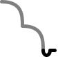 </td> 
    <td align="center">  </td> 
    <td align="center">  </td> 
</tr>
<tr>
    <td align="center">  <b>S3</b> </td> 
    <td align="center">  </td> 
    <td align="center">  </td> 
    <td align="center">  </td> 
    <td align="center">  </td> 
    <td align="center">  </td> 
    <td align="center"> 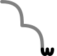 </td> 
    <td align="center">  </td> 
    <td align="center">  </td> 
</tr>
<tr>
    <td align="center">  <b>S0</b> </td> 
    <td align="center">  </td> 
    <td align="center">  </td> 
    <td align="center">  </td> 
    <td align="center">  </td> 
    <td align="center">  </td> 
    <td align="center">  </td> 
    <td align="center">  </td> 
    <td align="center">  </td> </tr>
</tbody>
</table>

Категории Протяженности и Перспективы на письме обозначаются верхним концевым элементом:

<table> 
<thead>
    <tr>
        <th >  </th><th> DEL </th> <th> PRX </th> <th> ICP </th> <th> ATV </th>  <th> GRA </th> <th> DPL </th>
    </tr>
</thead>
<tbody>
<tr>
    <td align=center rowspan=3> <b>M</b> </td>
    <td align=center> </td>
    <td align=center>  </td>
    <td align=center>  </td>
    <td align=center> 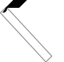 </td>
    <td align=center>  </td>
    <td align=center>  </td>
</tr>
<tr>
    <td align=center> </td>
    <td align=center>  </td>
    <td align=center>  </td>
    <td align=center>  </td>
    <td align=center>  </td>
    <td align=center>  </td>
</tr>
<tr>
    <td align=center> </td>
    <td align=center> 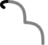 </td>
    <td align=center>  </td>
    <td align=center>  </td>
    <td align=center> 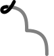 </td>
    <td align=center> 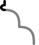 </td>
</tr>
<tr>
    <td align=center rowspan=3> <b>G</b> </td>
    <td align=center>  </td>
    <td align=center>  </td>
    <td align=center>  </td>
    <td align=center>  </td>
    <td align=center>  </td>
    <td align=center>  </td>
</tr>
<tr>
    <td align=center>  </td>
    <td align=center>  </td>
    <td align=center>  </td>
    <td align=center>  </td>
    <td align=center>  </td>
    <td align=center>  </td>
</tr>
<tr>
    <td align=center> 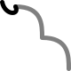 </td>
    <td align=center> 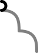 </td>
    <td align=center> 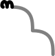 </td>
    <td align=center>  </td>
    <td align=center> 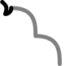 </td>
    <td align=center> 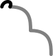 </td>
</tr>
<tr>
    <td align=center rowspan=3> <b>N</b> </td>
    <td align=center>  </td>
    <td align=center>  </td>
    <td align=center>  </td>
    <td align=center> 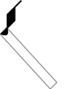 </td>
    <td align=center>  </td>
    <td align=center>  </td>
</tr>
<tr>
    <td align=center>  </td>
    <td align=center>  </td>
    <td align=center>  </td>
    <td align=center>  </td>
    <td align=center>  </td>
    <td align=center>  </td>
</tr>
<tr>
    <td align=center> 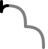 </td>
    <td align=center> 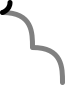 </td>
    <td align=center>  </td>
    <td align=center> 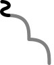 </td>
    <td align=center> 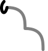 </td>
    <td align=center> 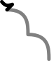 </td>
</tr>
<tr>
    <td align=center rowspan=3> <b>A</b> </td>
    <td align=center>  </td>
    <td align=center>  </td>
    <td align=center>  </td>
    <td align=center>  </td>
    <td align=center>  </td>
    <td align=center>  </td>
</tr>
<tr>
    <td align=center>  </td>
    <td align=center>  </td>
    <td align=center>  </td>
    <td align=center>  </td>
    <td align=center>  </td>
    <td align=center>  </td>
</tr>
<tr>
    <td align=center>  </td>
    <td align=center> 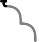 </td>
    <td align=center>  </td>
    <td align=center> 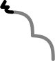 </td>
    <td align=center> 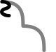 </td>
    <td align=center> 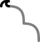 </td>
</tr>
</tbody>
</table>

### Примеры

#### Категории Спецификации и Принадлежности

Первая основа корня **-sř-** в базовой спецификации означает *комната/помещение*.

    sřala    

    (одна) комната (вне контекста целей)

    S1-"комната"-<b>CSL.UPX</b>.DEL.M.NRM

    <svg viewBox="0 -35 130 88.7750015258789" stroke-linejoin="round" stroke-linecap="round" fill="black" xmlns="http://www.w3.org/2000/svg"><g><g><g><g><path d="M 7.5 -35 l -7.5 7.5 57.5 62.5 7.5 -7.5 -57.5 -62.5 z"></path></g><g><path d="M 130 -34.975 l -10 10 l 0 20 l -35 0 l -10 10 l 29.95 29.95 l 7.5 -7.5 l -22.45 -22.45 l 30 0 l 10 -10 l 0 -30 z"></path><g><path d="M 104.95 34.974998474121094 l 7.05 -7.05 q -4.298 -1.674 -7.9 0.9 q -1.089 2.895 -0.3 4.95 l -7.5 7.55 q 16.8 -0.55 27.5 12.45 q -4.6 -18.35 -18.85 -18.8 z"></path></g></g></g></g></g></svg>

    <svg viewBox="-2.5 -37.5 140 86.25" stroke-linejoin="round" stroke-linecap="round" stroke-width="5" stroke="black" fill="none" xmlns="http://www.w3.org/2000/svg"><g><g><g><g><path d="M 0 -35 c 0 40 30 70 70 70"></path></g><g><path d="M 135 -35 c -10 55 -50 20 -50 20 c 0 45 30 50 40 50"></path><g><path d="M 125 35 l -7.5 7.5 c 7.5 -2.5 10 -2 15 3.75"></path></g></g></g></g></g></svg>

    sřanļa

    (одна) комната (имеющая определенную функцию)

    S1-"комната"-<b>ASO.UPX</b>.DEL.M.NRM

    <svg viewBox="0 -35 130 88.7750015258789" stroke-linejoin="round" stroke-linecap="round" fill="black" xmlns="http://www.w3.org/2000/svg"><g><g><g><g><path d="M 7.5 -35 l -7.5 7.5 57.5 62.5 7.5 -7.5 -57.5 -62.5 z"></path><path d="M 37.5 -27.5 l 20 20 l 7.5 -7.5 l -20 -20 l -7.5 7.5 z"></path></g><g><path d="M 130 -34.975 l -10 10 l 0 20 l -35 0 l -10 10 l 29.95 29.95 l 7.5 -7.5 l -22.45 -22.45 l 30 0 l 10 -10 l 0 -30 z"></path><g><path d="M 104.95 34.974998474121094 l 7.05 -7.05 q -4.298 -1.674 -7.9 0.9 q -1.089 2.895 -0.3 4.95 l -7.5 7.55 q 16.8 -0.55 27.5 12.45 q -4.6 -18.35 -18.85 -18.8 z"></path></g></g></g></g></g></svg>

    <svg viewBox="-2.5 -37.5 140 86.25" stroke-linejoin="round" stroke-linecap="round" stroke-width="5" stroke="black" fill="none" xmlns="http://www.w3.org/2000/svg"><g><g><g><g><path d="M 0 -35 c 0 40 30 70 70 70"></path><path d="M 50 -35 l 20 20"></path></g><g><path d="M 135 -35 c -10 55 -50 20 -50 20 c 0 45 30 50 40 50"></path><g><path d="M 125 35 l -7.5 7.5 c 7.5 -2.5 10 -2 15 3.75"></path></g></g></g></g></g></svg>

    sřarka

    здание, где все комнаты одинаковые, но служат разным (взаимодополняющим) целям; офисный центр

    S1-"комната"-<b>COA.MSC</b>.DEL.M.NRM

    <svg viewBox="0 -35 137.5 88.7750015258789" stroke-linejoin="round" stroke-linecap="round" fill="black" xmlns="http://www.w3.org/2000/svg"><g><g><g><g><path d="M 7.5 -35 l -7.5 7.5 57.5 62.5 7.5 -7.5 -57.5 -62.5 z"></path><path d="M 10 17.5 l -10 10 l 0 25 l 10 -10 l 0 -25 z"></path><path d="M 62.5 -25 l 10 -10 l -30 0 l -10 10 l 30 0 z"></path></g><g><path d="M 137.5 -34.975 l -10 10 l 0 20 l -35 0 l -10 10 l 29.95 29.95 l 7.5 -7.5 l -22.45 -22.45 l 30 0 l 10 -10 l 0 -30 z"></path><g><path d="M 112.45 34.974998474121094 l 7.05 -7.05 q -4.298 -1.674 -7.9 0.9 q -1.089 2.895 -0.3 4.95 l -7.5 7.55 q 16.8 -0.55 27.5 12.45 q -4.6 -18.35 -18.85 -18.8 z"></path></g></g></g></g></g></svg>

    <svg viewBox="-2.5 -37.5 140 86.25" stroke-linejoin="round" stroke-linecap="round" stroke-width="5" stroke="black" fill="none" xmlns="http://www.w3.org/2000/svg"><g><g><g><g><path d="M 0 -35 c 0 40 30 70 70 70"></path><path d="M 0 15 v 20"></path><path d="M 50 -35 h 20"></path></g><g><path d="M 135 -35 c -10 55 -50 20 -50 20 c 0 45 30 50 40 50"></path><g><path d="M 125 35 l -7.5 7.5 c 7.5 -2.5 10 -2 15 3.75"></path></g></g></g></g></g></svg>

    sřalža

    здание, где все сходство комнат не имеет значения, служащие одной цели; жилой дом

    S1-"комната"-<b>ASO.MFC</b>.DEL.M.NRM

    <svg viewBox="0 -35 137.5 88.7750015258789" stroke-linejoin="round" stroke-linecap="round" fill="black" xmlns="http://www.w3.org/2000/svg"><g><g><g><g><path d="M 15 -35 l -7.5 7.5 57.5 62.5 7.5 -7.5 -57.5 -62.5 z"></path><path d="M 12.5 12.5 l 12.5 12.5 l -15 0 l -10 10 l 30 0 l 10 -10 l -20 -20 l -7.5 7.5 z"></path><path d="M 45 -27.5 l 20 20 l 7.5 -7.5 l -20 -20 l -7.5 7.5 z"></path></g><g><path d="M 137.5 -34.975 l -10 10 l 0 20 l -35 0 l -10 10 l 29.95 29.95 l 7.5 -7.5 l -22.45 -22.45 l 30 0 l 10 -10 l 0 -30 z"></path><g><path d="M 112.45 34.974998474121094 l 7.05 -7.05 q -4.298 -1.674 -7.9 0.9 q -1.089 2.895 -0.3 4.95 l -7.5 7.55 q 16.8 -0.55 27.5 12.45 q -4.6 -18.35 -18.85 -18.8 z"></path></g></g></g></g></g></svg>

    <svg viewBox="-2.5 -37.5 140 86.25" stroke-linejoin="round" stroke-linecap="round" stroke-width="5" stroke="black" fill="none" xmlns="http://www.w3.org/2000/svg"><g><g><g><g><path d="M 0 -35 c 0 40 30 70 70 70"></path><path d="M 0 35 h 20 l -12.5 -15"></path><path d="M 50 -35 l 20 20"></path></g><g><path d="M 135 -35 c -10 55 -50 20 -50 20 c 0 45 30 50 40 50"></path><g><path d="M 125 35 l -7.5 7.5 c 7.5 -2.5 10 -2 15 3.75"></path></g></g></g></g></g></svg>

Для лучшего понимания примеров в корнем **-dpř-**сначала следует изучить значения его спецификаций и основ. Для первой основы:

- **BSC** *состояние/действие торговли краденными товарами, включая как предложение, так и принятие/получение/владение ими*
- **CTE** *сторона, занимающаяся владением/предложением/получением краденых товаров*; *быть этой стороной*
- **CSV** *физический акт торговли крадеными товарами*
- **OBJ** *краденый товар*

Для второй основы, спецификации имеют те же значения касательно *предложения на продажу краденых товаров*.

Для третьей основы, спецификации имею те же значения касательно *обладания крадеными товарами; получения краденых товаров*.

    adpřila

    (одна) украденная вещь (вне контекста цели)

    S1-"украденная вещь"-OBJ-<b>CSL.UPX</b>.DEL.M.NRM

    <svg viewBox="0 -53.80000305175781 130.85000610351562 106.4000015258789" stroke-linejoin="round" stroke-linecap="round" fill="black" xmlns="http://www.w3.org/2000/svg"><g><g><g><g><path d="M 47.5 35 l 7.5 -7.5 -26.9 -26.9 7.45 -7.55 -28.05 -28.05 -7.5 7.5 26.9 26.9 -7.5 7.5 28.1 28.1 z"></path></g><g><path d="M 80.05 -25 l 34.95 0 l 10 -10 l -50 0 l -10 10 l 25 25 l 0 35 l 10 -10 l 0 -30.05 l -19.95 -19.95 z"></path><g><path d="M 115 -35 q 2.55 4.45 -5 10 l 5 0 l 15.85 -15.9 l -13 -12.9 l -7 7 l 11.8 11.8 l -7.65 0 z"></path></g><g><path d="M 90 32.6 l -7.5 7.55 q 16.8 -0.55 27.5 12.45 q -4.6 -18.35 -18.85 -18.8 l 8.85 -8.8 l 0 -5 q -4.75 4.55 -10 1.5 l 0 11.1 z"></path></g></g></g></g></g></svg>

    <svg viewBox="-2.5 -47.5 130 96.25" stroke-linejoin="round" stroke-linecap="round" stroke-width="5" stroke="black" fill="none" xmlns="http://www.w3.org/2000/svg"><g><g><g><g><path d="M 0 -35 c 0 35 15 35 30 35 c 0 35 15 35 30 35"></path></g><g><path d="M 125 -35 h -50 c 0 20 10 30 30 30 v 40"></path><g><path d="M 125 -35 c 0 0 -7.5 -2.5 -7.5 -10"></path></g><g><path d="M 105 35 a -7.5 -7.5 0 0 0 -7.5 7.5 c 7.5 -2.5 10 -2 15 3.75"></path></g></g></g></g></g></svg>

    adpřiřfa

    контрабанда (всякая разная, выложенная на столе)

    S1-"украденная вещь"-OBJ-<b>VAR.MDC</b>.DEL.M.NRM

    <svg viewBox="-9.5367431640625e-7 -53.80000305175781 140.85000610351562 106.4000015258789" stroke-linejoin="round" stroke-linecap="round" fill="black" xmlns="http://www.w3.org/2000/svg"><g><g><g><g><path d="M 52.5 35 l 7.5 -7.5 -26.9 -26.9 7.45 -7.55 -28.05 -28.05 -7.5 7.5 26.9 26.9 -7.5 7.5 28.1 28.1 z"></path><path d="M 9.5367431640625e-7 27.5 l 0 25 l 20 -20 l -1.2 -1.2 l -8.8 8.8 l 0 -22.6 l -10 10 z"></path><path d="M 65 -52.5 l -10 10 l 0 25 l 10 -10 l 0 -25 z"></path></g><g><path d="M 90.05 -25 l 34.95 0 l 10 -10 l -50 0 l -10 10 l 25 25 l 0 35 l 10 -10 l 0 -30.05 l -19.95 -19.95 z"></path><g><path d="M 125 -35 q 2.55 4.45 -5 10 l 5 0 l 15.85 -15.9 l -13 -12.9 l -7 7 l 11.8 11.8 l -7.65 0 z"></path></g><g><path d="M 100 32.6 l -7.5 7.55 q 16.8 -0.55 27.5 12.45 q -4.6 -18.35 -18.85 -18.8 l 8.85 -8.8 l 0 -5 q -4.75 4.55 -10 1.5 l 0 11.1 z"></path></g></g></g></g></g></svg>

    <svg viewBox="-2.5 -47.5 130 96.25" stroke-linejoin="round" stroke-linecap="round" stroke-width="5" stroke="black" fill="none" xmlns="http://www.w3.org/2000/svg"><g><g><g><g><path d="M 0 -35 c 0 35 15 35 30 35 c 0 35 15 35 30 35"></path><path d="M 0 17.5 v 15 a 2.5 2.5 0 0 0 5 0"></path><path d="M 60 -35 v 20"></path></g><g><path d="M 125 -35 h -50 c 0 20 10 30 30 30 v 40"></path><g><path d="M 125 -35 c 0 0 -7.5 -2.5 -7.5 -10"></path></g><g><path d="M 105 35 a -7.5 -7.5 0 0 0 -7.5 7.5 c 7.5 -2.5 10 -2 15 3.75"></path></g></g></g></g></g></svg>

    edpřilza

    контрабанда на сбыт

    S2-"украденная вещь на продажу"-OBJ-<b>ASO.MFS</b>.DEL.M.NRM

    <svg viewBox="9.5367431640625e-7 -53.80000305175781 160.5 106.4000015258789" stroke-linejoin="round" stroke-linecap="round" fill="black" xmlns="http://www.w3.org/2000/svg"><g><g><g><g><path d="M 60 35 l 7.5 -7.5 -26.9 -26.9 7.45 -7.55 -28.05 -28.05 -7.5 7.5 26.9 26.9 -7.5 7.5 28.1 28.1 z"></path><path d="M 62.5 32.5 l 5 -5 l 10 10 l 7.15 -7.15 l -11.3 -11.2 l -7 7.1 l -1 1 q -3.183 -1.742 -3.85 0 q -0.916 1.293 0 6.25 z"></path><path d="M 25.850000381469727 12.500000953674316 q -0.75 -5.3 -5.4 -8.4 q -4.9 -3.3 -12.95 -3.2 l -7.5 7.5 q 14.9 0.4 18.6 8.55 q 3.75 8.2 -7.45 16.9 l 1.25 1.15 q 7.35 -5.2 10.9 -11.4 q 3.3 -5.85 2.55 -11.1 z"></path><path d="M 45 -27.5 l 20 20 l 7.5 -7.5 l -20 -20 l -7.5 7.5 z"></path></g><g><path d="M 109.7000015258789 -25 l 34.95 0 l 10 -10 l -50 0 l -10 10 l 25 25 l 0 35 l 10 -10 l 0 -30.05 l -19.95 -19.95 z"></path><g><path d="M 144.6500015258789 -35 q 2.55 4.45 -5 10 l 5 0 l 15.85 -15.9 l -13 -12.9 l -7 7 l 11.8 11.8 l -7.65 0 z"></path></g><g><path d="M 119.6500015258789 32.6 l -7.5 7.55 q 16.8 -0.55 27.5 12.45 q -4.6 -18.35 -18.85 -18.8 l 8.85 -8.8 l 0 -5 q -4.75 4.55 -10 1.5 l 0 11.1 z"></path></g></g></g></g></g></svg>

    <svg viewBox="-2.5 -47.5 145 96.25" stroke-linejoin="round" stroke-linecap="round" stroke-width="5" stroke="black" fill="none" xmlns="http://www.w3.org/2000/svg"><g><g><g><g><path d="M 0 -35 c 0 35 15 35 30 35 c 0 35 15 35 30 35"></path><path d="M 60 35 c -5 -10 12 -10 15 5"></path><path d="M 11.25 35 c 7.5 -7.5 3.75 -17.25 -11.25 -15"></path><path d="M 40 -35 l 20 20"></path></g><g><path d="M 140 -35 h -50 c 0 20 10 30 30 30 v 40"></path><g><path d="M 140 -35 c 0 0 -7.5 -2.5 -7.5 -10"></path></g><g><path d="M 120 35 a -7.5 -7.5 0 0 0 -7.5 7.5 c 7.5 -2.5 10 -2 15 3.75"></path></g></g></g></g></g></svg>

    adpřisa

    пара украденных вещей (вне контекста цели)

    S1-"украденная вещь"-OBJ-<b>CSL.DPX</b>.DEL.M.NRM

    <svg viewBox="0 -53.80000305175781 130.85000610351562 106.4000015258789" stroke-linejoin="round" stroke-linecap="round" fill="black" xmlns="http://www.w3.org/2000/svg"><g><g><g><g><path d="M 47.5 35 l 7.5 -7.5 -26.9 -26.9 7.45 -7.55 -28.05 -28.05 -7.5 7.5 26.9 26.9 -7.5 7.5 28.1 28.1 z"></path><path d="M 51.95 28.6 q -1.825 3.28 -4.45 6.4 l -7.5 7.5 l -1.2 -1.2 l 7.5 -7.5 q -1.688 -4.106 -0.35 -4.55 q 1.45 -0.6 6 -0.65 z"></path></g><g><path d="M 80.05 -25 l 34.95 0 l 10 -10 l -50 0 l -10 10 l 25 25 l 0 35 l 10 -10 l 0 -30.05 l -19.95 -19.95 z"></path><g><path d="M 115 -35 q 2.55 4.45 -5 10 l 5 0 l 15.85 -15.9 l -13 -12.9 l -7 7 l 11.8 11.8 l -7.65 0 z"></path></g><g><path d="M 90 32.6 l -7.5 7.55 q 16.8 -0.55 27.5 12.45 q -4.6 -18.35 -18.85 -18.8 l 8.85 -8.8 l 0 -5 q -4.75 4.55 -10 1.5 l 0 11.1 z"></path></g></g></g></g></g></svg>

    <svg viewBox="-2.5 -47.5 137.5 96.25" stroke-linejoin="round" stroke-linecap="round" stroke-width="5" stroke="black" fill="none" xmlns="http://www.w3.org/2000/svg"><g><g><g><g><path d="M 0 -35 c 0 35 15 35 30 35 c 0 35 15 35 30 35"></path><path d="M 60 35 a -7.5 -7.5 0 0 1 7.5 7.5"></path></g><g><path d="M 132.5 -35 h -50 c 0 20 10 30 30 30 v 40"></path><g><path d="M 132.5 -35 c 0 0 -7.5 -2.5 -7.5 -10"></path></g><g><path d="M 112.5 35 a -7.5 -7.5 0 0 0 -7.5 7.5 c 7.5 -2.5 10 -2 15 3.75"></path></g></g></g></g></g></svg>

Следующие примеры используют первую основу корня **-ksfw-**, значение которой имеет отношениe к *пиле*, как к инструменту. Спецификации этого корня подчиняются общему паттерну группы корней, относящихся к инструментам:

- **BSC** *пила; быть пилой; пилить* - [как сам инструмент, так и способ/процесс его функционирования]
- **СТЕ** *пила; быть пилой; использовать пилу* [касательно  самого инструмента]
- **CSV** *способ/процесс использования пилы* (т.е. как она работает); *использовать пилу* [касательно способа/ процесса ее функционирования]
- **OBJ** *сторона, использующая пилу; быть этой стороной*

    aksfwulá

    (кто-то) пильнул (один раз и не специально)

    S1-"пила"-DYN-<b>CSL.UPX</b>.DEL.M.NRM-OBS

    <svg viewBox="0 -44.974998474121094 199.89999389648438 104.9749984741211" stroke-linejoin="round" stroke-linecap="round" fill="black" xmlns="http://www.w3.org/2000/svg"><g><g><g><g><path d="M 7.5 -35 l -7.5 7.5 57.5 62.5 7.5 -7.5 -57.5 -62.5 z"></path><path d="M 54.9 25 q -1.655 2.716 2.6 10 l 15 0 l 10 -10 l -20 0 q -7.015 -2.931 -7.6 0 z"></path><path d="M 17.5 52.5 l 7.5 7.5 l 7.5 -7.5 l -7.5 -7.5 l -7.5 7.5 z"></path></g><g><path d="M 147.5 -34.975 l -10 10 l 0 20 l -35 0 l -10 10 l 29.95 29.95 l 7.5 -7.5 l -22.45 -22.45 l 30 0 l 10 -10 l 0 -30 z"></path><g><path d="M 159.9 -44.974998474121094 l -22.4 0 l -10 10.1 l 19.9 0 l 0.1 -0.1 l 0 0.1 l -0.05 0 l -9.95 9.9 l 0 5 q 5 -5.774 10 -5 l 0 -7.55 l 12.4 -12.4 z"></path></g><g><path d="M 146.15 46.324998474121095 q 0.35 -21.9 -9.85 -27.5 l -6.3 6.35 l -2 2 q -8.054 -2.82 -4.35 6.65 l 6.3 -6.35 q 10.8 2.6 16.2 18.85 z"></path></g></g><g><path d="M 189.89999389648438 -11.15 l -10 10 l 0 -33.85 l -10 10 l 0 36.2 l 10 -9.95 l 0 33.75 l 10 -10 l 0 -36.15 z"></path><g><path d="M 183.59999389648436 51.4 l 16.3 -16.3 l 0 -22.45 l -10 10 l 0 -5.15 q -5 6.1 -10 2.5 l 0 15 l 10 -10 l 0 17.7 l -7.5 7.5 l 1.2 1.2 z"></path></g></g></g></g></g></svg>

    <svg viewBox="-2.5 -47.5 192.0833282470703 101" stroke-linejoin="round" stroke-linecap="round" stroke-width="5" stroke="black" fill="none" xmlns="http://www.w3.org/2000/svg"><g><g><g><g><path d="M 0 -35 c 0 40 30 70 70 70"></path><path d="M 70 35 c 15 0 3.75 -22.5 -11.25 7.5"></path><path d="M 28.25 45.75 a -0.75 -0.75 0 0 0 -0.75 -0.75 a -0.75 -0.75 0 0 0 -0.75 0.75 a -0.75 -0.75 0 0 0 0.75 0.75 a -0.75 -0.75 0 0 0 0.75 -0.75"></path></g><g><path d="M 142.0833282470703 -35 c -10 55 -50 20 -50 20 c 0 45 30 50 40 50"></path><g><path d="M 142.0833282470703 -35 a 10 10 0 0 1 10 -10 h -15"></path></g><g><path d="M 132.0833282470703 35 c 5 -20 15 0 5 10"></path></g></g><g><path d="M 167.0833282470703 -35 v 42.5 l 10 -15 v 42.5"></path><g><path d="M 177.0833282470703 35 a -5 -6 0 0 0 10 0 v 6 a -10 -10 0 0 1 -10 10"></path></g></g></g></g></g></svg>

    aksfwulsá

    (кто-то) пильнул (сделал движение пилой вперед и назад)

    S1-"пила"-DYN-<b>ASO.DPX</b>.DEL.M.NRM-OBS

    <svg viewBox="0 -44.974998474121094 199.89999389648438 104.9749984741211" stroke-linejoin="round" stroke-linecap="round" fill="black" xmlns="http://www.w3.org/2000/svg"><g><g><g><g><path d="M 7.5 -35 l -7.5 7.5 57.5 62.5 7.5 -7.5 -57.5 -62.5 z"></path><path d="M 54.9 25 q -1.65 2.7 2.6 10 l 12.6 0 l -7.5 7.5 l 1.2 1.2 l 18.7 -18.7 l -20 0 q -7 -2.95 -7.6 0 z"></path><path d="M 37.5 -27.5 l 20 20 l 7.5 -7.5 l -20 -20 l -7.5 7.5 z"></path><path d="M 17.5 52.5 l 7.5 7.5 l 7.5 -7.5 l -7.5 -7.5 l -7.5 7.5 z"></path></g><g><path d="M 147.5 -34.975 l -10 10 l 0 20 l -35 0 l -10 10 l 29.95 29.95 l 7.5 -7.5 l -22.45 -22.45 l 30 0 l 10 -10 l 0 -30 z"></path><g><path d="M 159.9 -44.974998474121094 l -22.4 0 l -10 10.1 l 19.9 0 l 0.1 -0.1 l 0 0.1 l -0.05 0 l -9.95 9.9 l 0 5 q 5 -5.774 10 -5 l 0 -7.55 l 12.4 -12.4 z"></path></g><g><path d="M 146.15 46.324998474121095 q 0.35 -21.9 -9.85 -27.5 l -6.3 6.35 l -2 2 q -8.054 -2.82 -4.35 6.65 l 6.3 -6.35 q 10.8 2.6 16.2 18.85 z"></path></g></g><g><path d="M 189.89999389648438 -11.15 l -10 10 l 0 -33.85 l -10 10 l 0 36.2 l 10 -9.95 l 0 33.75 l 10 -10 l 0 -36.15 z"></path><g><path d="M 183.59999389648436 51.4 l 16.3 -16.3 l 0 -22.45 l -10 10 l 0 -5.15 q -5 6.1 -10 2.5 l 0 15 l 10 -10 l 0 17.7 l -7.5 7.5 l 1.2 1.2 z"></path></g></g></g></g></g></svg>

    <svg viewBox="-2.5 -47.5 192 103" stroke-linejoin="round" stroke-linecap="round" stroke-width="5" stroke="black" fill="none" xmlns="http://www.w3.org/2000/svg"><g><g><g><g><path d="M 0 -35 c 0 40 30 70 70 70"></path><path d="M 70 35 a -7 -5 0 0 1 0 10 v 8"></path><path d="M 50 -35 l 20 20"></path><path d="M 28.25 45.75 a -0.75 -0.75 0 0 0 -0.75 -0.75 a -0.75 -0.75 0 0 0 -0.75 0.75 a -0.75 -0.75 0 0 0 0.75 0.75 a -0.75 -0.75 0 0 0 0.75 -0.75"></path></g><g><path d="M 142 -35 c -10 55 -50 20 -50 20 c 0 45 30 50 40 50"></path><g><path d="M 142 -35 a 10 10 0 0 1 10 -10 h -15"></path></g><g><path d="M 132 35 c 5 -20 15 0 5 10"></path></g></g><g><path d="M 167 -35 v 42.5 l 10 -15 v 42.5"></path><g><path d="M 177 35 a -5 -6 0 0 0 10 0 v 6 a -10 -10 0 0 1 -10 10"></path></g></g></g></g></g></svg>

    aksfwulká

    (кто-то) пилит (акты пиления сменяют друг друга)

    S1-"пила"-DYN-<b>ASO.MSC</b>.DEL.M.NRM-OBS

    <svg viewBox="0 -44.974998474121094 199.89999389648438 104.9749984741211" stroke-linejoin="round" stroke-linecap="round" fill="black" xmlns="http://www.w3.org/2000/svg"><g><g><g><g><path d="M 7.5 -35 l -7.5 7.5 57.5 62.5 7.5 -7.5 -57.5 -62.5 z"></path><path d="M 54.9 25 q -1.655 2.716 2.6 10 l 15 0 l 10 -10 l -20 0 q -7.015 -2.931 -7.6 0 z"></path><path d="M 10 17.5 l -10 10 l 0 25 l 10 -10 l 0 -25 z"></path><path d="M 37.5 -27.5 l 20 20 l 7.5 -7.5 l -20 -20 l -7.5 7.5 z"></path><path d="M 17.5 52.5 l 7.5 7.5 l 7.5 -7.5 l -7.5 -7.5 l -7.5 7.5 z"></path></g><g><path d="M 147.5 -34.975 l -10 10 l 0 20 l -35 0 l -10 10 l 29.95 29.95 l 7.5 -7.5 l -22.45 -22.45 l 30 0 l 10 -10 l 0 -30 z"></path><g><path d="M 159.9 -44.974998474121094 l -22.4 0 l -10 10.1 l 19.9 0 l 0.1 -0.1 l 0 0.1 l -0.05 0 l -9.95 9.9 l 0 5 q 5 -5.774 10 -5 l 0 -7.55 l 12.4 -12.4 z"></path></g><g><path d="M 146.15 46.324998474121095 q 0.35 -21.9 -9.85 -27.5 l -6.3 6.35 l -2 2 q -8.054 -2.82 -4.35 6.65 l 6.3 -6.35 q 10.8 2.6 16.2 18.85 z"></path></g></g><g><path d="M 189.89999389648438 -11.15 l -10 10 l 0 -33.85 l -10 10 l 0 36.2 l 10 -9.95 l 0 33.75 l 10 -10 l 0 -36.15 z"></path><g><path d="M 183.59999389648436 51.4 l 16.3 -16.3 l 0 -22.45 l -10 10 l 0 -5.15 q -5 6.1 -10 2.5 l 0 15 l 10 -10 l 0 17.7 l -7.5 7.5 l 1.2 1.2 z"></path></g></g></g></g></g></svg>

    <svg viewBox="-2.5 -47.5 192.0833282470703 101" stroke-linejoin="round" stroke-linecap="round" stroke-width="5" stroke="black" fill="none" xmlns="http://www.w3.org/2000/svg"><g><g><g><g><path d="M 0 -35 c 0 40 30 70 70 70"></path><path d="M 70 35 c 15 0 3.75 -22.5 -11.25 7.5"></path><path d="M 0 15 v 20"></path><path d="M 50 -35 l 20 20"></path><path d="M 28.25 45.75 a -0.75 -0.75 0 0 0 -0.75 -0.75 a -0.75 -0.75 0 0 0 -0.75 0.75 a -0.75 -0.75 0 0 0 0.75 0.75 a -0.75 -0.75 0 0 0 0.75 -0.75"></path></g><g><path d="M 142.0833282470703 -35 c -10 55 -50 20 -50 20 c 0 45 30 50 40 50"></path><g><path d="M 142.0833282470703 -35 a 10 10 0 0 1 10 -10 h -15"></path></g><g><path d="M 132.0833282470703 35 c 5 -20 15 0 5 10"></path></g></g><g><path d="M 167.0833282470703 -35 v 42.5 l 10 -15 v 42.5"></path><g><path d="M 177.0833282470703 35 a -5 -6 0 0 0 10 0 v 6 a -10 -10 0 0 1 -10 10"></path></g></g></g></g></g></svg>

    aksfwuřțá

    (кто-то) балуется с пилой (пилит по-всякому по разным причитам то там то тут)

    S1-"пила"-DYN-<b>VAR.MDS</b>.DEL.M.NRM-OBS

    <svg viewBox="0 -52.5 207.39999389648438 112.5" stroke-linejoin="round" stroke-linecap="round" fill="black" xmlns="http://www.w3.org/2000/svg"><g><g><g><g><path d="M 15 -35 l -7.5 7.5 57.5 62.5 7.5 -7.5 -57.5 -62.5 z"></path><path d="M 62.4 25 q -1.655 2.716 2.6 10 l 15 0 l 10 -10 l -20 0 q -7.015 -2.931 -7.6 0 z"></path><path d="M 12.399999618530273 25 l 8.8 -8.8 l -1.2 -1.2 l -20 20 l 30 0 l 10 -10 l -27.6 0 z"></path><path d="M 72.5 -52.5 l -10 10 l 0 25 l 10 -10 l 0 -25 z"></path><path d="M 25 52.5 l 7.5 7.5 l 7.5 -7.5 l -7.5 -7.5 l -7.5 7.5 z"></path></g><g><path d="M 155 -34.975 l -10 10 l 0 20 l -35 0 l -10 10 l 29.95 29.95 l 7.5 -7.5 l -22.45 -22.45 l 30 0 l 10 -10 l 0 -30 z"></path><g><path d="M 167.4 -44.974998474121094 l -22.4 0 l -10 10.1 l 19.9 0 l 0.1 -0.1 l 0 0.1 l -0.05 0 l -9.95 9.9 l 0 5 q 5 -5.774 10 -5 l 0 -7.55 l 12.4 -12.4 z"></path></g><g><path d="M 153.65 46.324998474121095 q 0.35 -21.9 -9.85 -27.5 l -6.3 6.35 l -2 2 q -8.054 -2.82 -4.35 6.65 l 6.3 -6.35 q 10.8 2.6 16.2 18.85 z"></path></g></g><g><path d="M 197.39999389648438 -11.15 l -10 10 l 0 -33.85 l -10 10 l 0 36.2 l 10 -9.95 l 0 33.75 l 10 -10 l 0 -36.15 z"></path><g><path d="M 191.09999389648436 51.4 l 16.3 -16.3 l 0 -22.45 l -10 10 l 0 -5.15 q -5 6.1 -10 2.5 l 0 15 l 10 -10 l 0 17.7 l -7.5 7.5 l 1.2 1.2 z"></path></g></g></g></g></g></svg>

    <svg viewBox="-2.5 -47.5 192.0833282470703 101" stroke-linejoin="round" stroke-linecap="round" stroke-width="5" stroke="black" fill="none" xmlns="http://www.w3.org/2000/svg"><g><g><g><g><path d="M 0 -35 c 0 40 30 70 70 70"></path><path d="M 70 35 c 15 0 3.75 -22.5 -11.25 7.5"></path><path d="M 17.5 35 h -15 a 2.5 2.5 0 0 1 0 -5"></path><path d="M 70 -35 v 20"></path><path d="M 28.25 45.75 a -0.75 -0.75 0 0 0 -0.75 -0.75 a -0.75 -0.75 0 0 0 -0.75 0.75 a -0.75 -0.75 0 0 0 0.75 0.75 a -0.75 -0.75 0 0 0 0.75 -0.75"></path></g><g><path d="M 142.0833282470703 -35 c -10 55 -50 20 -50 20 c 0 45 30 50 40 50"></path><g><path d="M 142.0833282470703 -35 a 10 10 0 0 1 10 -10 h -15"></path></g><g><path d="M 132.0833282470703 35 c 5 -20 15 0 5 10"></path></g></g><g><path d="M 167.0833282470703 -35 v 42.5 l 10 -15 v 42.5"></path><g><path d="M 177.0833282470703 35 a -5 -6 0 0 0 10 0 v 6 a -10 -10 0 0 1 -10 10"></path></g></g></g></g></g></svg>

Обратите внимание: несмотря на то что Естественная Принадлежность ставится "по-умолчанию" как фонетически так и на письме, для глагола "пилить" она не является типичным случаем: обычно люди пилят с какой-то целью. Это было продемострировано на примерах выше.

Корень **-gř-** приблизительно означает *кость*. Три основы этого корня указывают на кости разной формы (цилиндрическую, плоскую, сложную форму), в нашем примере мы будем использовать нулевую основу. Спецификации этого корня подчиняются общему паттерну спецификаций для частей тела:

- **BSC** *кость; быть костью* (как материальный, так и функциональный аспект этого явления)
- **CTE** *функция кости; быть этой функцией*
- **CSV** *физическое материальное строение кости; быть этим строением*
- **OBJ** *тело, которому принадлежит кость; быть этим телом*

    ogřala

    (одна) кость (вне контекста функции)

    S0-"кость"-<b>CSL.UPX</b>.DEL.M.NRM

    <svg viewBox="0 -35 180.75 88.72499084472656" stroke-linejoin="round" stroke-linecap="round" fill="black" xmlns="http://www.w3.org/2000/svg"><g><g><g><g><path d="M 7.5 -35 l -7.5 7.5 57.5 62.5 7.5 -7.5 -57.5 -62.5 z"></path><path d="M 65 27.5 l 15.05 0 l 10 -10 l -17.45 0 l -8.75 8.8 q -6.9 -0.2 -3.8 6.15 l 4.95 -4.95 z"></path></g><g><path d="M 165.7 -24.925 l 10 -10 l -65.75 0 l -9.9 9.95 l 30.45 37.55 l 7.25 -7.3 l 24.15 29.65 l 7.45 -7.4 l -25.2 -31.05 l -7.5 7.45 l -23.1 -28.85 l 52.15 0 z"></path><g><path d="M 161.9 34.92499923706055 l 7.05 -7.05 q -4.298 -1.674 -7.9 0.9 q -1.089 2.895 -0.3 4.95 l -7.5 7.55 q 16.8 -0.55 27.5 12.45 q -4.6 -18.35 -18.85 -18.8 z"></path></g></g></g></g></g></svg>

    <svg viewBox="-2.5 -37.5 160 86.25" stroke-linejoin="round" stroke-linecap="round" stroke-width="5" stroke="black" fill="none" xmlns="http://www.w3.org/2000/svg"><g><g><g><g><path d="M 0 -35 c 0 40 30 70 70 70"></path><path d="M 70 35 a -5 -5 0 0 0 0 -10 h 10"></path></g><g><path d="M 155 -35 h -60 c 0 35 25 35 25 35 a 7.5 7.5 0 0 1 7.5 -7.5 c 20 0 17.5 42.5 17.5 42.5"></path><g><path d="M 145 35 a -7.5 -7.5 0 0 0 -7.5 7.5 c 7.5 -2.5 10 -2 15 3.75"></path></g></g></g></g></g></svg>

    ogřarfa

    скелет

    S0-"кость"-<b>COA.MDC</b>.DEL.M.NRM

    <svg viewBox="-9.5367431640625e-7 -35 180.75 88.72499084472656" stroke-linejoin="round" stroke-linecap="round" fill="black" xmlns="http://www.w3.org/2000/svg"><g><g><g><g><path d="M 7.5 -35 l -7.5 7.5 57.5 62.5 7.5 -7.5 -57.5 -62.5 z"></path><path d="M 65 27.5 l 15.05 0 l 10 -10 l -17.45 0 l -8.75 8.8 q -6.9 -0.2 -3.8 6.15 l 4.95 -4.95 z"></path><path d="M 9.5367431640625e-7 27.5 l 0 25 l 20 -20 l -1.2 -1.2 l -8.8 8.8 l 0 -22.6 l -10 10 z"></path><path d="M 62.5 -25 l 10 -10 l -30 0 l -10 10 l 30 0 z"></path></g><g><path d="M 165.7 -24.925 l 10 -10 l -65.75 0 l -9.9 9.95 l 30.45 37.55 l 7.25 -7.3 l 24.15 29.65 l 7.45 -7.4 l -25.2 -31.05 l -7.5 7.45 l -23.1 -28.85 l 52.15 0 z"></path><g><path d="M 161.9 34.92499923706055 l 7.05 -7.05 q -4.298 -1.674 -7.9 0.9 q -1.089 2.895 -0.3 4.95 l -7.5 7.55 q 16.8 -0.55 27.5 12.45 q -4.6 -18.35 -18.85 -18.8 z"></path></g></g></g></g></g></svg>

    <svg viewBox="-2.5 -37.5 160 86.25" stroke-linejoin="round" stroke-linecap="round" stroke-width="5" stroke="black" fill="none" xmlns="http://www.w3.org/2000/svg"><g><g><g><g><path d="M 0 -35 c 0 40 30 70 70 70"></path><path d="M 70 35 a -5 -5 0 0 0 0 -10 h 10"></path><path d="M 0 17.5 v 15 a 2.5 2.5 0 0 0 5 0"></path><path d="M 50 -35 h 20"></path></g><g><path d="M 155 -35 h -60 c 0 35 25 35 25 35 a 7.5 7.5 0 0 1 7.5 -7.5 c 20 0 17.5 42.5 17.5 42.5"></path><g><path d="M 145 35 a -7.5 -7.5 0 0 0 -7.5 7.5 c 7.5 -2.5 10 -2 15 3.75"></path></g></g></g></g></g></svg>

    ogřarța

    (разбросанные разные) кости (лежат тут по задумке)

    S0-"кость"-<b>COA.MDS</b>.DEL.M.NRM

    <svg viewBox="0 -35 188.25 88.72499084472656" stroke-linejoin="round" stroke-linecap="round" fill="black" xmlns="http://www.w3.org/2000/svg"><g><g><g><g><path d="M 15 -35 l -7.5 7.5 57.5 62.5 7.5 -7.5 -57.5 -62.5 z"></path><path d="M 72.5 27.5 l 15.05 0 l 10 -10 l -17.45 0 l -8.75 8.8 q -6.9 -0.2 -3.8 6.15 l 4.95 -4.95 z"></path><path d="M 12.399999618530273 25 l 8.8 -8.8 l -1.2 -1.2 l -20 20 l 30 0 l 10 -10 l -27.6 0 z"></path><path d="M 70 -25 l 10 -10 l -30 0 l -10 10 l 30 0 z"></path></g><g><path d="M 173.2 -24.925 l 10 -10 l -65.75 0 l -9.9 9.95 l 30.45 37.55 l 7.25 -7.3 l 24.15 29.65 l 7.45 -7.4 l -25.2 -31.05 l -7.5 7.45 l -23.1 -28.85 l 52.15 0 z"></path><g><path d="M 169.4 34.92499923706055 l 7.05 -7.05 q -4.298 -1.674 -7.9 0.9 q -1.089 2.895 -0.3 4.95 l -7.5 7.55 q 16.8 -0.55 27.5 12.45 q -4.6 -18.35 -18.85 -18.8 z"></path></g></g></g></g></g></svg>

    <svg viewBox="-2.5 -37.5 160 86.25" stroke-linejoin="round" stroke-linecap="round" stroke-width="5" stroke="black" fill="none" xmlns="http://www.w3.org/2000/svg"><g><g><g><g><path d="M 0 -35 c 0 40 30 70 70 70"></path><path d="M 70 35 a -5 -5 0 0 0 0 -10 h 10"></path><path d="M 17.5 35 h -15 a 2.5 2.5 0 0 1 0 -5"></path><path d="M 50 -35 h 20"></path></g><g><path d="M 155 -35 h -60 c 0 35 25 35 25 35 a 7.5 7.5 0 0 1 7.5 -7.5 c 20 0 17.5 42.5 17.5 42.5"></path><g><path d="M 145 35 a -7.5 -7.5 0 0 0 -7.5 7.5 c 7.5 -2.5 10 -2 15 3.75"></path></g></g></g></g></g></svg>

Третья основа корня **-ḑḑ-** приблизительно означает *кома*. Точное значение зависит от спецификации:

- **BSC** *состояние комы; действие, приводящее к погружению в кому; быть этим состоянием или действием; быть в коме*
- **CTE** *состояние комы; быть в этом состоянии*
- **CSV** *состояние/действие погружение в кому; быть этим состоянием/действием; впадать в кому; погружать (кого-то) в кому*
- **OBJ** *качество/длительность/описание чьей-то комы; быть этим качеством/длительностью/описанием;*

    üḑḑaňá

    (один раз) впать в кому из-за разных обстоятельств

    S3.CPT-"кома"-<b>VAR.UPX</b>.DEL.M.NRM-OBS

    <svg viewBox="0 -52.5 135 112.54999542236328" stroke-linejoin="round" stroke-linecap="round" fill="black" xmlns="http://www.w3.org/2000/svg"><g><g><g><g><path d="M 7.5 -35 l -7.5 7.5 57.5 62.5 7.5 -7.5 -57.5 -62.5 z"></path><path d="M 57.5 35 l 7.5 -7.5 q -11.45 -4.9 -8.7 6.3 l -8.8 8.9 l 0 17.35 l 10 -10 l 0 -15.05 z"></path><path d="M 65 -52.5 l -10 10 l 0 25 l 10 -10 l 0 -25 z"></path><path d="M 17.5 52.5 l 7.5 7.5 l 7.5 -7.5 l -7.5 -7.5 l -7.5 7.5 z"></path></g><g><path d="M 135 -34.925 l -50 0 l -10 10 l 0 40 l 9.55 -9.55 l 20.65 29.4 l 7.65 -7.65 l -21.65 -30.8 l -6.2 6.2 l 0 -27.6 l 40 0 l 10 -10 z"></path><g><path d="M 125.2 24.924999237060547 l -15 0 q -7 -2.95 -7.6 0 q -1.65 2.7 2.6 10 l 10 0 l 0 15 l 10 -10 l 0 -15 z"></path></g></g></g></g></g></svg>

    <svg viewBox="-2.5 -37.5 150 86.5" stroke-linejoin="round" stroke-linecap="round" stroke-width="5" stroke="black" fill="none" xmlns="http://www.w3.org/2000/svg"><g><g><g><g><path d="M 0 -35 c 0 40 30 70 70 70"></path><path d="M 70 35 c 0 0 -7.5 2.5 -7.5 10"></path><path d="M 70 -35 v 20"></path><path d="M 28.25 45.75 a -0.75 -0.75 0 0 0 -0.75 -0.75 a -0.75 -0.75 0 0 0 -0.75 0.75 a -0.75 -0.75 0 0 0 0.75 0.75 a -0.75 -0.75 0 0 0 0.75 -0.75"></path></g><g><path d="M 145 -35 c -50 0 -50 20 -50 40 l -10 -10 c 40 -10 40 40 40 40"></path><g><path d="M 125 35 h 10 v 7.5"></path></g></g></g></g></g></svg>

    üḑḑanļá

    (один раз) впасть в кому по какой-то умышленной причине ИЛИ (один раз) ввести в кому (кого-то)

    S3.CPT-"кома"-<b>ASO.UPX</b>.DEL.M.NRM-OBS

    <svg viewBox="0 -35 135 95.04999542236328" stroke-linejoin="round" stroke-linecap="round" fill="black" xmlns="http://www.w3.org/2000/svg"><g><g><g><g><path d="M 7.5 -35 l -7.5 7.5 57.5 62.5 7.5 -7.5 -57.5 -62.5 z"></path><path d="M 57.5 35 l 7.5 -7.5 q -11.45 -4.9 -8.7 6.3 l -8.8 8.9 l 0 17.35 l 10 -10 l 0 -15.05 z"></path><path d="M 37.5 -27.5 l 20 20 l 7.5 -7.5 l -20 -20 l -7.5 7.5 z"></path><path d="M 17.5 52.5 l 7.5 7.5 l 7.5 -7.5 l -7.5 -7.5 l -7.5 7.5 z"></path></g><g><path d="M 135 -34.925 l -50 0 l -10 10 l 0 40 l 9.55 -9.55 l 20.65 29.4 l 7.65 -7.65 l -21.65 -30.8 l -6.2 6.2 l 0 -27.6 l 40 0 l 10 -10 z"></path><g><path d="M 125.2 24.924999237060547 l -15 0 q -7 -2.95 -7.6 0 q -1.65 2.7 2.6 10 l 10 0 l 0 15 l 10 -10 l 0 -15 z"></path></g></g></g></g></g></svg>

    <svg viewBox="-2.5 -37.5 150 86.5" stroke-linejoin="round" stroke-linecap="round" stroke-width="5" stroke="black" fill="none" xmlns="http://www.w3.org/2000/svg"><g><g><g><g><path d="M 0 -35 c 0 40 30 70 70 70"></path><path d="M 70 35 c 0 0 -7.5 2.5 -7.5 10"></path><path d="M 50 -35 l 20 20"></path><path d="M 28.25 45.75 a -0.75 -0.75 0 0 0 -0.75 -0.75 a -0.75 -0.75 0 0 0 -0.75 0.75 a -0.75 -0.75 0 0 0 0.75 0.75 a -0.75 -0.75 0 0 0 0.75 -0.75"></path></g><g><path d="M 145 -35 c -50 0 -50 20 -50 40 l -10 -10 c 40 -10 40 40 40 40"></path><g><path d="M 125 35 h 10 v 7.5"></path></g></g></g></g></g></svg>

    üḑḑalá

    (один раз) впасть в кому (от болезни, пострадав и т.п.)

    S3.CPT-"кома"-<b>CSL.UPX</b>.DEL.M.NRM-OBS

    <svg viewBox="0 -35 135 95.04999542236328" stroke-linejoin="round" stroke-linecap="round" fill="black" xmlns="http://www.w3.org/2000/svg"><g><g><g><g><path d="M 7.5 -35 l -7.5 7.5 57.5 62.5 7.5 -7.5 -57.5 -62.5 z"></path><path d="M 57.5 35 l 7.5 -7.5 q -11.45 -4.9 -8.7 6.3 l -8.8 8.9 l 0 17.35 l 10 -10 l 0 -15.05 z"></path><path d="M 17.5 52.5 l 7.5 7.5 l 7.5 -7.5 l -7.5 -7.5 l -7.5 7.5 z"></path></g><g><path d="M 135 -34.925 l -50 0 l -10 10 l 0 40 l 9.55 -9.55 l 20.65 29.4 l 7.65 -7.65 l -21.65 -30.8 l -6.2 6.2 l 0 -27.6 l 40 0 l 10 -10 z"></path><g><path d="M 125.2 24.924999237060547 l -15 0 q -7 -2.95 -7.6 0 q -1.65 2.7 2.6 10 l 10 0 l 0 15 l 10 -10 l 0 -15 z"></path></g></g></g></g></g></svg>

    <svg viewBox="-2.5 -37.5 150 86.5" stroke-linejoin="round" stroke-linecap="round" stroke-width="5" stroke="black" fill="none" xmlns="http://www.w3.org/2000/svg"><g><g><g><g><path d="M 0 -35 c 0 40 30 70 70 70"></path><path d="M 70 35 c 0 0 -7.5 2.5 -7.5 10"></path><path d="M 28.25 45.75 a -0.75 -0.75 0 0 0 -0.75 -0.75 a -0.75 -0.75 0 0 0 -0.75 0.75 a -0.75 -0.75 0 0 0 0.75 0.75 a -0.75 -0.75 0 0 0 0.75 -0.75"></path></g><g><path d="M 145 -35 c -50 0 -50 20 -50 40 l -10 -10 c 40 -10 40 40 40 40"></path><g><path d="M 125 35 h 10 v 7.5"></path></g></g></g></g></g></svg>

#### Категория протяженности

    Lḑazá ackhali'a.

    На острове есть лес.

    S1-"дерево"-CSL.MFS.<b>DEL</b>.M.NRM-OBS S1-"остров"-CSL.UPX.<b>DEL</b>.M.NRM-LOC

    <svg viewBox="9.5367431640625e-7 -75.0250015258789 324.5500183105469 141.39999389648438" stroke-linejoin="round" stroke-linecap="round" fill="black" xmlns="http://www.w3.org/2000/svg"><g><g><g><g><path d="M 15 -35 l -7.5 7.5 57.5 62.5 7.5 -7.5 -57.5 -62.5 z"></path><path d="M 25.850000381469727 12.500000953674316 q -0.75 -5.3 -5.4 -8.4 q -4.9 -3.3 -12.95 -3.2 l -7.5 7.5 q 14.9 0.4 18.6 8.55 q 3.75 8.2 -7.45 16.9 l 1.25 1.15 q 7.35 -5.2 10.9 -11.4 q 3.3 -5.85 2.55 -11.1 z"></path><path d="M 25 52.5 l 7.5 7.5 l 7.5 -7.5 l -7.5 -7.5 l -7.5 7.5 z"></path></g><g><path d="M 97.5 -35 l -10 10 l 0 35 l 19.95 0 l -24.95 25 l 40 0 l 10 -10 l -37.6 0 l 24.85 -25 l -22.25 0 l 0 -35 z"></path><g><path d="M 112.05 35 l 10.45 0 l 16.35 -16.35 q -8.942 -4.256 -7.9 -14.9 q -8.313 8.782 -0.75 21.25 l -13.35 0 q 4.7 5.2 -4.8 10 z"></path></g></g><g><path d="M 156.35000610351562 -35 l -7.5 7.5 57.5 62.5 7.5 -7.5 -57.5 -62.5 z"></path></g><g><path d="M 233.7500030517578 -35.025 l -9.9 9.95 l 47.35 58.35 l 0.05 0 l 1.4 1.75 l 7.5 -7.5 l -42.7 -52.55 l 52.05 0 l 10 -10 l -65.75 0 z"></path><g><path d="M 299.5000030517578 -35.025001525878906 l 12.65 0 l -7.5 7.5 l 1.2 1.2 l 18.7 -18.7 l -17.45 0 l -9.95 10 l -7.6 0 q 4.95 4.2 -6.25 10 l 6.25 0 l 9.95 -10 z"></path></g><g><path d="M 255.1500030517578 65.17500152587891 l 1.2 1.2 l 16.3 -16.3 l 0 -15.05 l 7.5 -7.5 q -11.45 -4.9 -8.7 6.3 l -8.8 8.9 l 0 14.95 l -7.5 7.5 z"></path></g><path d="M 266.600004196167 -65.0250015258789 l 8.8 -8.8 l -1.2 -1.2 l -20 20 l 30 0 l 10 -10 l -27.6 0 z"></path></g></g></g></g></svg>

    <svg viewBox="-2.5 -60.34609603881836 316.9947814941406 117.84609985351562" stroke-linejoin="round" stroke-linecap="round" stroke-width="5" stroke="black" fill="none" xmlns="http://www.w3.org/2000/svg"><g><g><g><g><path d="M 0 -35 c 0 40 30 70 70 70"></path><path d="M 11.25 35 c 7.5 -7.5 3.75 -17.25 -11.25 -15"></path><path d="M 28.25 45.75 a -0.75 -0.75 0 0 0 -0.75 -0.75 a -0.75 -0.75 0 0 0 -0.75 0.75 a -0.75 -0.75 0 0 0 0.75 0.75 a -0.75 -0.75 0 0 0 0.75 -0.75"></path></g><g><path d="M 85 -35 v 35 c 60 0 0 35 0 35 h 50"></path><g><path d="M 135 35 a -7.5 -7.5 0 0 1 0 -15"></path></g></g><g><path d="M 150 -35 c 0 40 30 70 70 70"></path></g><g><path d="M 296.9862976074219 -35 h -60 c -10 50 20 70 40 70"></path><g><path d="M 296.9862976074219 -35 c 0 -10 7.5 -10 7.5 0 c 0 -10 7.5 -10 7.5 -2.5 a -2.5 -2.5 0 0 1 -1.5 2.5"></path></g><g><path d="M 276.9862976074219 35 c 10 0 15 7 5 10 c -10 3 -5 10 5 10"></path></g><path d="M 282.2473831176758 -52.84609603881836 h -15 a 2.5 2.5 0 0 1 0 -5"></path></g></g></g></g></svg>

В этом примере лес и остров рассматриваются целиком, вместе с границами.

    Eguldá ebzalu lḑazti'o.

    Заяц бежит по лесу.

    S2-"бежать"-DYN-ASO.UPX.<b>PRX</b>.M.NRM-OBS S2-"заяц"-CSL.UPX.<b>DEL</b>.M.NRM-IND S1-"дерево"-CSL.MFS.<b>PRX</b>.M.NRM-LOC

    <svg viewBox="-4.76837158203125e-7 -65 481.0999755859375 150.4029541015625" stroke-linejoin="round" stroke-linecap="round" fill="black" xmlns="http://www.w3.org/2000/svg"><g><g><g><g><path d="M 15 -35 l -7.5 7.5 57.5 62.5 7.5 -7.5 -57.5 -62.5 z"></path><path d="M 13.899999999999999 -31.95 q -3.28 1.825 -6.4 4.45 l -7.5 7.5 l 1.2 1.2 l 7.5 -7.5 q 4.106 1.688 4.55 0.35 q 0.6 -1.45 0.65 -6 z"></path><path d="M 85 25 l -15 0 q -7 -2.95 -7.6 0 q -1.65 2.7 2.6 10 l 10 0 l 0 15 l 10 -10 l 0 -15 z"></path><path d="M 45 -27.5 l 20 20 l 7.5 -7.5 l -20 -20 l -7.5 7.5 z"></path><path d="M 25 52.5 l 7.5 7.5 l 7.5 -7.5 l -7.5 -7.5 l -7.5 7.5 z"></path></g><g><path d="M 160.64999694824218 -24.925 l 10 -10 l -65.75 0 l -9.9 9.95 l 30.45 37.55 l 7.25 -7.3 l 24.15 29.65 l 7.45 -7.4 l -25.2 -31.05 l -7.5 7.45 l -23.1 -28.85 l 52.15 0 z"></path></g><g><path d="M 188.14999389648438 -35 l -7.5 7.5 57.5 62.5 7.5 -7.5 -57.5 -62.5 z"></path><path d="M 240.64999389648438 32.5 l 5 -5 l 10 10 l 7.15 -7.15 l -11.3 -11.2 l -7 7.1 l -1 1 q -3.183 -1.742 -3.85 0 q -0.916 1.293 0 6.25 z"></path></g><g><path d="M 332.1999881744385 -35 l -50 0 l -9.4 9.4 l 23.2 33.05 l 6.2 -6.25 l 0 33.8 l 10 -10 l 0 -36.15 l -1.1 1.1 q -2.967 2.977 -5.95 5.95 l -1.95 2 l -0.65 0.65 l -16.5 -23.5 l 36.2 0 l 10 -10 z"></path><g><path d="M 294.6999881744385 40.1 l 1.2 1.2 l 16.3 -16.3 l 0 -7.75 q -5 9.444 -10 6.55 l 0 8.8 l -7.5 7.5 z"></path></g><path d="M 289.6694321632385 73.80000305175781 q 0.75 5.3 5.4 8.4 q 4.9 3.3 12.95 3.2 l 7.5 -7.5 q -14.9 -0.4 -18.6 -8.55 q -3.75 -8.2 7.45 -16.9 l -1.25 -1.15 q -7.35 5.2 -10.9 11.4 q -3.3 5.85 -2.55 11.1 z"></path></g><g><path d="M 357.2499694824219 -35 l -7.5 7.5 57.5 62.5 7.5 -7.5 -57.5 -62.5 z"></path><path d="M 356.14996948242185 -31.95 q -3.28 1.825 -6.4 4.45 l -7.5 7.5 l 1.2 1.2 l 7.5 -7.5 q 4.106 1.688 4.55 0.35 q 0.6 -1.45 0.65 -6 z"></path><path d="M 368.0999698638916 12.500000953674316 q -0.75 -5.3 -5.4 -8.4 q -4.9 -3.3 -12.95 -3.2 l -7.5 7.5 q 14.9 0.4 18.6 8.55 q 3.75 8.2 -7.45 16.9 l 1.25 1.15 q 7.35 -5.2 10.9 -11.4 q 3.3 -5.85 2.55 -11.1 z"></path></g><g><path d="M 439.7499694824219 -35 l -10 10 l 0 35 l 19.95 0 l -24.95 25 l 40 0 l 10 -10 l -37.6 0 l 24.85 -25 l -22.25 0 l 0 -35 z"></path><g><path d="M 454.2999694824219 35 l 10.45 0 l 16.35 -16.35 q -8.942 -4.256 -7.9 -14.9 q -8.313 8.782 -0.75 21.25 l -13.35 0 q 4.7 5.2 -4.8 10 z"></path></g><path d="M 445.3249683380127 -55 l 8.8 -8.8 l -1.2 -1.2 l -20 20 l 30 0 l 10 -10 l -27.6 0 z"></path><path d="M 462.9249687194824 55 l 10 -10 l -30 0 l -10 10 l 30 0 z"></path></g></g></g></g></svg>

    <svg viewBox="-2.5 -52.5 492.08331298828125 125.32925415039062" stroke-linejoin="round" stroke-linecap="round" stroke-width="5" stroke="black" fill="none" xmlns="http://www.w3.org/2000/svg"><g><g><g><g><path d="M 10 -35 c 0 40 30 70 70 70"></path><path d="M 10 -35 c 0 -10 -7 -12 -10 -5"></path><path d="M 80 35 c 15 0 3.75 22.5 -11.25 -7.5"></path><path d="M 60 -35 l 20 20"></path><path d="M 38.25 45.75 a -0.75 -0.75 0 0 0 -0.75 -0.75 a -0.75 -0.75 0 0 0 -0.75 0.75 a -0.75 -0.75 0 0 0 0.75 0.75 a -0.75 -0.75 0 0 0 0.75 -0.75"></path></g><g><path d="M 162.0833282470703 -35 h -60 c 0 35 25 35 25 35 a 7.5 7.5 0 0 1 7.5 -7.5 c 20 0 17.5 42.5 17.5 42.5"></path></g><g><path d="M 177.0833282470703 -35 c 0 40 30 70 70 70"></path><path d="M 247.0833282470703 35 c -5 -10 12 -10 15 5"></path></g><g><path d="M 327.08331298828125 -35 h -50 c 0 20 15 40 35 30 l -10 -10 v 50"></path><g><path d="M 302.08331298828125 35 a -7.5 -10 0 0 1 -7.5 10"></path></g><path d="M 298.33331298828125 55 c -7.5 7.5 -3.75 17.25 11.25 15"></path></g><g><path d="M 352.08331298828125 -35 c 0 40 30 70 70 70"></path><path d="M 352.08331298828125 -35 c 0 -10 -7 -12 -10 -5"></path><path d="M 363.33331298828125 35 c 7.5 -7.5 3.75 -17.25 -11.25 -15"></path></g><g><path d="M 437.08331298828125 -35 v 35 c 60 0 0 35 0 35 h 50"></path><g><path d="M 487.08331298828125 35 a -7.5 -7.5 0 0 1 0 -15"></path></g><path d="M 470.83331298828125 -45 h -15 a 2.5 2.5 0 0 1 0 -5"></path><path d="M 452.08331298828125 45 h 20"></path></g></g></g></g></svg>

В этот примере мы говорим не о лесе целиком, а только о какой-то его части, по которой бежит заяц. Действие "бежать" тоже рассматривается без границ: он бежал раньше и будет бежать потом. Заяц рассматривается целиком.

    

    

    

    

    

    

    

    

    

    

    

    

